# 实验一：Web开发环境
> **姓名**：来靖轩 **学号**：25050824 **完成日期**：2026年7月9日

---

## 1. 实验目的

-  搭建完整的 Web 开发基础环境，独立完成 **Node.js** 运行时、**npm** 包管理器、**Git** 版本控制工具的下载、安装与验证，并配置国内镜像源以优化依赖安装效率
- 使用 **Hexo** 静态站点生成框架，完成从项目初始化、文章编写、主题更换到本地预览的全流程，构建一个功能完备的个人博客站点
- 理解 Web 开发中 *「运行时 → 包管理器 → 构建工具 → 本地服务器 → 部署平台」* 这一工具链的层次依赖与协作关系，形成对现代前端工程化的整体认知
- 掌握 **GitHub Pages** 免费部署静态站点的完整方法，走通 *环境准备 → 项目初始化 → 内容编写 → 主题定制 → 本地预览 → 部署上线* 六个标准开发环节
- 区分 **静态站点**与**动态站点**的本质差异，理解静态站点生成器（SSG）的工作原理、适用场景及其在性能、安全、成本方面的优势

---

## 2. 实验环境

| 项目 | 配置 |
|:---:|:---:|
| 操作系统 | Windows 11 家庭中文版 25H2 |
| 运行时 | Node.js `v24.15.0` |
| 包管理器 | npm `11.12.1` |
| 版本控制 | Git for Windows `2.54.0` |
| 静态站点框架 | Hexo CLI `4.3.2` |
| 代码编辑器 | Visual Studio Code `1.127.0` |
| 浏览器 | Microsoft Edge `150.0` |

<br>

**▸ 技术栈全景图**

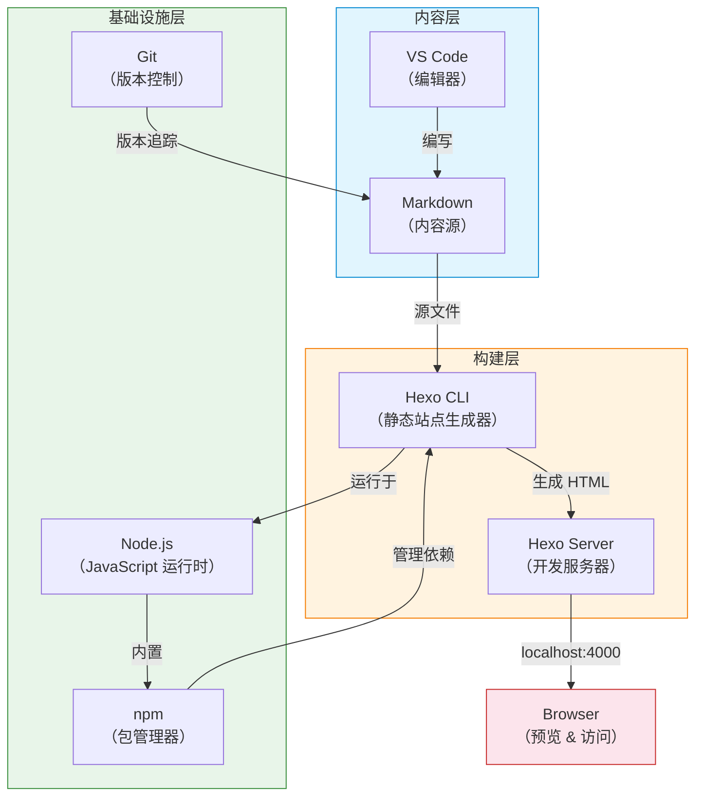
```mermaid
flowchart TB
    subgraph 内容层[" 内容层 "]
        VSCode["VS Code<br/>（编辑器）"]
        Markdown["Markdown<br/>（内容源）"]
    end

    subgraph 构建层[" 构建层 "]
        Hexo["Hexo CLI<br/>（静态站点生成器）"]
        HexoServer["Hexo Server<br/>（开发服务器）"]
    end

    subgraph 基础设施层[" 基础设施层 "]
        Node["Node.js<br/>（JavaScript 运行时）"]
        NPM["npm<br/>（包管理器）"]
        Git["Git<br/>（版本控制）"]
    end

    Browser["Browser<br/>（预览 & 访问）"]

    VSCode -->|"编写"| Markdown
    Markdown -->|"源文件"| Hexo
    Hexo -->|"生成 HTML"| HexoServer
    HexoServer -->|"localhost:4000"| Browser

    Hexo -->|"运行于"| Node
    NPM -->|"管理依赖"| Hexo
    Git -->|"版本追踪"| Markdown
    Node -->|"内置"| NPM

    style 内容层 fill:#e1f5fe,stroke:#0288d1
    style 构建层 fill:#fff3e0,stroke:#f57c00
    style 基础设施层 fill:#e8f5e9,stroke:#388e3c
    style Browser fill:#fce4ec,stroke:#c62828
```

---

## 3. 实验过程

本次实验涉及 4 款核心软件的安装配置 + Hexo 博客从初始化到上线的完整流程，按依赖关系顺序推进：

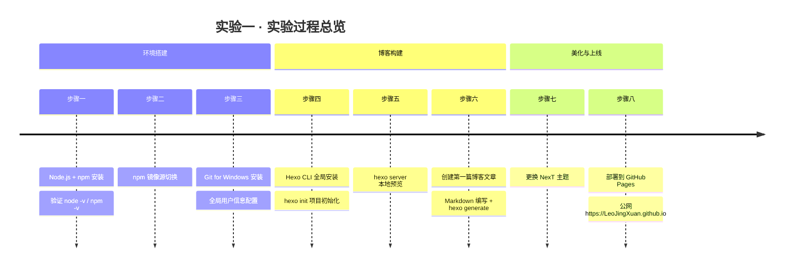
```mermaid
timeline
    title 实验一 · 实验过程总览
    section 环境搭建
      步骤一 : Node.js + npm 安装
             : 验证 node -v / npm -v
      步骤二 : npm 镜像源切换
      步骤三 : Git for Windows 安装
             : 全局用户信息配置
    section 博客构建
      步骤四 : Hexo CLI 全局安装
             : hexo init 项目初始化
      步骤五 : hexo server 本地预览
      步骤六 : 创建第一篇博客文章
             : Markdown 编写 + hexo generate
    section 美化与上线
      步骤七 : 更换 NexT 主题
      步骤八 : 部署到 GitHub Pages
             : 公网 https://LeoJingXuan.github.io
```

<br>

### 步骤一 安装 Node.js 与 npm

`Node.js` 是整个 Web 开发环境的基石 —— 它既是一个 JavaScript 运行时，也内置了 `npm` 包管理器。

> 💡 **下载**
> 访问 https://nodejs.org/ 下载 **LTS 版本**。

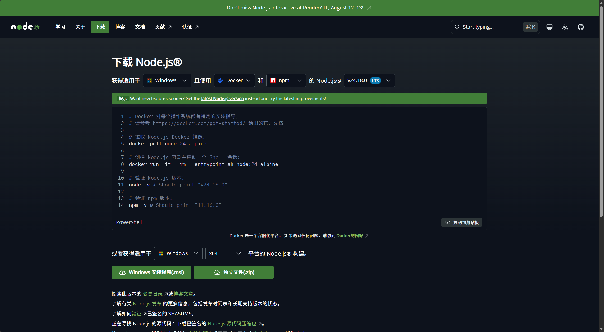
*△ 图 1 · Nodejs官网下载界面*

安装是标准的 Windows Installer 向导流程，但有**两处不能无脑点 "Next"**：

- 在 **Custom Setup** 页面，确保勾选 **"npm package manager"** 和 **"Add to PATH"** —— 前者保证 `npm` 随 Node.js 一同安装，后者让终端随处可敲 `node` 和 `npm`；
- 安装末尾出现的 **"Tools for Native Modules"** 复选框，**务必勾上** —— 自动安装 `windows-build-tools`（Python + C++ 编译链），日后 `node-gyp` 报错时可免去排雷之苦。

终端验证：

```bash
C:\Users\Lenovo> node -v
v24.15.0

C:\Users\Lenovo> npm -v
11.12.1
```

两个命令均返回版本号，说明安装无误、PATH 已生效。

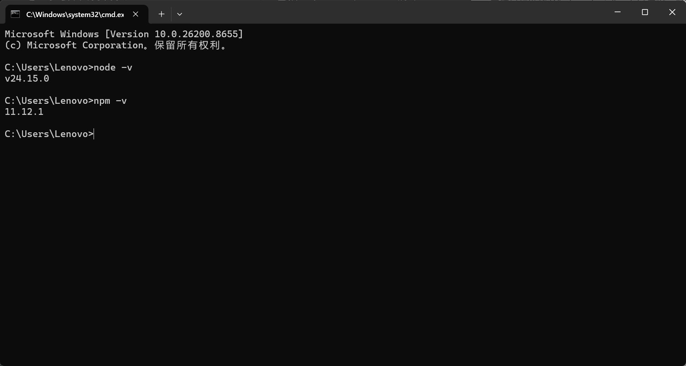
*△ 图 2 · 终端验证 Node.js 与 npm 安装成功*

---

### 步骤二 安装 Git for Windows

`Git` 在本次实验中扮演双角色：① 版本控制 Hexo 项目源码；② 主题安装与插件克隆需要 `git clone`。

> 💡 **下载**
> 访问 https://git-scm.com/download/win 下载 **64-bit** 版本。

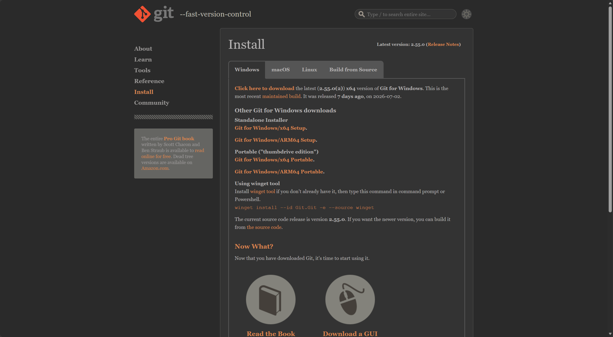
*△ 图 3 · Git官网下载界面*

安装时三处不可跳过的关键配置：

| 安装页面 | 选项 | 原因 |
|:--:|:--:|:--:|
| **Select Components** | 勾选 *Git Bash Here* + *Git GUI Here* | 右键菜单秒开 Git 终端 |
| **Choosing the default editor** | 选择 **VS Code** | `git commit` 自动在 VS Code 中编辑提交信息 |
| **Adjusting your PATH** | 选择 *Git from the command line and also from 3rd-party software* | CMD / PowerShell / VS Code 终端全局可用 |

其余保持默认。**务必重启终端**，否则 PATH 不刷新。

```bash
C:\Users\Lenovo> git --version
git version 2.54.0.windows.1
```

配置全局用户信息 —— 这是 Git 的「身份证」：

```bash
C:\Users\Lenovo> git config --global user.name "来靖轩"

C:\Users\Lenovo> git config --global user.email "25050824@hdu.edu.cn"
```

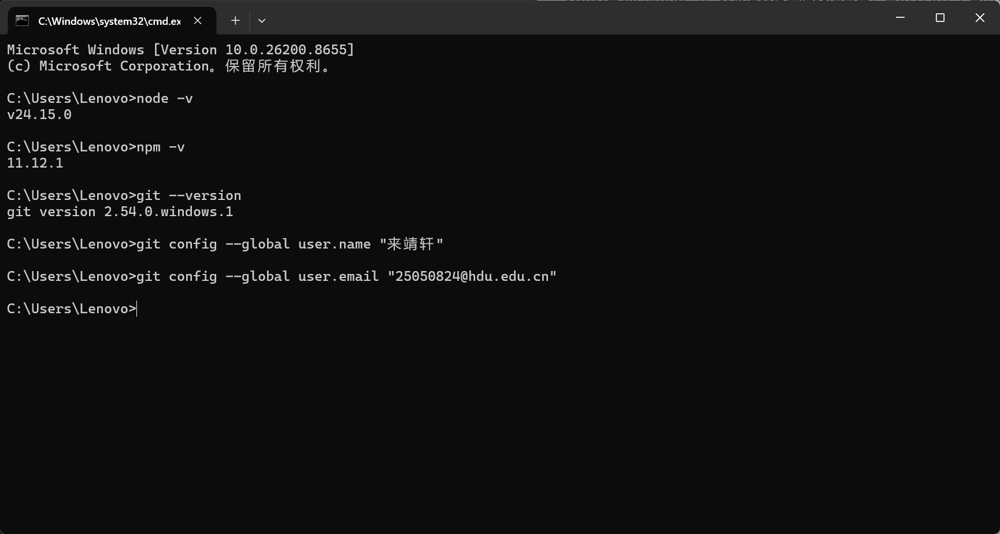
*△ 图 4 · 终端验证 Git 安装及全局用户信息配置*

---

### 步骤三 安装 Hexo CLI 并初始化博客项目

#### 3.1 全局安装 Hexo CLI

```bash
C:\Users\Lenovo> npm install -g hexo-cli
```

`-g`（global）使 `hexo` 命令在所有目录下可用，安装位置位于 Node.js 全局模块目录。

```bash
C:\Users\Lenovo>hexo -v
hexo-cli: 4.3.2
os: win32 10.0.26200 undefined
node: 24.15.0
acorn: 8.16.0
ada: 3.4.4
amaro: 1.1.8
ares: 1.34.6
brotli: 1.2.0
cldr: 48.0
icu: 78.2
llhttp: 9.3.1
merve: 1.2.2
modules: 137
napi: 10
nbytes: 0.1.3
ncrypto: 0.0.1
nghttp2: 1.68.0
openssl: 3.5.5
simdjson: 4.5.0
simdutf: 6.4.0
sqlite: 3.51.3
tz: 2026a
undici: 7.24.4
unicode: 17.0
uv: 1.51.0
uvwasi: 0.0.23
v8: 13.6.233.17-node.48
zlib: 1.3.1-e00f703
zstd: 1.5.7
```

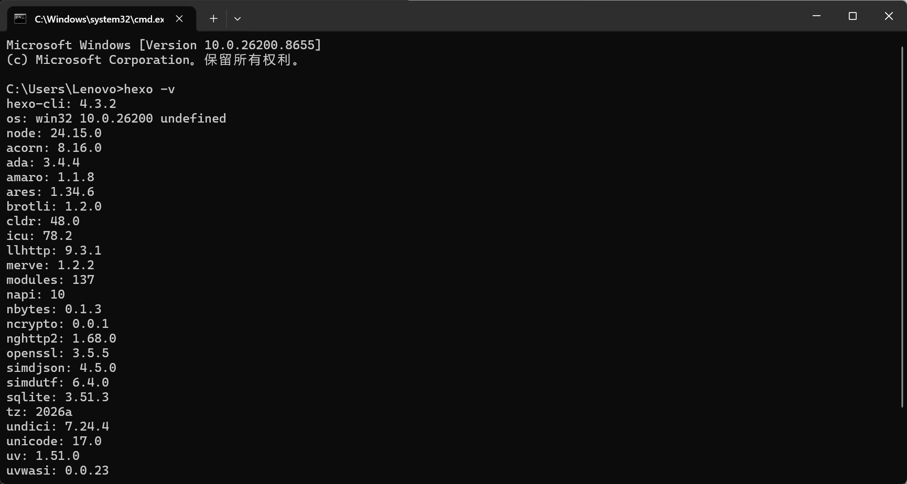
*△ 图 5 · 终端验证 Hexo CLI 安装成功*

---

#### 3.2 初始化项目

```bash
C:\Users\Lenovo> cd C:\Users\Lenovo\Desktop\软件开发实践1\Blog

C:\Users\Lenovo\Desktop\软件开发实践1\Blog> hexo init my-blog
INFO  Cloning hexo-starter https://github.com/hexojs/hexo-starter.git
INFO  Install dependencies
INFO  Start blogging with Hexo!
```

`hexo init` 背后执行了三件事：

- `git clone` → 克隆 `hexo-starter` 模板仓库
- `npm install` → 安装核心插件（`hexo-server`、`hexo-generator-*` 等 10+ 个）
- 生成标准项目骨架

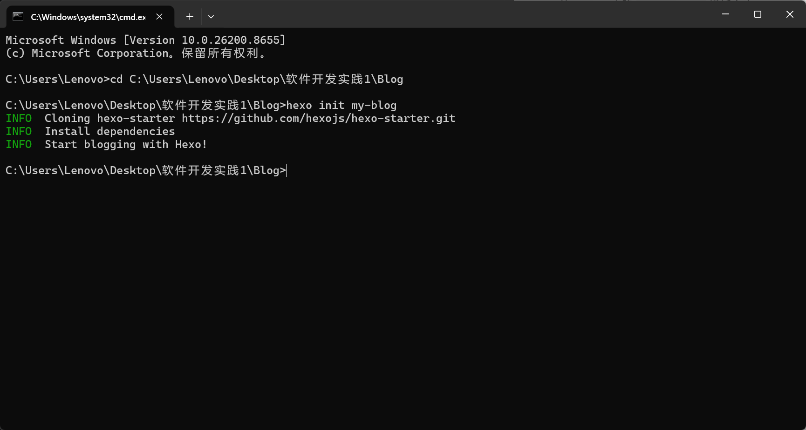
*△ 图 6 · hexo init 初始化博客项目*

```bash
C:\Users\Lenovo\Desktop\软件开发实践1\Blog> cd my-blog
C:\Users\Lenovo\Desktop\软件开发实践1\Blog\my-blog> npm install
```

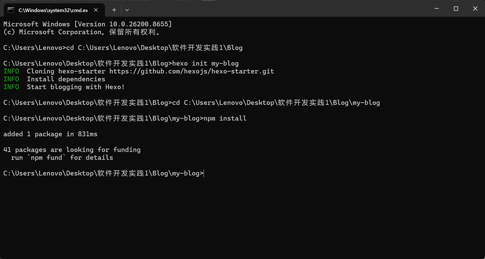
*△ 图 7 · npm install 安装项目依赖*

初始化完成后的目录结构：

```
my-blog/                          # 项目根目录（所有操作在此目录下执行）
├── .github/                      # GitHub 工作流配置目录
│   └── dependabot.yml            # 自动依赖更新配置（GitHub Dependabot）
├── .gitignore                    # Git 忽略规则（node_modules / public / .deploy_git）
├── _config.yml                   # 【核心】站点主配置文件（标题 / URL / 主题 / 部署）
├── _config.landscape.yml         # 默认主题 landscape 的独立配置文件
├── package.json                  # 项目依赖清单（声明需要哪些 npm 包）
├── package-lock.json             # 依赖版本锁定（确保团队环境一致）
├── node_modules/                 # 依赖包实体（约 200MB，由 npm install 生成）
│   └── ...                       # hexo、hexo-server、hexo-generator-* 等 150+ 个包
├── scaffolds/                    # 文章模板目录（hexo new 时按模板生成 Front-matter）
│   ├── draft.md                  # 草稿模板
│   ├── page.md                   # 独立页面模板
│   └── post.md                   # 文章模板（定义默认 Front-matter 结构）
├── source/                       # 【核心】内容源文件目录 —— 你写的东西全在这里
│   └── _posts/                   # 文章存放目录
│       └── hello-world.md        # 默认示例文章（第一篇博客）
└── themes/                       # 主题目录（每个子目录对应一个主题）
    └── .gitkeep                  # 占位文件（Git 不追踪空目录）
```

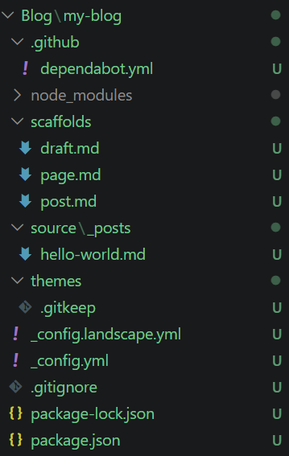
*△ 图 8 · VS Code 中查看 Hexo 项目的标准目录结构*

---

### 步骤四 本地预览博客

在项目目录下启动内置开发服务器：

```bash
C:\Users\Lenovo> cd C:\Users\Lenovo\Desktop\软件开发实践1\Blog\my-blog

C:\Users\Lenovo\Desktop\软件开发实践1\Blog\my-blog> hexo server
INFO  Validating config
INFO  Start processing
INFO  Hexo is running at http://localhost:4000/ . Press Ctrl+C to stop.
```

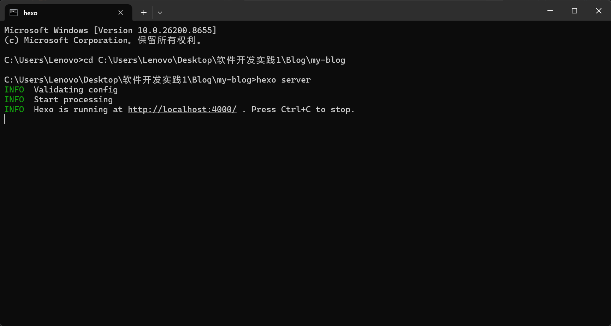
*△ 图 9 · 内置开发服务器启动成功*

`hexo server` 在本地 `4000` 端口启动了一个 HTTP 服务器。浏览器访问 `http://localhost:4000`，即可看到默认 Hexo 博客首页 —— 蓝色系 Landscape 主题，搭载一篇 *Hello World* 示例文章。

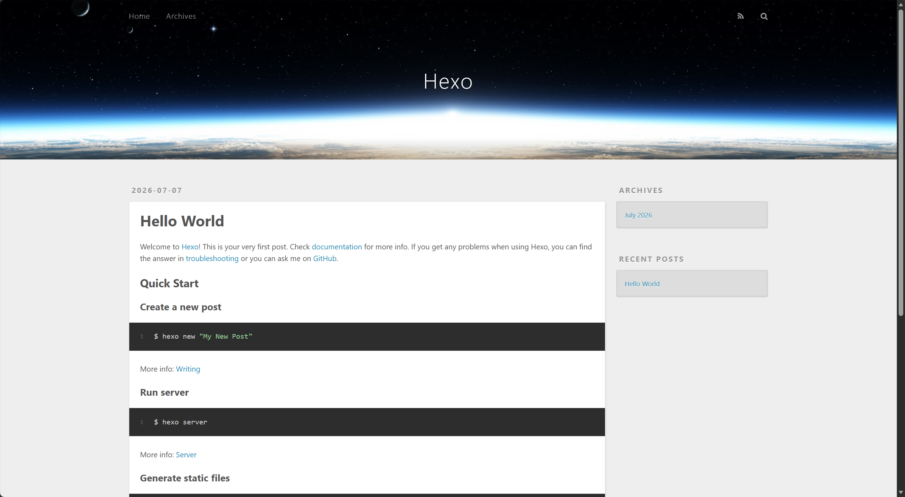
*△ 图 10 · 本地预览 —— 浏览器中 Hexo 博客默认首页（Landscape 主题）*

---

### 步骤五 创建并发布第一篇博客文章

#### 5.1　新建文章

```bash
C:\Users\Lenovo> cd C:\Users\Lenovo\Desktop\软件开发实践1\Blog\my-blog

C:\Users\Lenovo\Desktop\软件开发实践1\Blog\my-blog> hexo new "Web开发环境实践记录"
INFO  Validating config
INFO  Created: ~\Desktop\软件开发实践1\Blog\my-blog\source\_posts\Web开发环境实践记录.md
```
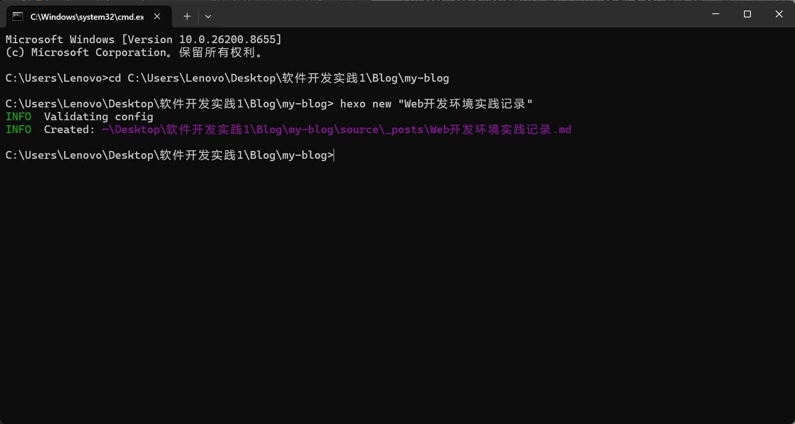
*△ 图 11 · 新建文章《Web开发环境实践记录》成功*

`hexo new` 在 `source/_posts/` 下生成了 Markdown 文件。打开后可见自动填充的 **Front-matter**（YAML 元数据区块）：

```markdown
---
title: Web开发环境实践记录
date: 2026-07-07 23:13:26
tags:
---
```

Front-matter 是 Markdown 文件顶部 `---` 包裹的 YAML 区域，定义标题、日期、标签、分类等元信息 —— Hexo 构建时解析这些字段，生成对应的 HTML `meta` 标签和分类页面。

---

#### 5.2 编写内容

在 Front-matter 下方用 Markdown 书写正文：

```markdown
## 实验环境搭建小结

### 工具链概述

本次实验安装了 **Node.js + npm + Git + Hexo** 四件套，
它们构成了一个完整的静态博客开发栈。

### 一个有意思的发现

在 `hexo init` 的过程中，我注意到命令行输出的依赖安装阶段
实际上就是在执行 `npm install`。
这意味着 `hexo init` 本质上是：

1. `git clone` 模板仓库
2. `npm install` 安装依赖
3. 生成默认配置文件

理解了这一点，"Hexo 到底是什么"就变得清晰了——
它是一个**基于 Node.js 的命令行工具**，
借助 npm 包管理能力来组织和加载插件。
```

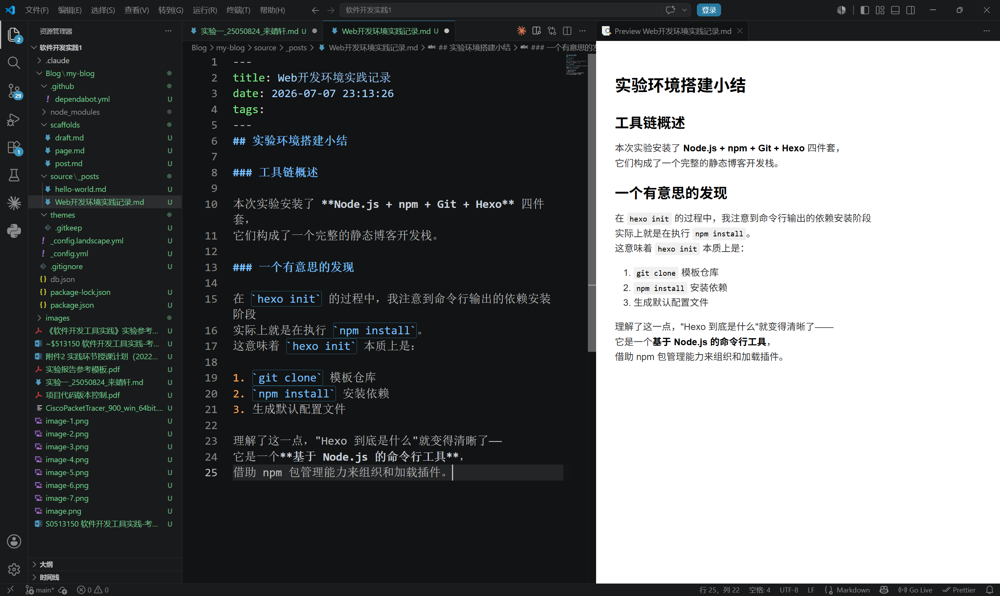
*△ 图 12 · VS Code 分屏：左侧 Markdown 源码，右侧 Markdown Preview Enhanced 实时预览*

---

#### 5.3 重新生成并预览

```bash
C:\Users\Lenovo\Desktop\软件开发实践1\Blog\my-blog>hexo generate
INFO  Validating config
INFO  Start processing
INFO  Files loaded in 298 ms
INFO  Generated: archives/index.html
INFO  Generated: index.html
INFO  Generated: js/jquery-3.6.4.min.js
INFO  Generated: fancybox/jquery.fancybox.min.js
INFO  Generated: archives/2026/07/index.html
INFO  Generated: js/script.js
INFO  Generated: fancybox/jquery.fancybox.min.css
INFO  Generated: css/style.css
INFO  Generated: 2026/07/09/Web开发环境实践记录/index.html
INFO  Generated: archives/2026/index.html
INFO  Generated: 2026/07/09/hello-world/index.html
INFO  Generated: css/images/banner.jpg
INFO  12 files generated in 147 ms
```
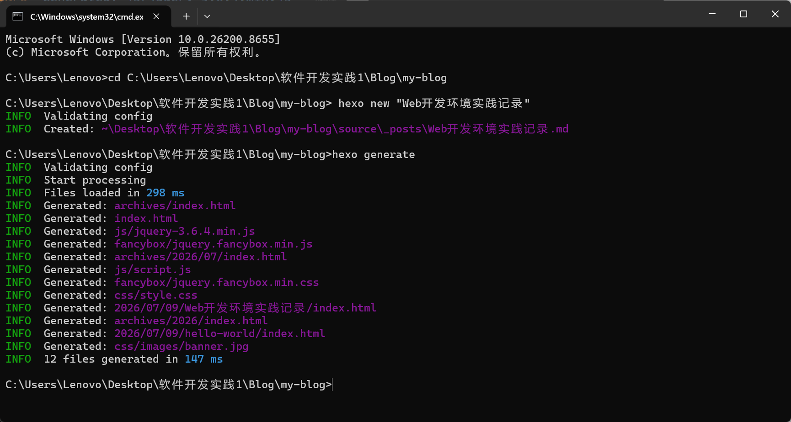
*△ 图 13 · 重新生成成功*

`hexo generate`（简写 `hexo g`）将 Markdown 源文件 + 主题模板编译为纯静态 HTML / CSS / JS，输出至 `public/` 目录。

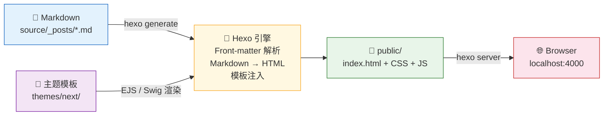
```mermaid
flowchart LR
    MD["📝 Markdown<br/>source/_posts/*.md"] -->|"hexo generate"| Render
    Theme["🎨 主题模板<br/>themes/next/"] -->|"EJS / Swig 渲染"| Render

    Render["🔧 Hexo 引擎<br/>Front-matter 解析<br/>Markdown → HTML<br/>模板注入"] --> Public["📂 public/<br/>index.html + CSS + JS"]

    Public -->|"hexo server"| Browser["🌐 Browser<br/>localhost:4000"]

    style MD fill:#e3f2fd,stroke:#1565c0
    style Theme fill:#f3e5f5,stroke:#7b1fa2
    style Render fill:#fff8e1,stroke:#f9a825
    style Public fill:#e8f5e9,stroke:#2e7d32
    style Browser fill:#fce4ec,stroke:#c62828
```

刷新 `http://localhost:4000`，首页已出现新文章。

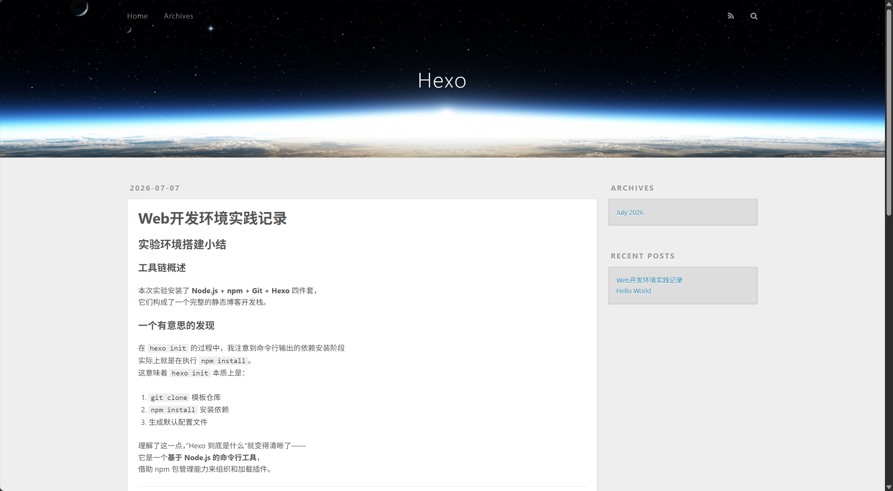
*△ 图 14 · 浏览器刷新博客首页，新文章已出现在文章列表中*

---

### 步骤六 更换主题（NexT）

默认 Landscape 主题功能有限，换上社区最流行的 **NexT** 主题：

```bash
C:\Users\Lenovo> cd C:\Users\Lenovo\Desktop\软件开发实践1\Blog\my-blog

C:\Users\Lenovo\Desktop\软件开发实践1\Blog\my-blog> git clone https://github.com/theme-next/hexo-theme-next themes/next
Cloning into 'themes/next'...
remote: Enumerating objects: 12582, done.
remote: Total 12582 (delta 0), reused 0 (delta 0), pack-reused 12582 (from 1)
Receiving objects: 100% (12582/12582), 8.04 MiB | 27.00 KiB/s, done.
Resolving deltas: 100% (7986/7986), done.
```

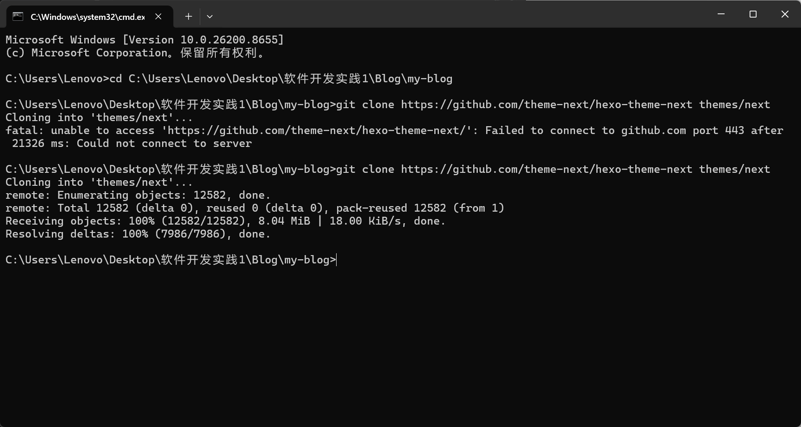
*△ 图 15 · git clone获取NexT主题成功*

修改 `_config.yml` 中的主题配置 —— **一行 YAML 的事**：

```yaml
# 将
theme: landscape
# 改为
theme: next
```

```bash
C:\Users\Lenovo>cd C:\Users\Lenovo\Desktop\软件开发实践1\Blog\my-blog

C:\Users\Lenovo\Desktop\软件开发实践1\Blog\my-blog>hexo clean && hexo generate && hexo server
INFO  Validating config
INFO  Deleted database.
INFO  Deleted public folder.
INFO  Validating config
INFO  Start processing
INFO  Files loaded in 358 ms
(node:13452) [DEP0169] DeprecationWarning: `url.parse()` behavior is not standardized and prone to errors that have security implications. Use the WHATWG URL API instead. CVEs are not issued for `url.parse()` vulnerabilities.
(Use `node --trace-deprecation ...` to show where the warning was created)
INFO  Generated: archives/index.html
INFO  Generated: images/algolia_logo.svg
INFO  Generated: index.html
INFO  Generated: css/main.css
INFO  Generated: lib/anime.min.js
INFO  Generated: js/algolia-search.js
INFO  Generated: lib/velocity/velocity.min.js
INFO  Generated: js/schemes/pisces.js
INFO  Generated: images/cc-by-nc-nd.svg
INFO  Generated: images/avatar.gif
INFO  Generated: images/apple-touch-icon-next.png
INFO  Generated: images/cc-by-nc-sa.svg
INFO  Generated: images/cc-by-nc.svg
INFO  Generated: images/cc-by-nd.svg
INFO  Generated: images/cc-by.svg
INFO  Generated: images/cc-by-sa.svg
INFO  Generated: images/cc-zero.svg
INFO  Generated: images/favicon-32x32-next.png
INFO  Generated: images/logo.svg
INFO  Generated: archives/2026/07/index.html
INFO  Generated: images/favicon-16x16-next.png
INFO  Generated: js/bookmark.js
INFO  Generated: js/local-search.js
INFO  Generated: lib/velocity/velocity.ui.min.js
INFO  Generated: js/motion.js
INFO  Generated: js/next-boot.js
INFO  Generated: js/utils.js
INFO  Generated: js/schemes/muse.js
INFO  Generated: lib/font-awesome/webfonts/fa-regular-400.woff2
INFO  Generated: archives/2026/index.html
INFO  Generated: lib/font-awesome/css/all.min.css
INFO  Generated: 2026/07/09/Web开发环境实践记录/index.html
INFO  Generated: lib/font-awesome/webfonts/fa-brands-400.woff2
INFO  Generated: lib/font-awesome/webfonts/fa-solid-900.woff2
INFO  Generated: 2026/07/09/hello-world/index.html
INFO  35 files generated in 265 ms
INFO  Validating config
INFO  Start processing
INFO  Hexo is running at http://localhost:4000/ . Press Ctrl+C to stop.
```

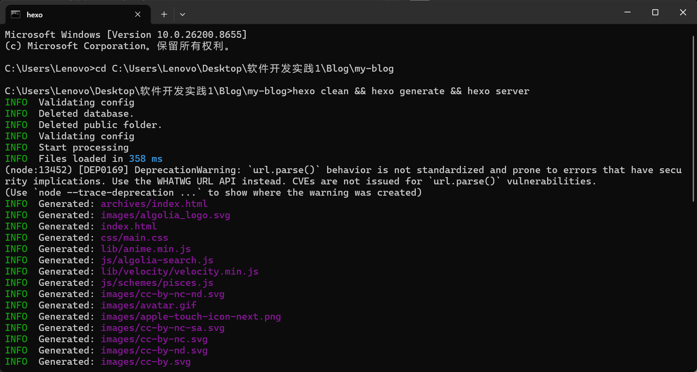
*△ 图 16 · 新主题重构成功*

刷新浏览器 —— 样式焕然一新。NexT 提供更现代的排版、暗色模式、代码高亮、侧边栏目录等开箱即用的特性。

> ✨ **关注点分离**在此体现得淋漓尽致：**内容（Markdown）+ 配置（`_config.yml`）+ 主题（`theme`）= 最终网站**。换主题只需一行配置，所有文章毫发无损 —— 这就是 SSG 对比手写 HTML 的核心优势。

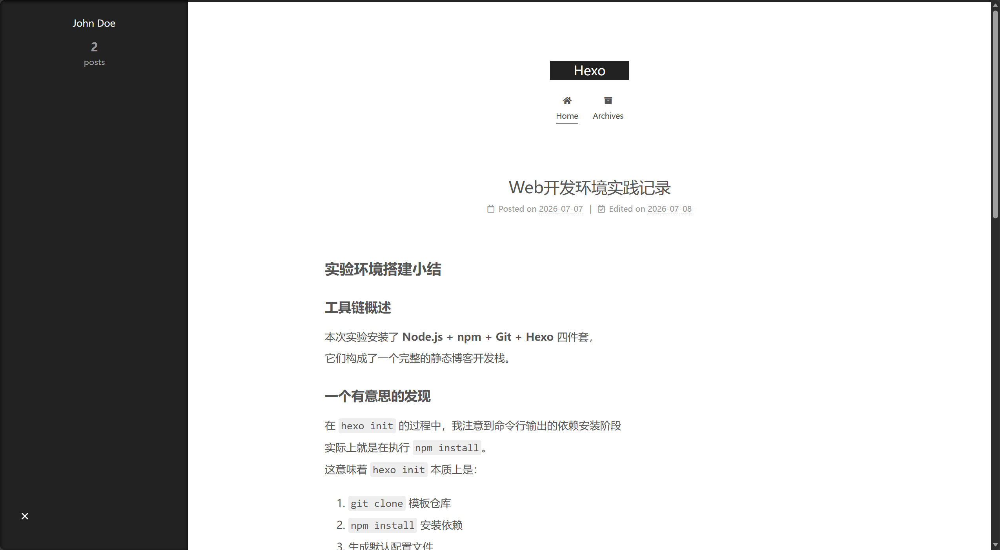
*△ 图 17 · 更换 NexT 主题后的博客首页 —— 现代排版与侧边栏目录*

---

### 步骤七 部署到 GitHub Pages

博客目前只在本机 `localhost` 可见。要让世界访问，需要把静态文件托管到公网服务器上。**GitHub Pages** 是最适合静态站点的免费方案。

#### 7.1 创建 GitHub 仓库

1. 登录 [GitHub](https://github.com/)，右上角 **"+"** → **"New repository"**
2. 仓库名**必须**设为 `<你的用户名>.github.io`
3. 可见性选 **Public**，**不要**勾选 *"Add a README file"*
4. 点击 *"Create repository"*

> 📌 **为什么仓库名非此不可？**
> GitHub Pages 域名约定：名为 `<user>.github.io` 的仓库自动映射为 `https://<user>.github.io`。若仓库名随意取，URL 会多出一层路径前缀，导致资源路径错乱。

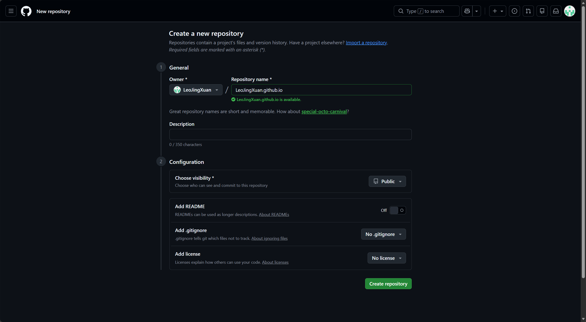
*△ 图 18 · GitHub 创建部署仓库*

---

#### 7.2 安装部署插件

Hexo 默认不自动推送远程仓库，需借助 `hexo-deployer-git` 插件：

```bash
C:\Users\Lenovo>cd C:\Users\Lenovo\Desktop\软件开发实践1\Blog\my-blog

C:\Users\Lenovo\Desktop\软件开发实践1\Blog\my-blog>npm install hexo-deployer-git --save

added 9 packages in 2s

36 packages are looking for funding
  run `npm fund` for details
```

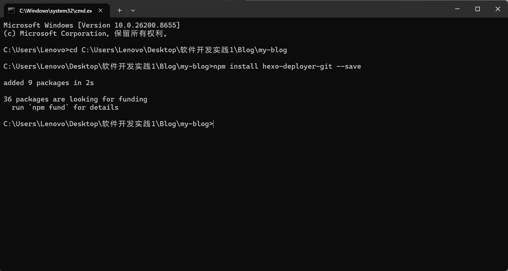
*△ 图 19 · 终端验证插件安装成功*

> ⚠️ `--save` 将插件写入 `package.json` 的 `dependencies` 字段。丢弃该参数将导致别人克隆项目后 `npm install` 装不上此包，部署直接报错。

---

#### 7.3 配置部署信息

打开 `_config.yml`，末尾追加部署配置：

```yaml
deploy:
  type: git
  repo: https://github.com/LeoJingXuan/LeoJingXuan.github.io.git
  branch: master
```

三行配置含义：

| 字段 | 值 | 含义 |
|:--:|:--:|:--:|
| `type` | `git` | 使用 Git 协议推送（Hexo 也支持 `rsync`、`ftp` 等） |
| `repo` | 仓库地址 | 推送目标仓库 |
| `branch` | `master` | 推送到哪个分支 |

---

#### 7.4 执行部署

```bash
C:\Users\Lenovo\Desktop\软件开发实践1\Blog\my-blog>hexo clean && hexo generate && hexo deploy
INFO  Validating config
INFO  Deleted database.
INFO  Deleted public folder.
INFO  Validating config
INFO  Start processing
INFO  Files loaded in 156 ms
(node:32904) [DEP0169] DeprecationWarning: `url.parse()` behavior is not standardized and prone to errors that have security implications. Use the WHATWG URL API instead. CVEs are not issued for `url.parse()` vulnerabilities.
(Use `node --trace-deprecation ...` to show where the warning was created)
INFO  Generated: images/algolia_logo.svg
INFO  Generated: archives/index.html
INFO  Generated: index.html
INFO  Generated: css/main.css
INFO  Generated: images/avatar.gif
INFO  Generated: images/cc-by-sa.svg
INFO  Generated: images/cc-by-nc-nd.svg
INFO  Generated: images/cc-by-nc-sa.svg
INFO  Generated: images/apple-touch-icon-next.png
INFO  Generated: images/cc-by.svg
INFO  Generated: images/cc-by-nc.svg
INFO  Generated: images/cc-by-nd.svg
INFO  Generated: js/algolia-search.js
INFO  Generated: images/favicon-32x32-next.png
INFO  Generated: lib/anime.min.js
INFO  Generated: js/schemes/muse.js
INFO  Generated: lib/velocity/velocity.min.js
INFO  Generated: images/cc-zero.svg
INFO  Generated: images/favicon-16x16-next.png
INFO  Generated: images/logo.svg
INFO  Generated: archives/2026/07/index.html
INFO  Generated: js/local-search.js
INFO  Generated: js/bookmark.js
INFO  Generated: js/utils.js
INFO  Generated: js/schemes/pisces.js
INFO  Generated: js/motion.js
INFO  Generated: js/next-boot.js
INFO  Generated: lib/velocity/velocity.ui.min.js
INFO  Generated: lib/font-awesome/webfonts/fa-brands-400.woff2
INFO  Generated: archives/2026/index.html
INFO  Generated: lib/font-awesome/css/all.min.css
INFO  Generated: lib/font-awesome/webfonts/fa-solid-900.woff2
INFO  Generated: 2026/07/09/hello-world/index.html
INFO  Generated: lib/font-awesome/webfonts/fa-regular-400.woff2
INFO  Generated: 2026/07/09/Web开发环境实践记录/index.html
INFO  35 files generated in 264 ms
INFO  Validating config
INFO  Deploying: git
INFO  Clearing .deploy_git folder...
INFO  Copying files from public folder...
INFO  Copying files from extend dirs...
warning: in the working copy of '2026/07/09/Web开发环境实践记录/index.html', LF will be replaced by CRLF the next time Git touches it
warning: in the working copy of '2026/07/09/hello-world/index.html', LF will be replaced by CRLF the next time Git touches it
warning: in the working copy of 'archives/2026/07/index.html', LF will be replaced by CRLF the next time Git touches it
warning: in the working copy of 'archives/2026/index.html', LF will be replaced by CRLF the next time Git touches it
warning: in the working copy of 'archives/index.html', LF will be replaced by CRLF the next time Git touches it
warning: in the working copy of 'css/main.css', LF will be replaced by CRLF the next time Git touches it
warning: in the working copy of 'index.html', LF will be replaced by CRLF the next time Git touches it
warning: in the working copy of 'js/algolia-search.js', LF will be replaced by CRLF the next time Git touches it
warning: in the working copy of 'js/bookmark.js', LF will be replaced by CRLF the next time Git touches it
warning: in the working copy of 'js/local-search.js', LF will be replaced by CRLF the next time Git touches it
warning: in the working copy of 'js/motion.js', LF will be replaced by CRLF the next time Git touches it
warning: in the working copy of 'js/next-boot.js', LF will be replaced by CRLF the next time Git touches it
warning: in the working copy of 'js/schemes/muse.js', LF will be replaced by CRLF the next time Git touches it
warning: in the working copy of 'js/schemes/pisces.js', LF will be replaced by CRLF the next time Git touches it
warning: in the working copy of 'js/utils.js', LF will be replaced by CRLF the next time Git touches it
warning: in the working copy of 'lib/anime.min.js', LF will be replaced by CRLF the next time Git touches it
warning: in the working copy of 'lib/font-awesome/css/all.min.css', LF will be replaced by CRLF the next time Git touches it
warning: in the working copy of 'lib/velocity/velocity.min.js', LF will be replaced by CRLF the next time Git touches it
warning: in the working copy of 'lib/velocity/velocity.ui.min.js', LF will be replaced by CRLF the next time Git touches it
[master 9c3d9c7] Site updated: 2026-07-09 13:48:14
 1 file changed, 1 insertion(+), 1 deletion(-)
Enumerating objects: 7, done.
Counting objects: 100% (7/7), done.
Delta compression using up to 32 threads
Compressing objects: 100% (3/3), done.
Writing objects: 100% (4/4), 377 bytes | 377.00 KiB/s, done.
Total 4 (delta 2), reused 0 (delta 0), pack-reused 0 (from 0)
remote: Resolving deltas: 100% (2/2), completed with 2 local objects.
To github.com:LeoJingXuan/LeoJingXuan.github.io.git
   306869c..9c3d9c7  HEAD -> master
branch 'master' set up to track 'git@github.com:LeoJingXuan/LeoJingXuan.github.io.git/master'.
INFO  Deploy done: git
```

这条命令串联了三个动作：

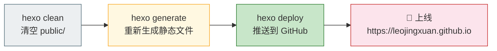
```mermaid
flowchart LR
    Clean["hexo clean<br/>清空 public/"] --> Generate["hexo generate<br/>重新生成静态文件"]
    Generate --> Deploy["hexo deploy<br/>推送到 GitHub"]
    Deploy --> Live["🚀 上线<br/>https://leojingxuan.github.io"]

    style Clean fill:#eceff1,stroke:#546e7a
    style Generate fill:#fff8e1,stroke:#f9a825
    style Deploy fill:#c8e6c9,stroke:#2e7d32
    style Live fill:#fce4ec,stroke:#c62828
```

- `hexo clean`　删除 `public/`，避免残留上一版的多余文件
- `hexo generate`　重新编译 Markdown → HTML
- `hexo deploy`　推送 `public/` 至 GitHub 仓库

> ⚠️ **GitHub 认证说明**
> 自 2021 年起 GitHub 禁用密码认证，需改用 **Personal Access Token**（Settings → Developer settings → Tokens (classic) → 勾选 `repo` → Generate），或使用 **SSH 密钥** 免密推送（推荐，一劳永逸）。

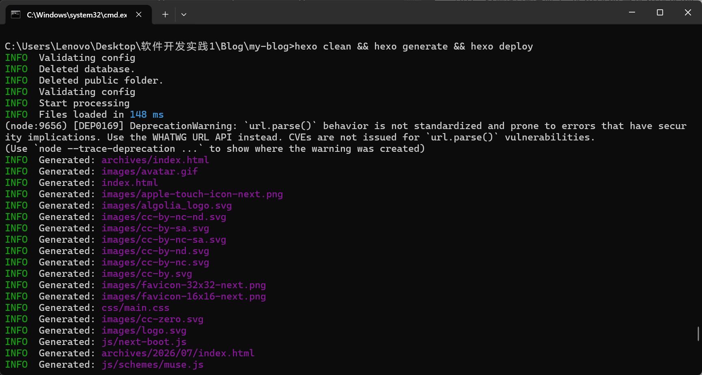
*△ 图 20 · 终端执行 hexo clean → hexo generate → hexo deploy 全流程*

---

#### 7.5 验证上线

部署完成后，浏览器访问 **https://leojingxuan.github.io**，之前只能在 `localhost:4000` 看到的博客，现已可被任何人通过公网访问。至此，完整走通了 Web 开发的六个核心环节：

```
环境准备  ➜  项目初始化  ➜  内容编写  ➜  主题定制  ➜  本地预览  ➜  部署上线
```

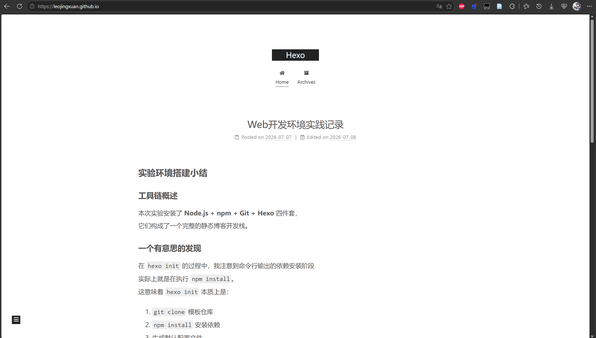
*△ 图 21 · 部署成功 —— 公网访问 leojingxuan.github.io，博客正式上线*

---

## 4. 实验结果

| 验证项 | 操作 | 预期结果 | 实际结果 |
|:--:|:--:|:--:|:--:|
| Node.js 安装 | `node -v` | ≥ v20.x | ✅ `v24.15.0` |
| npm 安装 | `npm -v` | ≥ v10.x | ✅ `11.12.1` |
| Git 安装 | `git --version` | ≥ v2.x | ✅ `2.54.0` |
| Hexo CLI 安装 | `hexo -v` | 输出版本及依赖列表 | ✅ `4.3.2` |
| 镜像源配置 | `npm config get registry` | 输出 `npmmirror.com` | ✅ 已切换 |
| 项目初始化 | `hexo init` | 生成标准项目骨架 | ✅ 全部文件就位 |
| 本地预览 | 浏览器访问 `localhost:4000` | 显示 Hexo 默认首页 | ✅ 正常渲染 |
| 文章创建 | `hexo new "..."` | `_posts/` 下生成 `.md` 文件 | ✅ 含 Front-matter |
| 页面生成 | `hexo generate` | `public/` 含 HTML 文件 | ✅ `12 files generated` |
| 主题更换 | 换 NexT 后刷新 | 页面外观变化 | ✅ NexT 生效 |
| 部署插件安装 | `npm install hexo-deployer-git --save` | 写入 `package.json` | ✅ 已安装 |
| 部署到 GitHub Pages | `hexo clean && hexo g && hexo d` | 推送至远程仓库 | ✅ `Deploy done` |
| 公网验证 | 浏览器访问 `用户名.github.io` | 显示与本地一致的博客 | ✅ 部署成功 |

**▸ 成果物清单**

```
成果一：C:\Users\Lenovo\Desktop\软件开发实践1\Blog\my-blog\   ← 完整的 Hexo 博客项目
成果二：http://localhost:4000                                    ← 可访问的本地博客站点
成果三：https://leojingxuan.github.io                            ← 已上线的公网博客
成果四：source/_posts/Web开发环境实践记录.md                      ← 第一篇实验记录文章
成果五：themes/next/                                              ← 已安装的 NexT 主题
```

---

## 5. 知识总结

### 5.1 工具链的「俄罗斯套娃」模型

回顾整个搭建过程，这套工具链的依赖关系如同俄罗斯套娃 —— 层层嵌套，每一层为上一层提供运行基础：

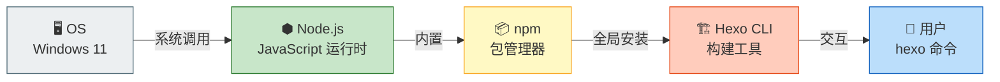
```mermaid
flowchart LR
    OS["🖥️ OS<br/>Windows 11"]
    Node["⬢ Node.js<br/>JavaScript 运行时"]
    NPM["📦 npm<br/>包管理器"]
    Hexo["🏗️ Hexo CLI<br/>构建工具"]
    User["👤 用户<br/>hexo 命令"]

    OS -->|"系统调用"| Node
    Node -->|"内置"| NPM
    NPM -->|"全局安装"| Hexo
    Hexo -->|"交互"| User

    style OS fill:#eceff1,stroke:#546e7a
    style Node fill:#c8e6c9,stroke:#2e7d32
    style NPM fill:#fff9c4,stroke:#f9a825
    style Hexo fill:#ffccbc,stroke:#e64a19
    style User fill:#bbdefb,stroke:#1565c0
```

> 📐 **公式**
> 「Web 开发环境」= 运行时 + 包管理器 + 构建工具 + 编辑器 + 浏览器 —— 五者缺一不可。

---

### 5.2 静态站点开发的六阶段流程

本实验正好完整走了一遍 Web 应用开发的标准六环节：

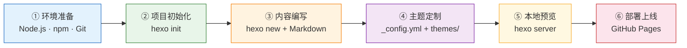
```mermaid
flowchart LR
    A["① 环境准备<br/>Node.js · npm · Git"] --> B["② 项目初始化<br/>hexo init"]
    B --> C["③ 内容编写<br/>hexo new + Markdown"]
    C --> D["④ 主题定制<br/>_config.yml + themes/"]
    D --> E["⑤ 本地预览<br/>hexo server"]
    E --> F["⑥ 部署上线<br/>GitHub Pages"]

    style A fill:#e3f2fd,stroke:#1565c0
    style B fill:#e8f5e9,stroke:#2e7d32
    style C fill:#fff3e0,stroke:#f57c00
    style D fill:#f3e5f5,stroke:#7b1fa2
    style E fill:#fff8e1,stroke:#f9a825
    style F fill:#fce4ec,stroke:#c62828
```

| 阶段 | 做了什么 | 产出物 |
|:--:|:--:|:--:|
| ① 环境准备 | 安装 Node.js / npm / Git、切换镜像源 | 可用的开发工具链 |
| ② 项目初始化 | `hexo init` 克隆模板 + 安装依赖 | 标准项目骨架 |
| ③ 内容编写 | `hexo new` 创建 `.md`，写 Front-matter + Markdown | 博客文章源文件 |
| ④ 主题定制 | 安装 NexT 主题，修改 `_config.yml` | 定制化外观 |
| ⑤ 本地预览 | `hexo server` 起开发服务器，`localhost:4000` 实时查看 | 开发阶段效果验证 |
| ⑥ 部署上线 | `hexo deploy` 推送至 GitHub Pages | 公网可访问的网站 |

> 🔁 实际开发中 ③④⑤ 会反复循环：写文章 → 本地预览 → 调样式 → 再预览 → 满意后部署。这种「本地迭代 + 最终发布」的模式，正是 SSG 区别于动态博客的核心工作流。

---

### 5.3 静态博客 vs 动态博客

| 对比维度 | 静态（Hexo / Hugo / VuePress） | 动态（WordPress / Typecho） |
|:--:|:--:|:--:|
| 页面生成时机 | **构建时**预先生成全部 HTML | **请求时**由服务器实时生成 |
| 数据库 | 不需要 | 需要（MySQL / PostgreSQL） |
| 加载速度 | 极快（纯静态文件，CDN 友好） | 较慢（执行后端代码 + 查数据库） |
| 安全性 | 高（无后端，攻击面极小） | 需持续关注安全更新 |
| 管理后台 | 无（Markdown + 命令行写作） | 有（Web 后台界面） |
| 托管成本 | 极低（GitHub Pages / Vercel 免费） | 需支持 PHP + MySQL 的主机 |
| 适合人群 | 技术博客 / 文档站 / 追求极简 | 企业官网 / 电商 / 非技术人员维护 |

---

### 5.4 核心工具与概念映射

| 工具 | 在 Web 开发中的角色 | 对应的通用概念 |
|:--:|:--:|:--:|
| Node.js | JavaScript 脱离浏览器运行的环境 | **运行时（Runtime）** |
| npm | 依赖声明、安装、版本锁定 | **包管理器（Package Manager）** |
| Git | 代码版本追踪、协作、远程同步 | **版本控制（Version Control）** |
| Hexo CLI | 项目脚手架、构建、本地服务 | **构建工具链（Build Toolchain）** |
| `hexo server` | 开发时提供 HTTP 服务 | **开发服务器（Dev Server）** |
| `_config.yml` | 站点全局参数 | **配置管理（Configuration）** |
| `node_modules/` | 第三方依赖物理存放 | **依赖隔离（Dependency Isolation）** |
| `public/` | 编译产物输出 | **构建产物（Build Artifacts）** |

---

## 6. 出现问题

| 问题 | 现象 | 原因 | 解决方案 |
|:--:|:--:|:--:|:--:|
| `'node'` 不是内部或外部命令 | 终端无法识别 `node` / `npm` | 未勾选 *Add to PATH*，或未重启终端 | ① 重启终端；② 重装勾选 PATH；③ 手动将 `C:\Program Files\nodejs\` 加入系统环境变量 |
| `hexo init` 卡在 *Installing dependencies* | 长时间无响应，最终超时 | npm 默认源在海外，校园网 RTT > 200ms | `npm config set registry https://registry.npmmirror.com` 切换国内镜像 |
| `git clone` 主题极慢或失败 | 几十 KB/s 或 Connection refused | GitHub 在国内访问不稳定 | ① 走代理；② fork 到 Gitee；③ 直接下载 ZIP 解压到 `themes/` |
| `hexo deploy` 认证失败 | `remote: Invalid username or password` | GitHub 已禁用密码认证 | 使用 Personal Access Token 代替密码，或配置 SSH 密钥一键免密 |
| Pages 显示 404 | 浏览器打开 `用户名.github.io` 出 404 | ① 仓库名格式不对；② Pages 分支没选对 | ① 检查仓库名；② Settings → Pages → Branch 选 `master` |
---

## 7. 拓展与进阶

基础实验完成后，Markdown 工作流和工具链可进一步深化。以下是实验手册推荐的五项进阶操作。

### 7.1 自定义代码片段（Snippets）

VS Code 支持配置代码片段 —— 敲几个触发字符，自动展开为预设结构，大幅减少重复输入。

> 🎯 **操作**
> `Ctrl+Shift+P` → `Snippets: Configure User Snippets` → 选择 `markdown.json`

实用示例：

```json
{
  "Insert Hexo Post Header": {
    "prefix": "hexo-header",
    "body": [
      "---",
      "title: ${1:文章标题}",
      "date: ${CURRENT_YEAR}-${CURRENT_MONTH}-${CURRENT_DATE} ${CURRENT_HOUR}:${CURRENT_MINUTE}:00",
      "tags: [${2:标签}]",
      "categories: ${3:分类}",
      "---",
      "",
      "${4:正文开始...}"
    ],
    "description": "插入 Hexo 文章 Front-matter 头部"
  },
  "Insert Mermaid Flowchart": {
    "prefix": "mmd-flow",
    "body": [
      "```mermaid",
      "flowchart TD",
      "    ${1:A}[${2:开始}] --> ${3:B}[${4:结束}]",
      "```"
    ],
    "description": "快速插入 Mermaid 流程图框架"
  }
}
```

| 占位符 | 含义 |
|:--:|:--:|
| `${1:title}` | 光标默认停留位置，`Tab` 跳转 `${2}`，以此类推 |
| `${CURRENT_YEAR}` | 自动填充当前年份 |

配置后，输入 `hexo-header` → `Tab`，Front-matter 模板即刻展开。

---

### 7.2 导出为 PDF

Markdown Preview Enhanced 支持将 `.md` 文件导出为排版精美的 **PDF** 或 **HTML**。

> 🎯 **操作**
> `Ctrl+K V` 打开侧边预览 → 预览窗口右键 → **Chrome (Puppeteer) → PDF**

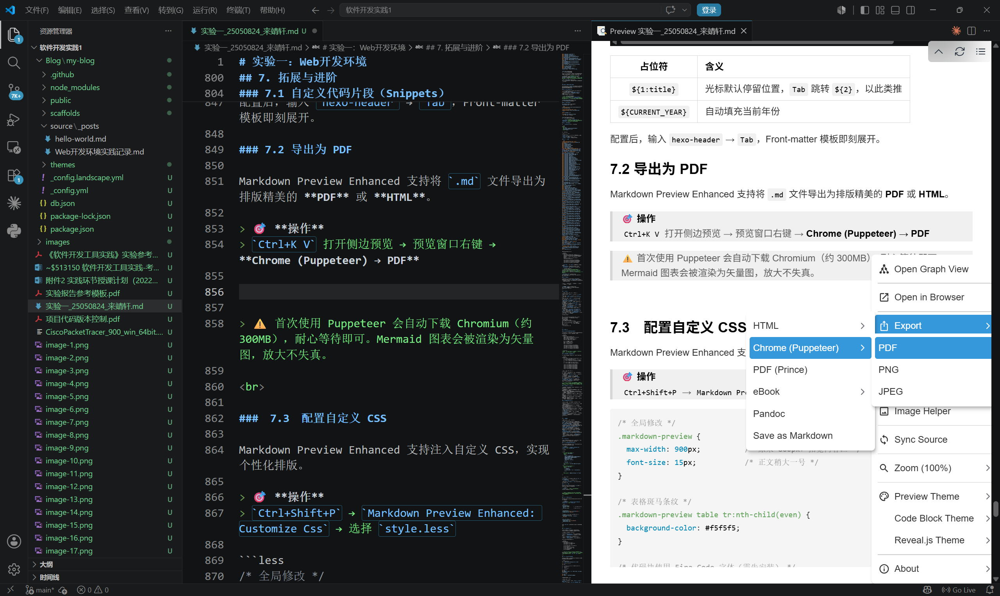
*△ 图 22 · 使用Markdown Preview Enhanced扩展将markdown文件导出为PDF*

> ⚠️ 首次使用 Puppeteer 会自动下载 Chromium（约 300MB），耐心等待即可。Mermaid 图表会被渲染为矢量图，放大不失真。

---

### 7.3 配置自定义 CSS

Markdown Preview Enhanced 支持注入自定义 CSS，实现个性化排版。

> 🎯 **操作**
> `Ctrl+Shift+P` → `Markdown Preview Enhanced: Customize Css` → 选择 `style.less`

```less
/* 全局修改 */
.markdown-preview {
  max-width: 900px;          /* 原来 860px，拓宽内容区 */
  font-size: 15px;           /* 正文稍大一号 */
}

/* 表格斑马条纹 */
.markdown-preview table tr:nth-child(even) {
  background-color: #f5f5f5;
}

/* 代码块使用 Fira Code 字体（需先安装） */
.markdown-preview code {
  font-family: 'Fira Code', 'Consolas', monospace;
}

/* H2 标题加底部横线 */
.markdown-preview h2 {
  border-bottom: 2px solid #0366d6;
  padding-bottom: 6px;
}
```
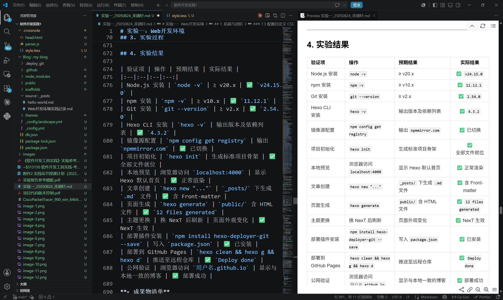
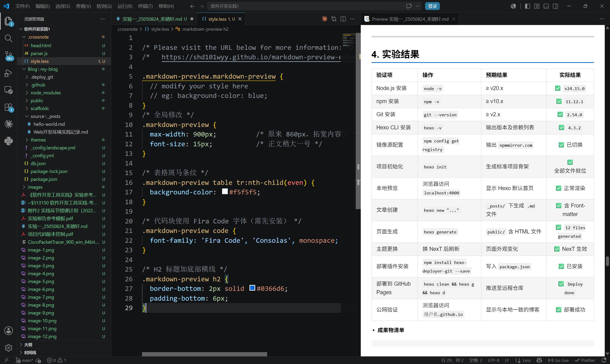
*△ 图 23 图 24 · 注入自定义CSS后排版的前后对比*

保存 `style.less` 后预览窗口自动刷新 —— 排版即时生效。

---

### 7.4 Mermaid 流程图

本报告中已大量使用的 Mermaid 图表，Markdown Preview Enhanced **原生支持**，无需额外插件。

| 图表类型 | 语法块 | 典型用途 |
|:--:|:--:|:--:|
| 流程图 | `flowchart TD` | 步骤流程、决策分支 |
| 时序图 | `sequenceDiagram` | 请求响应过程、API 调用链 |
| 类图 | `classDiagram` | 软件架构、类关系 |
| 甘特图 | `gantt` | 项目排期 |
| 状态图 | `stateDiagram-v2` | 状态机、生命周期 |

示例 —— Hexo 站点访问时序图：

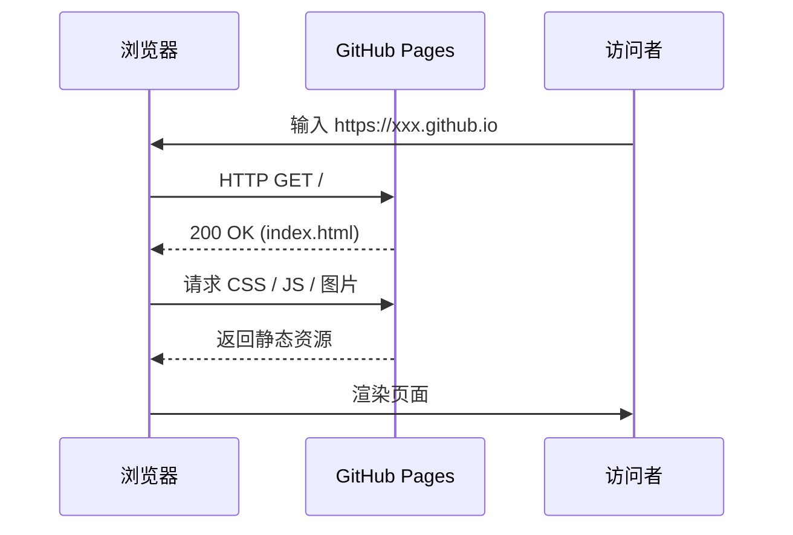
```mermaid
sequenceDiagram
    participant B as 浏览器
    participant S as GitHub Pages
    participant V as 访问者

    V->>B: 输入 https://xxx.github.io
    B->>S: HTTP GET /
    S-->>B: 200 OK (index.html)
    B->>S: 请求 CSS / JS / 图片
    S-->>B: 返回静态资源
    B->>V: 渲染页面
```

> ✨ 相比 Visio 或 Draw.io，Mermaid 的核心优势是**文本即图表** —— 图表源码和 Markdown 作为同一个文件版本管理，无需维护额外的 `.vsdx` 或 `.png` 附件。

---

## 8. 心得体会

说实话，这个实验做完最大的感受就是——看起来简单的事情，自己动手的时候才会发现全是坑。装 Node.js、装 Git、敲几条命令、最后访问一个网页，听起来撑死了半小时。实际我从配镜像源开始就卡住了——`npm install` 那个进度条像是被冻住一样，查了一圈才发现默认源连的是美国服务器。切到国内镜像之后速度直接翻了十倍，那一刻真的很直观地理解了什么叫「网络基础设施差异」。然后是 GitHub 部署，HTTPS 被校园网封了 443 端口，换 SSH 折腾了半天密钥，推到一半又断连，反复试了五六次才看到那行 `Deploy done: git`——页面上终于蹦出来自己搭的博客，那种感觉确实挺爽的。

回过头想，这套工具链里每一层——Node.js、npm、Git、Hexo——几乎都是开源社区的产物，全球的开发者无偿维护了几十年。我一个学生敲几行命令就能让全世界的人访问我的网站，放在二十年前得租服务器、配 Apache、买域名，门槛高到普通人根本迈不过去。这是开源运动真正了不起的地方。但这同时也让人有点不安：整条链子最核心的环节——npm registry——服务器全在国外。如果哪天它真断了，国内成千上万的项目构建就会直接瘫痪，「left-pad 事件」就是前车之鉴。技术依赖这件事，舒适的时候没人当回事，出事的时候才明白什么叫受制于人。

