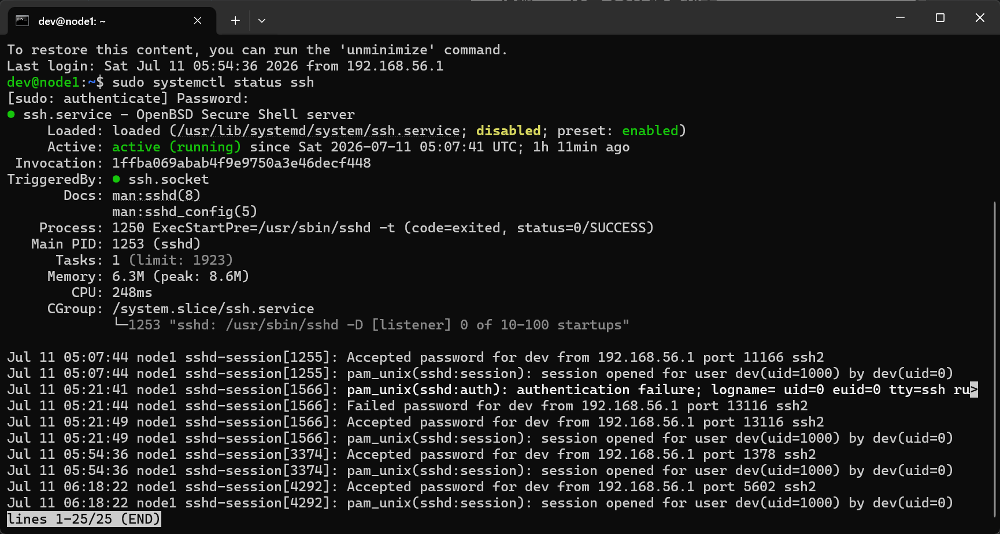
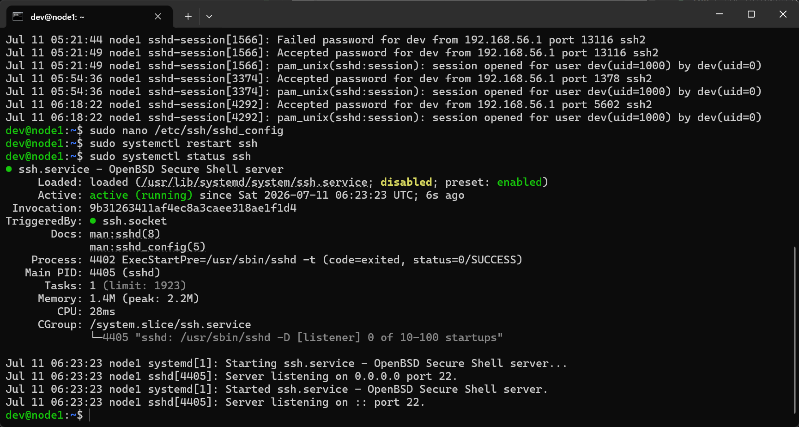
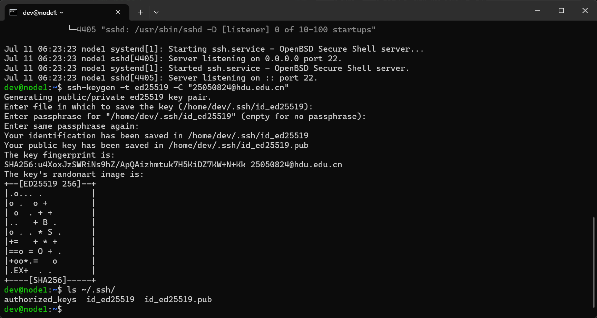
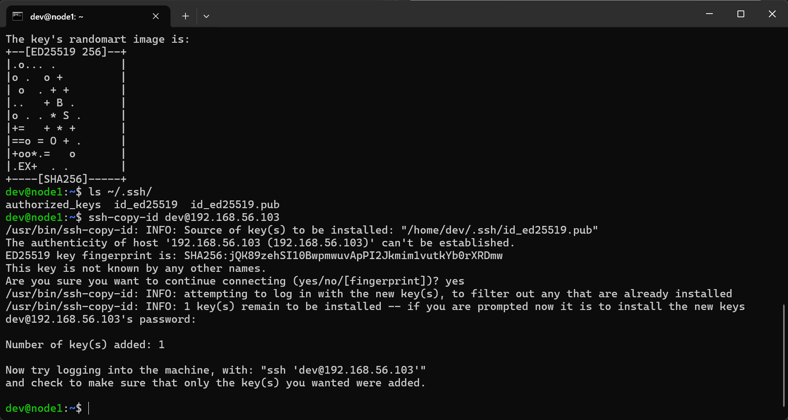
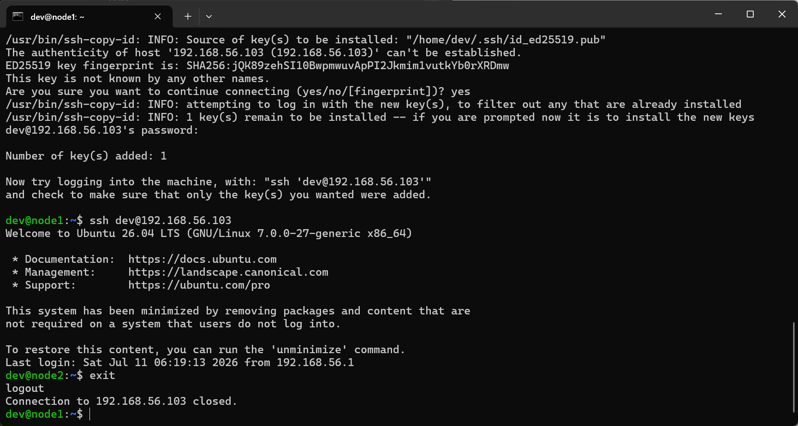
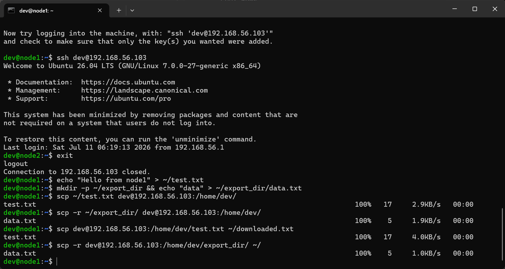
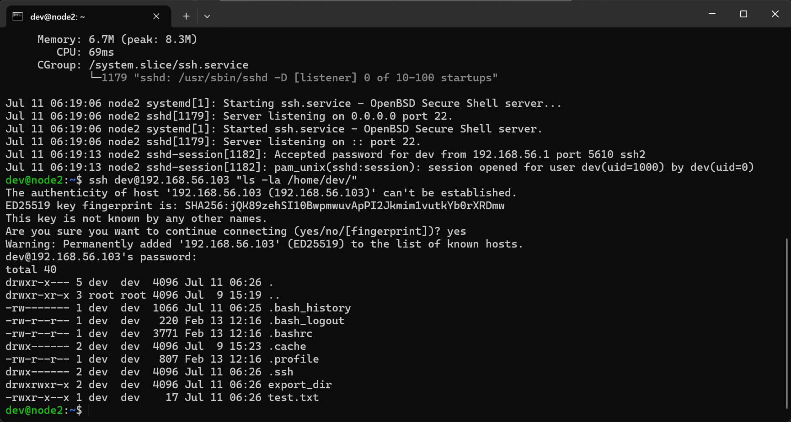
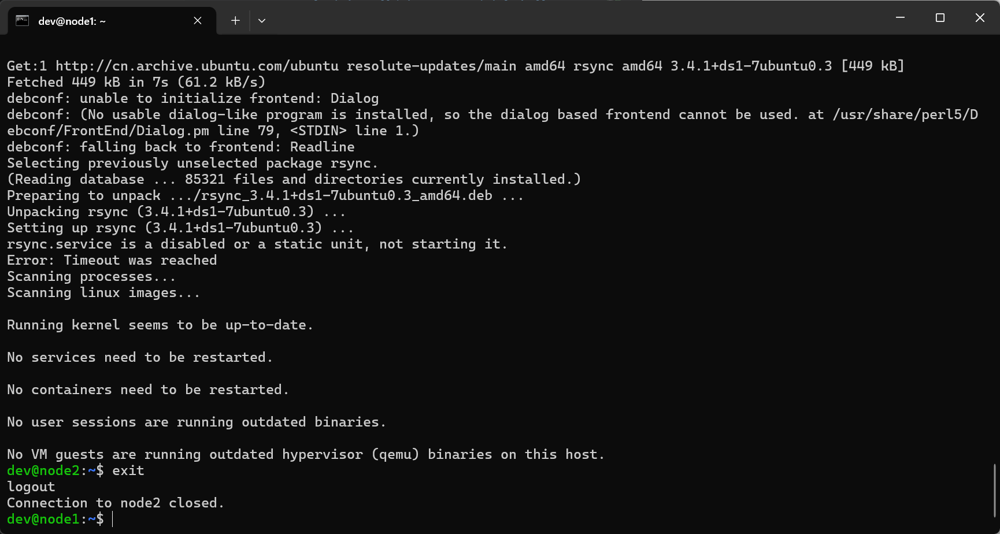
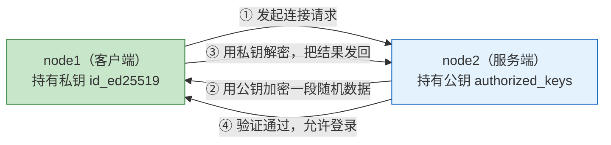

# 实验七：远程登录管理
> **姓名**：来靖轩 **学号**：25050824 **完成日期**：2026年7月11日

---

## 1. 实验目的

1. 安装和配置 OpenSSH 服务，实现多机之间的远程登录管理
2. 配置 SSH 密钥认证，实现免密登录
3. 了解多机开发环境下的账户管理方法
4. 掌握使用 SCP 和 rsync 进行跨机文件传输与同步

---

## 2. 实验环境

| 项目 | 配置 |
|:---:|:---:|
| 宿主机操作系统 | Windows 11 家庭中文版 25H2 |
| 虚拟机操作系统 | Ubuntu Server 26.04 LTS |
| 网络 | Host-Only 私网 192.168.56.0/24 |
| 实验节点 | node1（192.168.56.102）、node2（192.168.56.103） |
| SSH 客户端 | Windows 自带 OpenSSH 客户端 |

---

## 3. 实验过程

> 💡 本实验需要两台虚拟机（node1 和 node2）。**先在两个终端窗口分别 SSH 连入 node1 和 node2**，从头到尾对着做，看清楚每行命令前标注的执行位置：
>
> ```
> 📍 [node1]      → 在 node1（192.168.56.102）的终端里敲
> 📍 [node2]      → 在 node2（192.168.56.103）的终端里敲
> 📍 [node1→node2]→ 在 node1 上敲，命令会通过 SSH 作用于 node2
> 📍 [宿主机]      → 在 Windows PowerShell / CMD 里敲
> ```
>
> `ssh dev@192.168.56.xxx` 连上后，按步骤往下走即可。

---

### 第一部分：SSH 服务安装与基础配置

---

#### 步骤一　检查 SSH 服务状态

> 📍 在 **[node1]** 和 **[node2]** 上**分别**执行以下命令：

```bash
sudo systemctl status ssh            # 检查 SSH 服务状态
```

如果未安装（`Unit ssh.service could not be found`），执行：

```bash
sudo apt install openssh-server -y   # 安装 OpenSSH 服务端
sudo systemctl enable ssh            # 设置开机自启
sudo systemctl start ssh             # 立即启动
```

> 实验三安装 Ubuntu 时已勾选 "Install OpenSSH server"，正常情况下 node1 和 node2 都已装好。


*△ 图 1 · systemctl status ssh 检查 SSH 服务运行状态*

---

#### 步骤二　配置 SSH 服务器

编辑 SSH 服务端配置文件：

> 📍 在 **[node1]** 上执行（node2 也同样配置）：

```bash
sudo nano /etc/ssh/sshd_config
```

关键配置项及其含义：

| 配置项 | 推荐值 | 含义 |
|:--:|:--:|:--:|
| `Port 22` | `22`（默认） | SSH 监听端口 |
| `PermitRootLogin` | `no` | 禁止 root 直接通过 SSH 登录（安全加固） |
| `PubkeyAuthentication` | `yes` | 允许使用公钥认证 |
| `PasswordAuthentication` | `yes` | 允许使用密码认证（密钥配好之后可改为 `no`） |

修改完成后重启服务：

> 📍 在 **[node1]** 上执行：

```bash
sudo systemctl restart ssh
sudo systemctl status ssh            # 确认仍为 active (running)
```

> `PermitRootLogin no` 是安全最佳实践：即使 root 密码泄露，攻击者也无法通过 SSH 直接获得 root Shell，必须先以普通用户登录再 `sudo` 提权。


*△ 图 2 · nano 编辑 sshd_config + 重启 SSH 服务生效*

---

### 第二部分：SSH 密钥认证配置

SSH 支持两种认证方式：

| 认证方式 | 原理 | 安全性 | 适用场景 |
|:--:|:--:|:--:|:--:|
| 密码认证 | 每次登录输入密码 | 较低（可暴力破解） | 临时访问 |
| 密钥认证 | 使用公钥 / 私钥对验证身份 | 高（2048+ 位非对称加密） | 日常管理、自动化脚本 |

---

#### 步骤三　生成 SSH 密钥对

> 📍 在 **[node1]** 上执行：

```bash
ssh-keygen -t ed25519 -C "25050824@hdu.edu.cn"
# 一路回车（使用默认路径 ~/.ssh/id_ed25519，不设密码短语）

ls ~/.ssh/
# 应看到两个文件：
# id_ed25519      → 私钥（绝不要分享、不要上传 GitHub）
# id_ed25519.pub  → 公钥（可以安全地分发到任何你想登录的服务器）
```

| 选项 | 含义 |
|:--:|:--|
| `-t ed25519` | 使用 Ed25519 算法（比 RSA 更快更安全，现代 SSH 推荐） |
| `-C "注释"` | 给公钥加备注，方便区分"这把钥匙是谁的" |

> Ed25519 vs RSA：Ed25519 密钥长度仅 256 位，安全性等价于 RSA 3072 位，但生成和验证速度快 10 倍以上。2026 年 Ed25519 已是 SSH 密钥的默认推荐算法。


*△ 图 3 · ssh-keygen 生成 Ed25519 密钥对 + ls ~/.ssh/ 确认文件*

---

#### 步骤四　将公钥复制到远程服务器

**方法一（推荐）：`ssh-copy-id`**

> 📍 在 **[node1]** 上执行，把公钥推送到 node2：

```bash
ssh-copy-id dev@192.168.56.103      # 把公钥拷贝到 node2
# 输入 node2 上 dev 用户的密码（这是最后一次输密码）
```

`ssh-copy-id` 背后做了三件事：登录远程主机 → 把公钥追加到 `~/.ssh/authorized_keys` → 自动设好文件权限。

**方法二（手动）：**

> 📍 先在 **[node1]** 查看公钥，再切换到 **[node2]** 手动写入：

```bash
# 在 node1 上查看公钥内容
cat ~/.ssh/id_ed25519.pub
```

复制输出内容，然后切换到 **node2** 的终端：

```bash
mkdir -p ~/.ssh
echo "粘贴公钥内容" >> ~/.ssh/authorized_keys
chmod 600 ~/.ssh/authorized_keys     # 权限必须是 600，否则 SSH 拒绝使用
chmod 700 ~/.ssh                     # .ssh 目录必须是 700
```

> `authorized_keys` 权限必须严格为 `600`（仅 owner 可读写），`.ssh` 目录必须为 `700`（仅 owner 可读写执行）。权限过宽会让 SSH 认为文件可能被篡改而拒绝使用——这是最常见的"配了密钥仍然要密码"的原因。


*△ 图 4 · ssh-copy-id 拷贝公钥到 node2*

---

#### 步骤五　测试免密登录

> 📍 在 **[node1]** 上执行，SSH 连接 node2：

```bash
ssh dev@192.168.56.103              # 应无需输入密码，直接登录
# 或者用主机名（前提：/etc/hosts 已配置）
ssh dev@node2
```

成功免密登录后先 `exit` 回到 node1：

```bash
exit
```

> 此时从 node1 SSH 到 node2 已免密，但反向（node2 → node1）仍需密码。双向免密需要在 node2 上也生成密钥对并 `ssh-copy-id` 到 node1。本实验只需 node1 → node2 单向免密。


*△ 图 5 · ssh dev@node2 免密登录成功 + exit 退出*

---

### 第三部分：文件传输

| 工具 | 特点 | 适用场景 |
|:--:|:--|:--:|
| SCP | 基于 SSH 的简单复制，`cp` 命令的远程版 | 一次性、少量文件传输 |
| rsync | 增量同步，只传输变化的部分 | 目录同步、定期备份、部署 |

---

#### 步骤六　使用 SCP 传输文件

> 📍 上传/下载命令在 **[node1]** 上执行，最后验证在 node1 上远程查看 node2：

```bash
# 在 node1 上创建测试文件
echo "Hello from node1" > ~/test.txt
mkdir -p ~/export_dir && echo "data" > ~/export_dir/data.txt

# 上传单个文件（node1 → node2）
scp ~/test.txt dev@192.168.56.103:/home/dev/

# 上传整个目录（-r 递归）
scp -r ~/export_dir/ dev@192.168.56.103:/home/dev/

# 下载文件（node2 → node1）
scp dev@192.168.56.103:/home/dev/test.txt ~/downloaded.txt

# 下载整个目录
scp -r dev@192.168.56.103:/home/dev/export_dir/ ~/
```

| 选项 | 含义 |
|:--:|:--|
| `-r` | 递归传输目录 |
| `-P 端口` | 指定 SSH 端口（非默认 22 时使用） |
| `-v` | 显示详细传输过程（排查问题时用） |

在 node2 上验证文件已到达：

```bash
ssh dev@192.168.56.103 "ls -la /home/dev/"
```



*△ 图 6 图 7 · scp 上传文件 + 下载文件 + 远程验证*

---

#### 步骤七　使用 rsync 同步文件

`rsync` 的核心卖点是**增量同步**——第二次同步时，只传输改动过的文件，已存在且未变的直接跳过。

```bash
# 安装 rsync —— 先在 node1 上装，再通过 SSH 在 node2 上装
sudo apt install rsync -y
ssh dev@192.168.56.103 "sudo apt install rsync -y"

# 创建测试数据
mkdir -p ~/project/src ~/project/docs
echo "main code" > ~/project/src/main.py
echo "readme content" > ~/project/docs/readme.md
echo "temp log" > ~/project/temp.log

# 推送到远程（同步整个 project 目录到 node2）
rsync -avz -e ssh ~/project/ dev@192.168.56.103:/home/dev/project/

# 从远程拉取
mkdir -p ~/logs
rsync -avz -e ssh dev@192.168.56.103:/home/dev/logs/ ~/logs/

# 保持完全一致（--delete：目标中多出的文件会被删掉）
rsync -avz --delete -e ssh ~/project/ dev@192.168.56.103:/home/dev/project/

# 排除特定文件（不同步日志和临时文件）
rsync -avz --exclude='*.log' --exclude='tmp/' -e ssh ~/project/ dev@192.168.56.103:/home/dev/project/
```

| 选项 | 含义 |
|:--:|:--|
| `-a` | 归档模式（保留权限、时间戳、软链接等） |
| `-v` | 显示传输详情 |
| `-z` | 传输时压缩（节省带宽） |
| `-e ssh` | 走 SSH 加密通道 |
| `--delete` | 目标端多出的文件会被删除（镜像同步） |
| `--exclude` | 排除匹配模式的文件/目录 |


*△ 图 8 · rsync 推送 + 拉取 + 排除 + --delete 镜像同步*

---

## 4. 实验结果

| 验证项 | 关键命令 | 预期结果 | 实际结果 |
|:--:|:--:|:--:|:--:|
| SSH 服务状态 | `systemctl status ssh` | `active (running)` | ✅ 正常 |
| 修改 sshd 配置 | 编辑 `/etc/ssh/sshd_config` → `sudo systemctl restart ssh` | 配置持久化 | ✅ 正常 |
| 生成密钥对 | `ssh-keygen -t ed25519` | `~/.ssh/` 下出现公私钥 | ✅ 正常 |
| 分发公钥 | `ssh-copy-id dev@192.168.56.103` | 公钥写入 node2 | ✅ 正常 |
| 免密登录 | `ssh dev@192.168.56.103` | 无需密码直接登录 | ✅ 正常 |
| SCP 上传 | `scp file dev@192.168.56.103:/home/dev/` | node2 上出现 file | ✅ 正常 |
| SCP 下载 | `scp dev@192.168.56.103:/path/file ./` | 本地出现 file | ✅ 正常 |
| rsync 推送 | `rsync -avz -e ssh dir/ dev@...:dir/` | 远端目录同步 | ✅ 正常 |
| rsync 排除 | `--exclude='*.log'` | 日志文件不同步 | ✅ 正常 |

---

## 5. 知识总结

### 5.1 SSH 密钥认证流程



整个过程私钥从未离开 node1，安全性高于密码认证。

### 5.2 关键文件与权限

| 文件 | 位置 | 必须权限 | 内容 |
|:--|:--|:--|:--|
| 私钥 | `~/.ssh/id_ed25519` | `600` | 绝不可分享 |
| 公钥 | `~/.ssh/id_ed25519.pub` | `644` | 可以安全分发 |
| 授权密钥列表 | `~/.ssh/authorized_keys` | `600` | 存放允许登录的公钥 |
| SSH 配置 | `~/.ssh` 目录 | `700` | |

> 权限过宽时 SSH 直接 ignore 密钥文件——这是免密失败的第一大原因。

### 5.3 scp vs rsync 选用指南

| | scp | rsync |
|:--|:--|:--|
| 适合场景 | 一次性传几个文件 | 定期备份、部署同步 |
| 增量传输 | 不支持 | 支持（第二次起只传变化部分） |
| 排除文件 | 不支持 | 支持 `--exclude` |
| 删除多余文件 | 不支持 | 支持 `--delete` |
| 命令复杂度 | 简单 | 选项较多 |

---

## 6. 出现问题

| 问题 | 现象 | 原因 | 解决方案 |
|:--:|:--:|:--:|:--:|
| `ssh: command not found` | 客户端无法执行 ssh | SSH 客户端未安装 | `sudo apt install openssh-client` |
| `Connection refused` | 连接被拒绝 | SSH 服务未运行 | `sudo systemctl start ssh` |
| `Permission denied` | 登录被拒绝 | 密码错误或密钥未配置 | 检查用户名密码；检查 `authorized_keys` |
| 配置免密后仍需密码 | 公钥已分发但 `ssh` 仍提示输密码 | `authorized_keys` 或 `.ssh` 目录权限不对 | `chmod 600 ~/.ssh/authorized_keys`；`chmod 700 ~/.ssh` |
| `rsync: command not found` | rsync 命令不存在 | 未安装 rsync | `sudo apt install rsync -y`（两台都要装） |
| `ssh-copy-id` 报端口错 | `ssh-copy-id: connect to host port 22` | SSH 端口不是默认 22 | 查询实际端口后 `ssh-copy-id -p 端口号 user@host` |

---

## 7. 心得体会

实验七是实验三到实验六的能力"串联点"——之前配的 IP、装的 SSH、写的 hosts 解析，全在为这一步铺路。当我在 node1 上敲下 `ssh dev@node2` 然后瞬间连进去，连密码都没问的时候，突然理解了为什么运维工程师整天抱着终端不放——这种"一键抵达任意节点"的感觉确实爽。

scp 和 rsync 的区别也很有意思。scp 像快递——每次都把整个包裹重新寄一遍；rsync 像仓库盘点——只补缺的和变了的。传几个小文件时 scp 简单粗暴够用，但目录一大、频率一高，rsync 省下来的时间就是指数级的。这个"增量思维"不只用在同步文件上，所有大规模系统设计里都能看到它的影子。
