# 实验三：虚拟机安装与配置
> **姓名**：来靖轩 **学号**：25050824 **完成日期**：2026年7月10日

---

## 1. 实验目的

1. 安装并配置 **Oracle VirtualBox** 虚拟化软件，理解宿主机与虚拟机的概念边界及 Hypervisor 的基本工作原理
2. 下载 **Ubuntu Server 26.04 LTS** 镜像并完成系统安装，掌握虚拟机硬件资源分配（CPU / 内存 / 硬盘）与双网卡（NAT + Host-Only）网络拓扑的配置方法
3. 通过 **Netplan** 配置静态 IP 地址，编辑 `/etc/hosts` 建立主机名解析，实现虚拟机之间及虚拟机与宿主机之间的网络互通
4. 利用 VirtualBox **完全克隆**技术，从模板机快速复制出 3 台节点（node1 / node2 / node3），构建一个四节点的虚拟化实验环境

---

## 2. 实验环境

| 项目 | 配置 |
|:---:|:---:|
| 操作系统 | Windows 11 家庭中文版 25H2 |
| 虚拟化软件 | Oracle VirtualBox |
| 虚拟机镜像 | Ubuntu Server 26.04 LTS (64-bit) |
| 网络模式 | NAT（适配器1）+ 仅主机 Host-Only（适配器2） |
| 私网网段 | 192.168.56.0/24 |
| 虚拟机内存 | 2048 MB |
| 虚拟机硬盘 | 20 GB（VDI 动态分配） |

**▸ 四节点虚拟化拓扑**

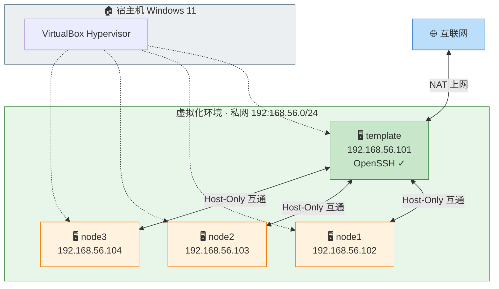
```mermaid
flowchart TB
    subgraph 宿主机["🏠 宿主机 Windows 11"]
        VBox["VirtualBox Hypervisor"]
    end

    subgraph 虚拟化环境["虚拟化环境 · 私网 192.168.56.0/24"]
        direction LR
        Template["🖥️ template<br/>192.168.56.101<br/>OpenSSH ✓"]
        Node1["🖥️ node1<br/>192.168.56.102"]
        Node2["🖥️ node2<br/>192.168.56.103"]
        Node3["🖥️ node3<br/>192.168.56.104"]
    end

    Internet["🌐 互联网"] <-->|"NAT 上网"| Template
    VBox -.-> Template
    VBox -.-> Node1
    VBox -.-> Node2
    VBox -.-> Node3

    Template <-->|"Host-Only 互通"| Node1
    Template <-->|"Host-Only 互通"| Node2
    Template <-->|"Host-Only 互通"| Node3

    style 宿主机 fill:#eceff1,stroke:#546e7a
    style 虚拟化环境 fill:#e8f5e9,stroke:#2e7d32
    style Template fill:#c8e6c9,stroke:#388e3c
    style Node1 fill:#fff3e0,stroke:#f57c00
    style Node2 fill:#fff3e0,stroke:#f57c00
    style Node3 fill:#fff3e0,stroke:#f57c00
    style Internet fill:#bbdefb,stroke:#1565c0
```

---

## 3. 实验过程

### 步骤一 下载与安装 VirtualBox

1. 浏览器访问 [https://www.virtualbox.org/](https://www.virtualbox.org/)，点击 **"Download VirtualBox"** → 选择 **Windows hosts**，下载最新版本安装包
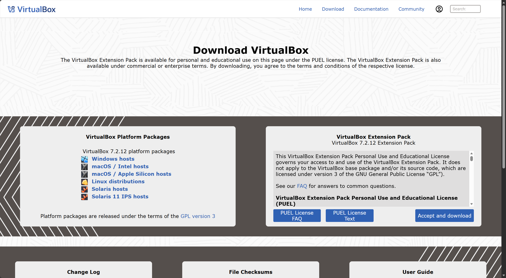
*△ 图 1 · VirtualBox下载界面*

1. 双击安装包启动安装向导，全部保持默认选项，一路 *"Next"* 至完成
2. 安装过程中网络会短暂中断（VirtualBox 会安装虚拟网卡驱动），这是正常现象
3. 安装完毕后**建议重启电脑**，确保虚拟网卡驱动完全生效

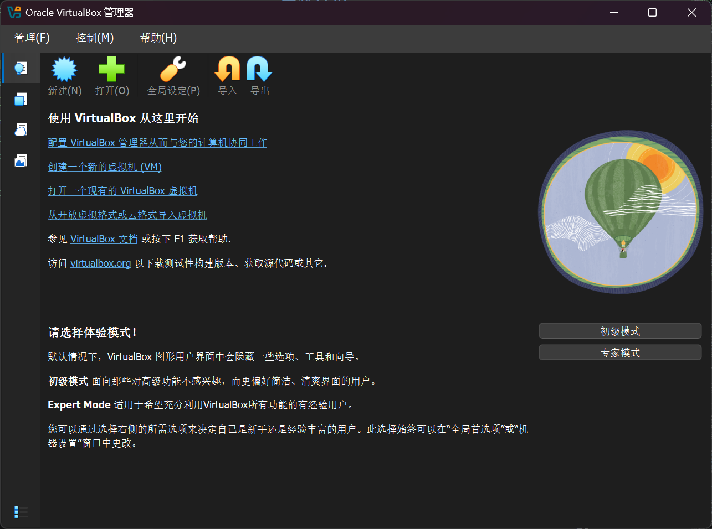
*△ 图 2 · VirtualBox 安装完成，首次启动主界面*

> ⚠️ 若启动虚拟机时报 `VT-x/AMD-V 未启用`，需重启进入 BIOS → 找到 *Virtualization Technology* 选项 → 设为 **Enabled**。AMD CPU 显示为 SVM Mode。

---

### 步骤二 下载 Ubuntu Server ISO 镜像

访问 [https://ubuntu.com/download/server](https://ubuntu.com/download/server) → 下载 **Ubuntu Server 26.04 LTS** 的 ISO 镜像文件（约 2GB）。LTS 代表 *Long Term Support*，提供 5 年安全更新，适合作为稳定的实验基础环境。

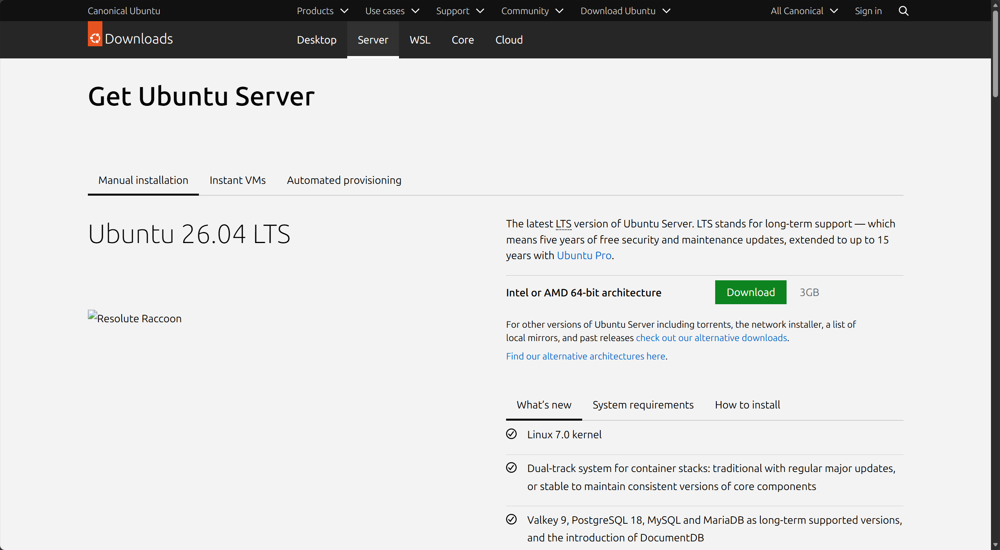
*△ 图 3 · Ubuntu下载界面*

---

### 步骤三 创建第一台虚拟机（模板机）

**3.1 新建虚拟机**

VirtualBox 主界面 → 点击 **"新建"**，按以下参数填写：

| 参数 | 值 | 说明 |
|:--|:--:|:--:|
| 名称 | `ubuntu-template` | 该机将作为克隆源，不再直接使用 |
| 文件夹 | 默认 | 虚拟机文件存放位置 |
| ISO 映像 | 选择下载的 Ubuntu Server ISO | 相当于虚拟光驱插入安装盘 |
| 类型 / 版本 | Linux / Ubuntu (64-bit) | |
| 跳过无人值守安装 | **勾选** | 我们手动安装以完全控制每步配置 |

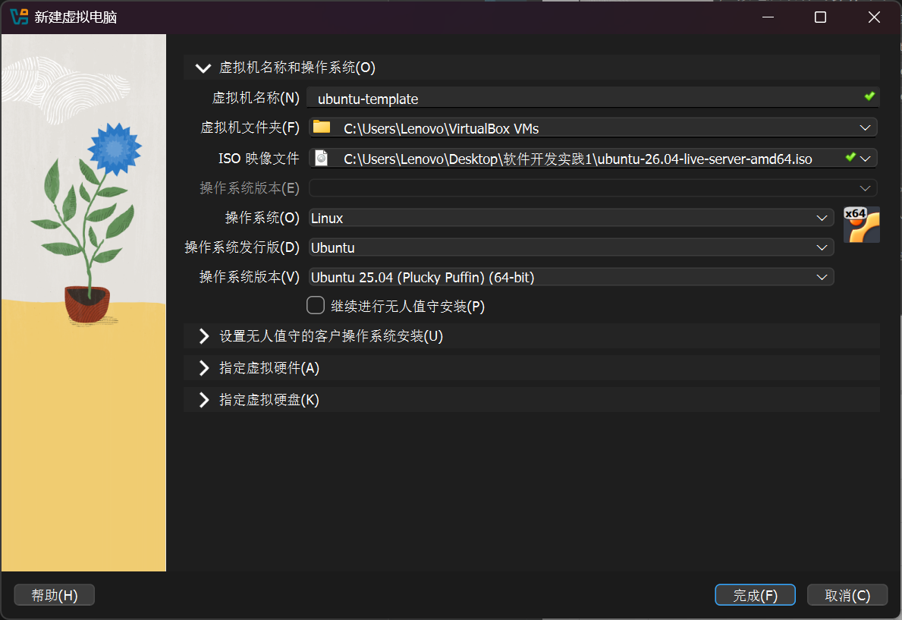

*△ 图 4 · 新建虚拟机配置界面*

---

**3.2 分配硬件资源**

| 参数 | 值 | 依据 |
|:--:|:--:|:--:|
| 内存 | 2048 MB | Ubuntu Server 无桌面环境，2GB 充裕 |
| CPU | 2 核 | 能流畅编译和并行操作 |
| 硬盘 | VDI 格式，动态分配，20 GB | 动态分配按实际用量占用宿主机磁盘，不预占 |

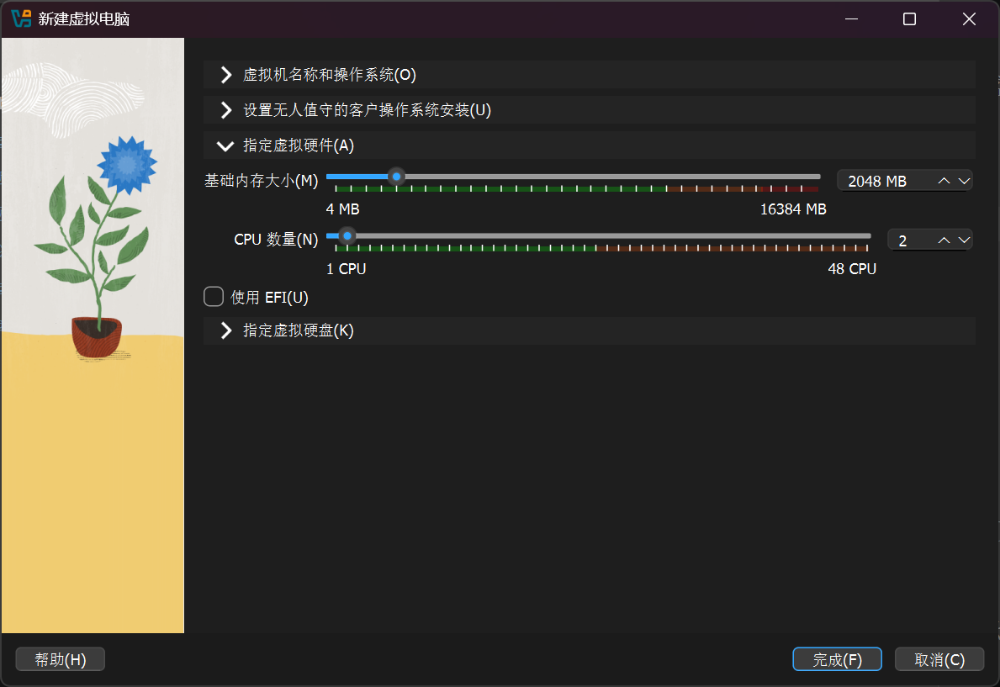
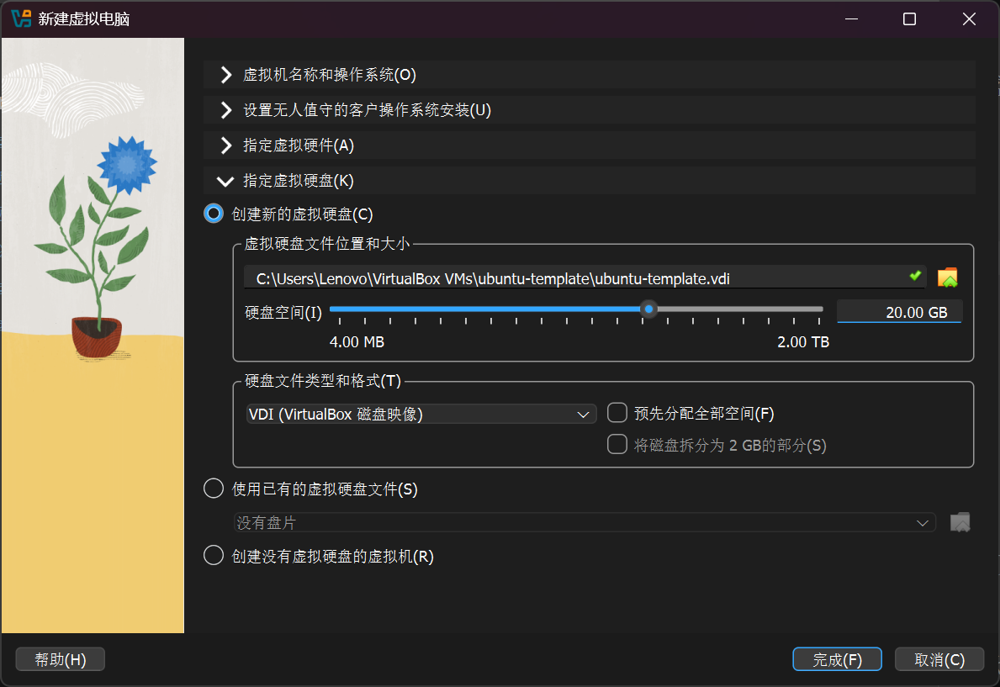
*△ 图 5 图 6 · 新建虚拟机配置界面*

---

**3.3 配置双网卡**

虚拟机设置 → **网络**：

| 适配器 | 连接方式 | 用途 |
|:--:|:--:|:--:|
| 适配器 1 | **NAT** | 虚拟机通过宿主机访问外网、安装软件 |
| 适配器 2 | **仅主机 (Host-Only) 适配器** | 虚拟机之间 + 宿主机之间私网互通 |

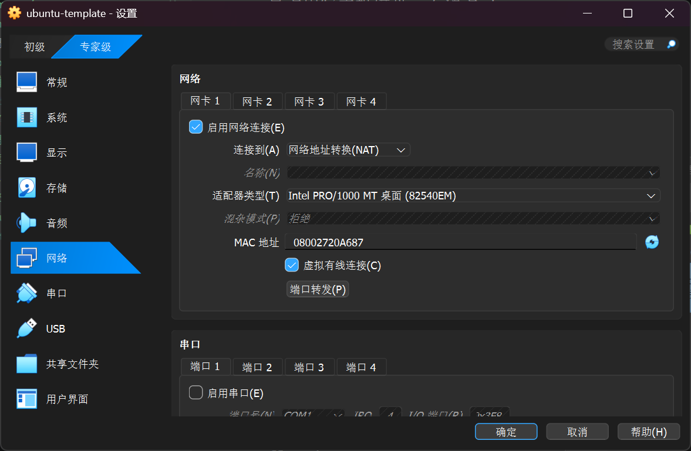
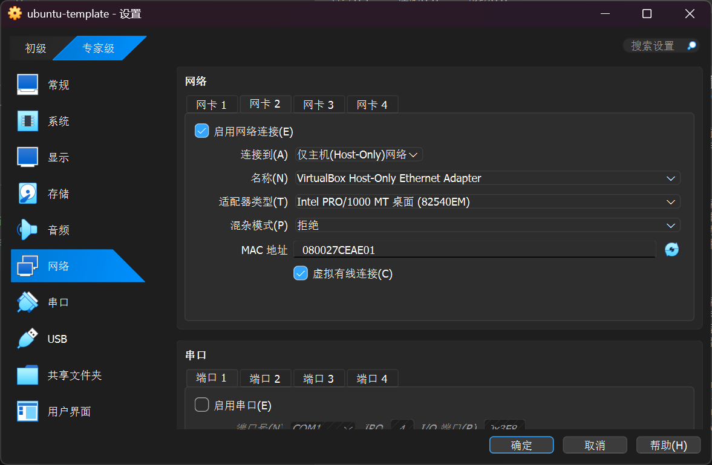

*△ 图 7 图 8 · 双网卡配置：适配器 1 为 NAT，适配器 2 为仅主机 (Host-Only) 适配器*

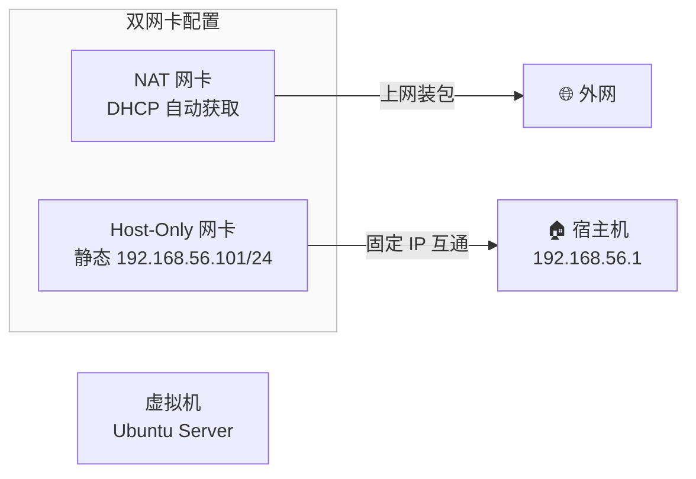
```mermaid
flowchart LR
    VM["虚拟机<br/>Ubuntu Server"]

    subgraph NIC["双网卡配置"]
        NAT["NAT 网卡<br/>DHCP 自动获取"]
        HostOnly["Host-Only 网卡<br/>静态 192.168.56.101/24"]
    end

    NAT -->|"上网装包"| Internet["🌐 外网"]
    HostOnly -->|"固定 IP 互通"| Host["🏠 宿主机<br/>192.168.56.1"]

    style NIC fill:#fafafa,stroke:#bdbdbd
```

> 💡 为什么用双网卡？**NAT** 让虚拟机上网装包；**Host-Only** 让虚拟机之间及与宿主机之间通过固定 IP 互通，不受宿主机物理网络切换（WiFi ↔ 有线）影响。

---

### 步骤四 安装 Ubuntu Server

**4.1 启动安装**

选中模板机 → **启动** → 按 `Enter` 进入安装流程。
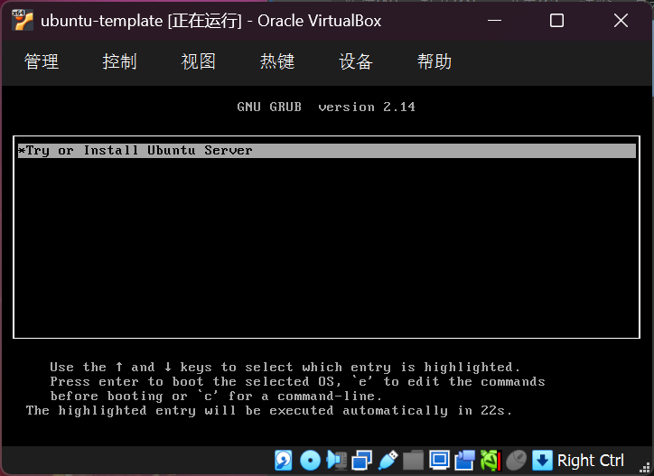
*△ 图 9 · 按下`Enter`启动模版机安装*

**4.2 各步骤选项**

| 步骤 | 选择 | 说明 |
|:--:|:--:|:--:|
| 语言 | English | 避免中文终端乱码 |
| 键盘布局 | English (US) | 标准美式键盘 |
| 安装类型 | Ubuntu Server (minimized) | 最小化安装，节省磁盘 |
| 网络连接 | DHCP 自动获取 | 安装时会自动通过 NAT 联网 |
| 代理 | 留空 | |
| 镜像源 | 默认 | |
| 磁盘分区 | Use an entire disk | 整盘使用，不设 LVM |
| 用户配置 | 自定义 | 参照下表 |
| SSH | **按空格勾选 Install OpenSSH server** | 🔥最关键的一步 |
| 附加软件 | 全部不选 | 后续按需安装 |

**用户配置：**

| 字段 | 值 |
|:--:|:--:|
| 用户名 | `dev` |
| 主机名 | `template` |
| 密码 | 自定义（6 位以上，不含用户名） |

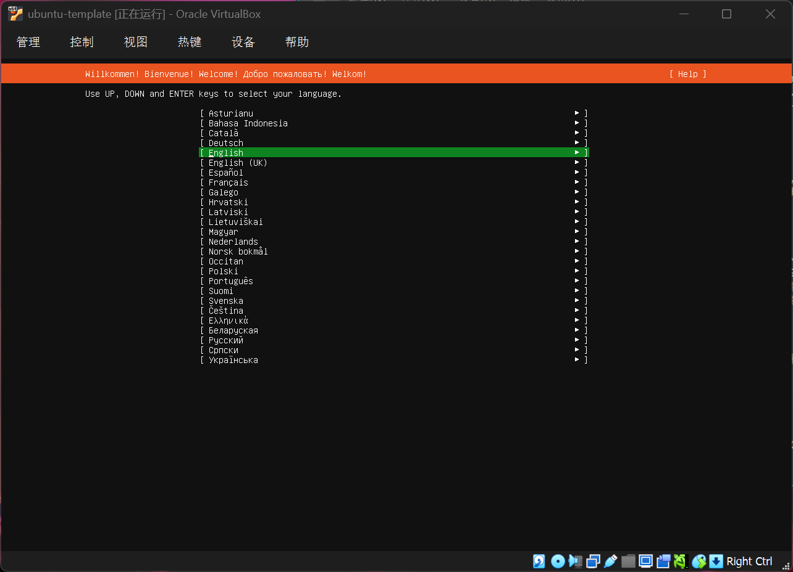
*△ 图 10 · 配置界面*

> 🔥 **务必勾选 OpenSSH server！** 实验七的远程管理完全依赖 SSH 服务。此处漏勾后续需手动 `sudo apt install openssh-server`。

安装完成后自动重启 → 看到 `template login:` 提示符 → 安装成功。

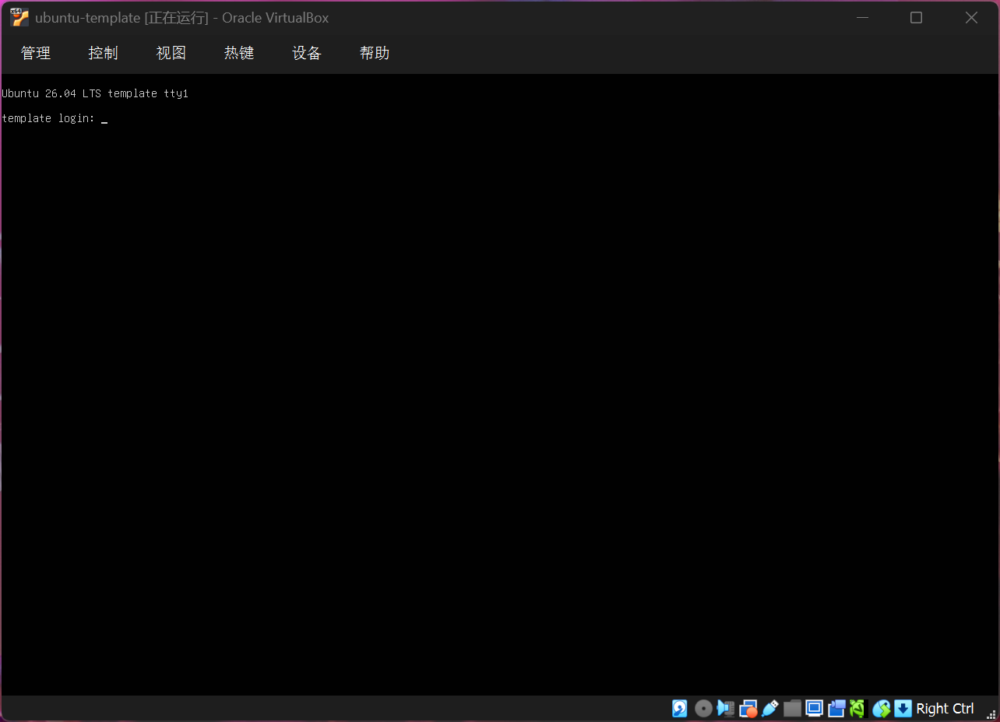
*△ 图 11 · Ubuntu Server 安装完成，出现 login 登录提示符*

> ⚠️ Ubuntu Server (minimized) 最小化安装**不含 `nano` 编辑器**和 **`ping` 命令**。后续步骤需要编辑配置文件和测试网络，先安装：
> ```bash
> sudo apt update
> sudo apt install nano iputils-ping -y
> ```

---

### 步骤五 配置静态 IP 地址

登录虚拟机后，编辑 Netplan 网络配置文件：

```bash
sudo nano /etc/netplan/50-cloud-init.yaml
```

修改为以下内容（MAC 地址用 `ip link show` 看到的真实值替换）：

```yaml
network:
  version: 2
  renderer: networkd
  ethernets:
    nat:
      match:
        macaddress: "08:00:27:0c:5d:66"           # NAT 网卡的 MAC
      dhcp4: yes
    lan:
      match:
        macaddress: "08:00:27:ec:42:e4"           # Host-Only 网卡的 MAC
      dhcp4: no
      addresses:
        - 192.168.56.101/24
      nameservers:
        addresses: [8.8.8.8, 114.114.114.114]
```

| 字段 | 含义 |
|:--:|:--:|
| `nat` / `lan` | 顶层标签，只是标识，可以随意取名 |
| `match: {macaddress: ...}` | 用 MAC 地址匹配网卡（绝对唯一，避免 altname 导致匹配失败） |
| `dhcp4: yes` | NAT 网卡自动获取 IP，无需手动管理 |
| `dhcp4: no` + `addresses` | Host-Only 网卡手动指定静态 IP `/24` |
| `nameservers` | DNS 服务器（Google `8.8.8.8` + 国内 `114.114.114.114`） |

应用配置：

```bash
sudo chmod 600 /etc/netplan/50-cloud-init.yaml
sudo netplan apply
```

验证：

```bash
ip addr show enp0s8        # 应显示 192.168.56.101/24
ping -c 3 8.8.8.8           # 外网连通性
ping -c 3 192.168.56.1      # 宿主机连通性
```

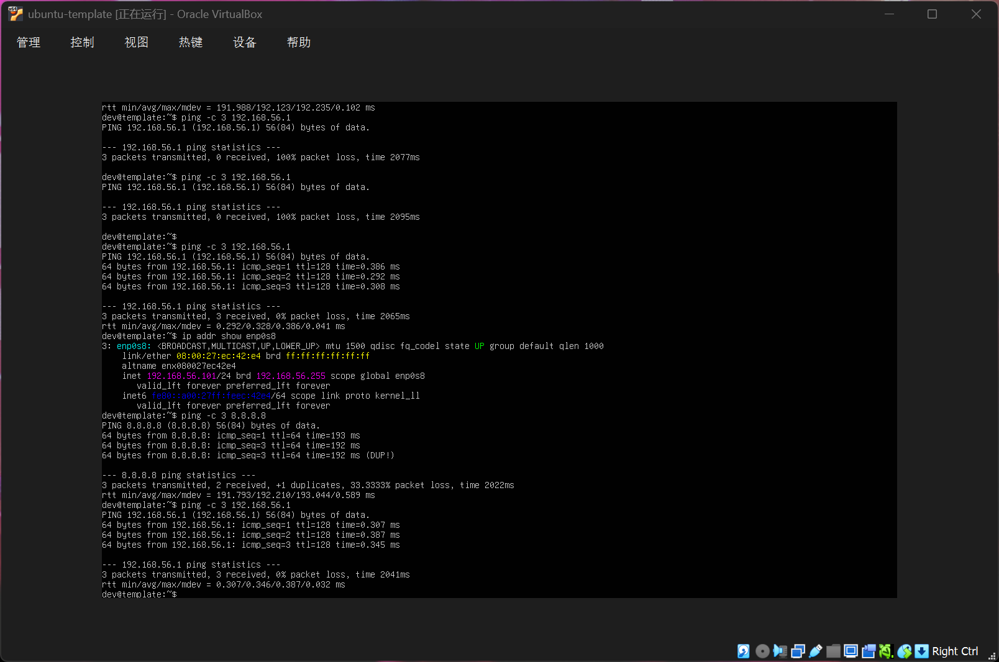
*△ 图 12 · Netplan 静态 IP 配置生效 — ip addr 验证 + 外网与宿主机 ping 通*

---

### 步骤六 配置主机名与 hosts 解析

```bash
sudo hostnamectl set-hostname template

sudo nano /etc/hosts
```

在文件末尾添加四台机器的映射：

```
192.168.56.101  template
192.168.56.102  node1
192.168.56.103  node2
192.168.56.104  node3
```

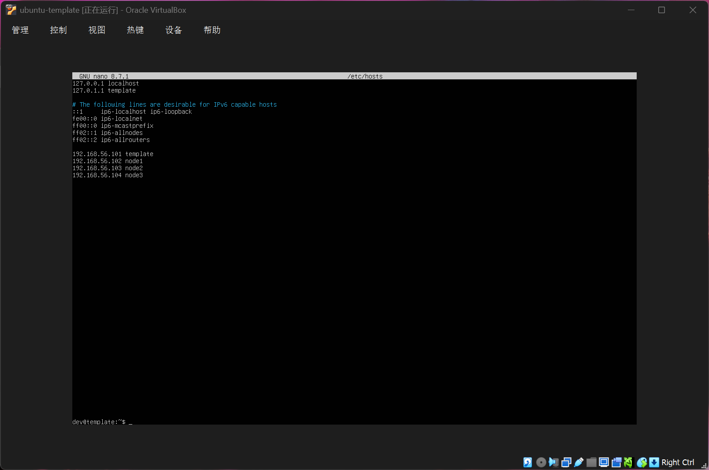
*△ 图 13 · /etc/hosts 文件编辑完成 — 四台机器的 IP → 主机名映射*

> 💡 提前把尚未创建的 node1~3 写进 hosts 是为了克隆后每台机器都能用主机名互访 —— `ping node2` 比 `ping 192.168.56.103` 直观得多。

---

### 步骤七 克隆虚拟机

**7.1 关闭模板机**

```bash
sudo shutdown now
```

---

**7.2 克隆**

VirtualBox 主界面 → 右键 `ubuntu-template` → **"克隆"** → 关键选项：

| 选项 | 选择 | 原因 |
|:--:|:--:|:--:|
| 名称 | `node1` / `node2` / `node3` | |
| 克隆类型 | **完全克隆** | 每台独立的虚拟硬盘，互不影响 |
| MAC 地址策略 | **重新初始化所有网卡的 MAC 地址** | 🔥 否则所有克隆机 MAC 相同，网络瘫痪 |

依次克隆出 `node1`、`node2`、`node3`。

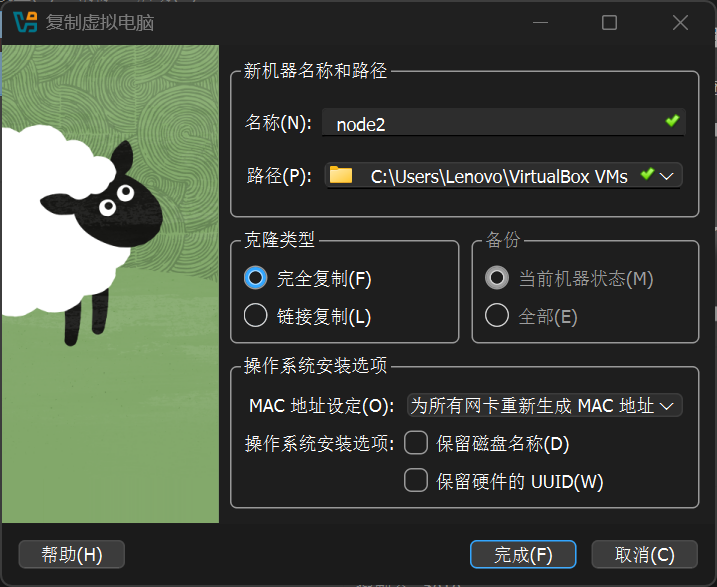
*△ 图 14 · 克隆虚拟机 — 完全克隆 + 重新初始化 MAC 地址*

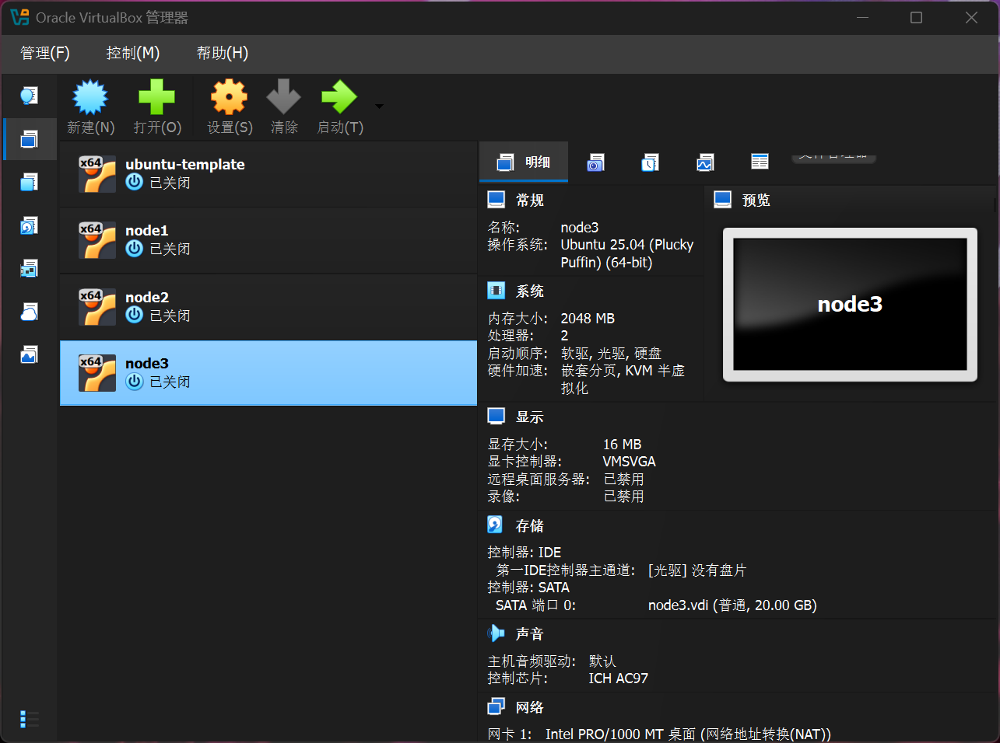
*△ 图 15 · 四节点就绪 — VirtualBox 虚拟机列表*

> ⚠️ 选择**完全克隆**而非"链接克隆"。链接克隆依赖原始磁盘，删掉模板机会让所有克隆机无法启动。完全克隆生成独立副本，安全、可迁移。

---

### 步骤八 修改克隆机的主机名和 IP

对每台克隆机分别执行。以 node1 为例：

> 💡 模板机 IP 配好后，建议在宿主机 PowerShell / CMD 里 `ssh dev@192.168.56.101` 连上虚拟机操作，命令可以直接从报告里复制粘贴，省去在 VirtualBox 小窗口里手打。

**1. 登录后先看网卡的真实 MAC 地址：**

```bash
ip link show
```

输出示例（每台克隆机的 MAC 都不同，以你实际看到的为准）：

```
2: enp0s9: <...> state DOWN ... link/ether 08:00:27:xx:xx:xx ...
    altname enx080027xxxxxxxx
3: enp0s8: <...> state UP   ... link/ether 08:00:27:xx:xx:xx ...
    altname enx080027xxxxxxxx
```

记下两张网卡各自的 `link/ether` 后面的 MAC 地址：
- `state DOWN` 的是 NAT 网卡
- `state UP` 的是 Host-Only 网卡

---

**2. 修改主机名：**

```bash
sudo hostnamectl set-hostname node1
exit                          # 退出登录，重新 SSH 连入即可看到前缀变为 node1
```

---

**3. 清理可能残留的多余 netplan 配置文件：**

```bash
ls /etc/netplan/
```

如果存在多个 `.yaml` 文件（如 `00-installer-config.yaml`），只保留一个，其余删掉：

```bash
sudo rm /etc/netplan/00-installer-config.yaml    # 示例，以实际看到的为准
```

> netplan 会合并该目录下所有 yaml 文件，残留的旧配置可能仍引用失效的接口名导致匹配报错。

---

**4. 编辑 netplan，用 MAC 地址匹配（彻底避开 altname 问题）：**

```bash
sudo nano /etc/netplan/50-cloud-init.yaml
```

```yaml
network:
  version: 2
  renderer: networkd
  ethernets:
    nat:
      match:
        macaddress: "08:00:27:xx:xx:xx"       # NAT 网卡的 MAC（state DOWN 那张）
      dhcp4: yes
    lan:
      match:
        macaddress: "08:00:27:xx:xx:xx"       # Host-Only 网卡的 MAC（state UP 那张）
      dhcp4: no
      addresses:
        - 192.168.56.102/24     # node2→103，node3→104
      nameservers:
        addresses: [8.8.8.8, 114.114.114.114]
```

> 顶层键名 `nat` / `lan` 只是标签，可以随便取名。用了 `match: {macaddress: ...}` 之后 netplan 只看 MAC 地址，不管接口名是 enp0s8 还是 enp0s9 还是有什么 altname，通通没问题。

---

**5. 应用配置：**

```bash
sudo chmod 600 /etc/netplan/50-cloud-init.yaml
sudo netplan apply
```

---

**6. 更新 /etc/hosts，确保四台机器都有主机名解析：**

```bash
sudo nano /etc/hosts
```

在末尾追加（如果已有则跳过）：

```
192.168.56.101  template
192.168.56.102  node1
192.168.56.103  node2
192.168.56.104  node3
```

---

**7. 验证：**

```bash
ip addr                           # 确认 Host-Only 网卡拿到了 192.168.56.102/24
ping -c 3 8.8.8.8                 # 外网（确认 NAT 网卡没丢）
```

node2、node3 照搬上述流程，区别只有两处（见下表）：

| 节点 | 主机名 | Host-Only IP | netplan 中改这一行 |
|:--:|:--:|:--:|:--:|
| 模板机 | template | 192.168.56.101 | （不克隆，保持不变） |
| 克隆 1 | node1 | 192.168.56.102 | `192.168.56.102/24` |
| 克隆 2 | node2 | 192.168.56.103 | `192.168.56.103/24` |
| 克隆 3 | node3 | 192.168.56.104 | `192.168.56.104/24` |

> ⚠️ 每台克隆机的 MAC 地址都不同，**不要复制模板机的 MAC**。先在每台上跑 `ip link show`，用实际看到的 MAC 地址填入配置。

### 步骤九　验证多机环境

在 node1 上执行四组 ping 测试：

```bash
ping -c 3 8.8.8.8                  # 外网连通
ping -c 3 192.168.56.1             # 宿主机连通
ping -c 3 node2                    # 跨虚拟机连通（验证 hosts 解析）
ping -c 3 node3
```

全部返回 `0% packet loss` → 四节点虚拟化环境构建完毕。

> ⚠️ 若 `ping 192.168.56.1`（宿主机）不通，但宿主机能 ping 通虚拟机，说明 **Windows 防火墙拦截了来自 Host-Only 网卡的入站 ICMP 包**。临时关闭防火墙再测即可。永久方案参考本文第 6 节"出现问题"表格最后一行。

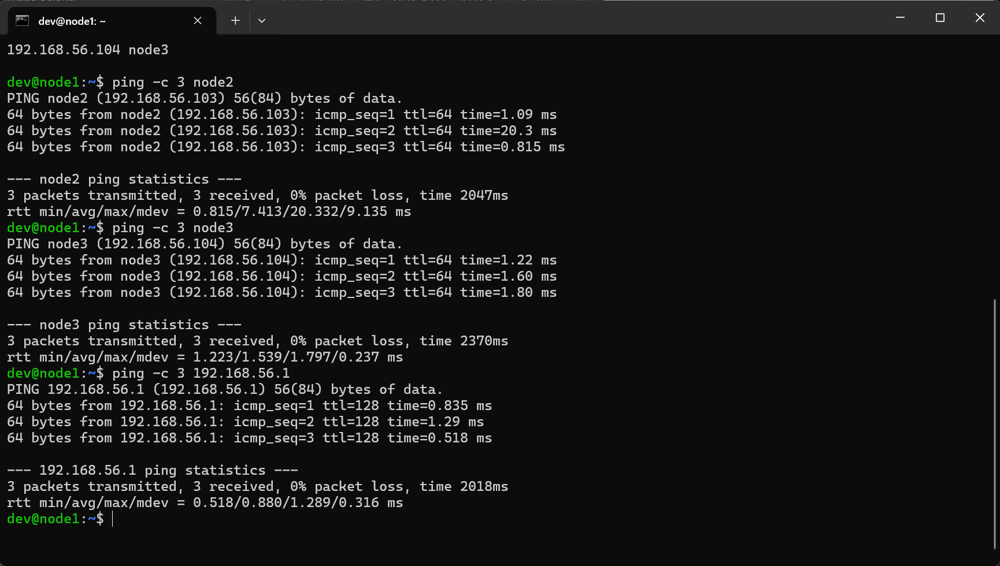
*△ 图 16 · 多机环境验证：外网 + 宿主机 + node2 + node3 四组 ping 全部 0% packet loss*

---

## 4. 实验结果

| 验证项 | 操作 | 预期结果 | 实际结果 |
|:--|:--:|:--:|:--:|
| VirtualBox 安装 | 双击启动 | 显示 VirtualBox 主界面 | ✅ 正常启动 |
| 模板机创建 | 新建 → 按参数配置 | 虚拟机列表中出现 `ubuntu-template` | ✅ 已创建 |
| Ubuntu Server 安装 | 启动 VM → 走完安装流程 | 出现 `template login:` 登录提示 | ✅ 安装成功 |
| OpenSSH 安装 | `systemctl status sshd` | `active (running)` | ✅ SSH 已启用 |
| NAT 网络 | `ping -c 3 8.8.8.8` | 外网可达 | ✅ 连通 |
| Host-Only + 静态 IP | `ip addr show enp0s8` | 显示 `192.168.56.101/24` | ✅ 配置生效 |
| 宿主机互通 | `ping -c 3 192.168.56.1` | 宿主机可达 | ✅ 连通 |
| hosts 解析 | `ping -c 3 node2` | 通过主机名 ping 通 node2 | ✅ 解析正常 |
| 克隆虚拟机 | 右键 → 克隆 × 3 | 虚拟机列表出现 node1/2/3 | ✅ 四节点就绪 |
| 多机互 ping | node1 ping node2/node3 | 全部 `0% loss` | ✅ 网络互通 |

**▸ 成果物清单**

```
成果一：VirtualBox 虚拟化运行环境              ← 宿主机上的 Hypervisor
成果二：ubuntu-template（模板机）              ← 不再启动，仅作克隆源保存
成果三：node1 / node2 / node3（三台克隆节点）   ← 可直接使用的实验节点
成果四：192.168.56.0/24 私网 + hosts 解析      ← 主机名互访的网络环境
```

---

## 5. 知识总结

### 5.1 虚拟化技术核心概念

| 概念 | 含义 | 本实验中的体现 |
|:--|:--:|:--:|
| 宿主机（Host） | 运行虚拟化软件的物理计算机 | Windows 11 |
| 虚拟机（Guest） | 在宿主机上模拟运行的完整操作系统 | Ubuntu Server |
| Hypervisor | 管理虚拟机资源分配的核心软件 | VirtualBox |
| VDI | VirtualBox 原生虚拟硬盘格式 | 20GB 动态分配 |
| 快照 | 保存虚拟机当前状态的瞬时备份 | 实验五将用到 |

---

### 5.2 虚拟机三种网络模式的本质

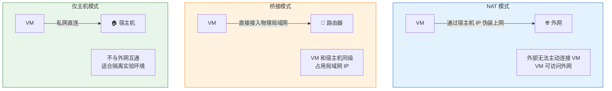
```mermaid
flowchart TB
    subgraph NAT["NAT 模式"]
        VM1["VM"] -->|"通过宿主机 IP 伪装上网"| Net1["🌐 外网"]
        Note1["外部无法主动连接 VM<br/>VM 可访问外网"]
    end

    subgraph Bridge["桥接模式"]
        VM2["VM"] -->|"直接接入物理局域网"| Router["📡 路由器"]
        Note2["VM 和宿主机同级<br/>占用局域网 IP"]
    end

    subgraph HostOnly["仅主机模式"]
        VM3["VM"] -->|"私网直连"| Host["🏠 宿主机"]
        Note3["不与外网互通<br/>适合隔离实验环境"]
    end

    style NAT fill:#e3f2fd,stroke:#1565c0
    style Bridge fill:#fff3e0,stroke:#f57c00
    style HostOnly fill:#e8f5e9,stroke:#2e7d32
```

本实验用 **NAT + Host-Only 双网卡** 的原因：NAT 负责 `apt install` 等外网操作，Host-Only 提供固定 IP 的私网互通 —— 两者各司其职，互不干扰。

---

### 5.3 克隆 vs 快照

| 操作 | 产物 | 是否独立 | 适用场景 |
|:--:|:--:|:--:|:--:|
| **完全克隆** | 完整独立的虚拟硬盘副本 | 是 | 批量创建多台节点 |
| **链接克隆** | 共享原始磁盘，只存储差异 | 否（依赖母盘） | 节省空间但不可迁移 |
| **快照** | 保存虚拟机状态，可随时回滚 | 否（依赖原机） | 实验前留回退点 |

---

## 6. 出现问题

| 问题 | 现象 | 原因 | 解决方案 |
|:--:|:--:|:--:|:--:|
| `netplan apply` 报 Cannot find unique interface | 执行 `sudo netplan apply` 报错找不到接口，但 `ip link show` 能看到对应接口名且名字正确 | 网卡存在 `altname`（如 `enx08002732c107`）：同一个接口同时有 `enp0s8` 和 `enx…` 两个名字，netplan 仅凭名字自动匹配时发现"两个名字指向同一设备"，判定不唯一。克隆后 MAC 变更更会加剧此问题 | 改用 `match: {macaddress: "xx:xx:xx:xx:xx:xx"}` 以 MAC 地址匹配（绝对唯一）。先在每台机器上 `ip link show` 获取真实 MAC，填入 netplan 配置 |
| `netplan apply` 配置正确但仍报接口不唯一 | netplan 配置已改为 MAC 匹配格式，但依旧报 `Cannot find unique matching interface` | `/etc/netplan/` 下存在多个 `.yaml` 文件（如 `00-installer-config.yaml` + `50-cloud-init.yaml`），netplan 会合并所有文件，残留的旧配置仍在引用接口名 | `ls /etc/netplan/` 查看，`sudo rm` 删掉多余的 yaml 文件（只保留一个），再 `sudo netplan apply` |
| `ssh: connect to host port 22: Connection refused` | 无法 SSH 登录虚拟机 | 安装时未勾选 *Install OpenSSH server* | 在虚拟机中执行 `sudo apt update && sudo apt install openssh-server -y` |
| 虚拟机 ping 宿主机不通 | `ping 192.168.56.1` 超时，但宿主机可以 ping 通虚拟机 | Windows 防火墙默认拦截来自 Host-Only 网卡的入站 ICMP 包 | **临时方案**：Windows 防火墙 → 高级设置 → 入站规则 → 启用"文件和打印机共享(回显请求 - ICMPv4-In)"——仅限专用网络；或直接关闭防火墙测试。**永久方案**：新建入站规则 → 协议 ICMPv4 → 远程 IP 设为 `192.168.56.0/24` |

---

## 7. 拓展与进阶

### 7.1 快照管理

实验前留快照，操作失误一键回滚：

```bash
# VirtualBox 图形界面
选中 VM → 右上角 "快照" → "生成" → 命名（如"A-初始配置"）

# 恢复快照
选中快照 → "恢复备份"

# CLI 方式
VBoxManage snapshot template take "before-experiment"
VBoxManage snapshot template restore "before-experiment"
```

---

### 7.2 端口转发（从宿主机 SSH 到 VM）

NAT 模式下外界无法直接访问 VM。通过端口转发，将宿主机端口映射到虚拟机 SSH：

```bash
VBoxManage modifyvm "template" --natpf1 "ssh,tcp,,2222,,22"
```

之后可在宿主机 PowerShell 中 `ssh dev@localhost -p 2222` 直连虚拟机 —— 无需切换到 Host-Only 网络，适合单机开发。

---

## 8. 心得体会

装系统这件事本身不新鲜，但用虚拟化方式装，感受完全不一样。以前重装系统要腾 U 盘、进 BIOS 改启动顺序、覆盖磁盘分区 —— 每一步都怕出错。VirtualBox 打开之后点几下鼠标就能起一台全新的 Ubuntu，装毁了也不怕，删掉重来就是。这种"零成本试错"的快感，让人更愿意动手尝试，而不是看教程畏手畏脚。

四台机器互 ping 全通的那一刻，我突然理解了为什么运维和分布式系统课程都从虚拟机上手 —— 在这个虚拟私网里，可以做任何你想做的实验：搭集群、配负载均衡、模拟网络分区故障。而这一切只占用了你宿主机上一块 80GB 的硬盘空间。虚拟化技术本质上就是把昂贵的硬件资源「切分」和「隔离」，让每个人都能拥有一片属于自己的机房。这种将物理资源抽象为软件接口的思想，从云计算到容器再到 K8s，贯穿了整个后端基础设施的演进史。