# 实验二：代码编辑与管理
> **姓名**：来靖轩 **学号**：25050824 **完成日期**：2026年7月9日

---

## 1. 实验目的

1. 熟悉 **Visual Studio Code** 的主界面布局（活动栏、侧边栏、编辑器、面板、状态栏），理解代码编辑器与集成开发环境（IDE）的本质区别与适用场景
2. 掌握 VS Code 插件（Extension）的安装、配置与使用流程，完成 **Markdown All in One**、**Markdown Preview Enhanced**、**Paste Image** 等 Markdown 生态插件的部署
3. 系统学习 **Markdown** 轻量级标记语言的完整语法体系（基础排版、代码、表格、LaTeX 公式、Mermaid 图表、HTML 混编），能够独立完成结构化文档的编写、实时预览与渲染
4. 掌握 **Git** 版本控制的基本概念（工作区、暂存区、仓库）与核心工作流（修改 → 暂存 → 提交），学会通过 VS Code 图形界面和命令行两种方式管理项目版本
5. 通过配置自动保存、单词折行、图片粘贴路径等编辑器选项，构建一套「Markdown 写作 + Git 版本管理」的高效实验工作流

---

## 2. 实验环境

| 项目 | 配置 |
|:---:|:---:|
| 操作系统 | Windows 11 家庭中文版 25H2 |
| 代码编辑器 | Visual Studio Code `1.127.0` |
| 核心插件 | Markdown All in One `v3.6.2` |
| | Markdown Preview Enhanced `v0.8.15` |
| | Paste Image `v1.0.4` |
| | markdownlint `v0.12.0` |

<br>

**▸ 编辑器插件生态示意图**

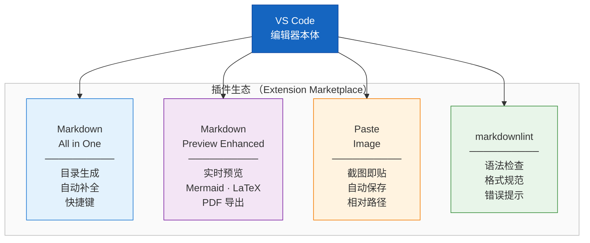
```mermaid
flowchart TB
    VSC["VS Code<br/>编辑器本体"]

    subgraph 插件层["插件生态 （Extension Marketplace）"]
        MAO["<br/>Markdown<br/>All in One<br/>──────────<br/>目录生成<br/>自动补全<br/>快捷键"]
        MPE["<br/>Markdown<br/>Preview Enhanced<br/>──────────<br/>实时预览<br/>Mermaid · LaTeX<br/>PDF 导出"]
        PI["<br/>Paste<br/>Image<br/>──────────<br/>截图即贴<br/>自动保存<br/>相对路径"]
        ML["<br/>markdownlint<br/>──────────<br/>语法检查<br/>格式规范<br/>错误提示"]
    end

    VSC --> MAO
    VSC --> MPE
    VSC --> PI
    VSC --> ML

    style VSC fill:#1565c0,color:#fff,stroke:#0d47a1
    style 插件层 fill:#fafafa,stroke:#bdbdbd
    style MAO fill:#e3f2fd,stroke:#1976d2
    style MPE fill:#f3e5f5,stroke:#7b1fa2
    style PI fill:#fff3e0,stroke:#f57c00
    style ML fill:#e8f5e9,stroke:#388e3c
```

---

## 3. 实验过程

### 步骤一 熟悉 VS Code 主界面

启动 VS Code 后，界面划分为五个功能区域：


```mermaid
flowchart LR
    subgraph 布局["VS Code 五区域布局"]
        direction TB
        A["🔵 活动栏<br/><sub>最左侧竖条<br/>资源管理器 · 搜索 · Git · 扩展</sub>"]
        B["🟢 侧边栏<br/><sub>活动栏右侧<br/>显示当前工具的具体内容</sub>"]
        C["🟡 编辑器区域<br/><sub>中央主区域<br/>标签页 · 分屏编辑 · 代码缩略图</sub>"]
        D["🟣 面板<br/><sub>底部<br/>终端 · 输出 · 问题 · 调试控制台</sub>"]
        E["🔴 状态栏<br/><sub>最底部<br/>语言模式 · Git 分支 · 编码 · 行列号</sub>"]
    end

    style A fill:#bbdefb,stroke:#1565c0
    style B fill:#c8e6c9,stroke:#2e7d32
    style C fill:#fff9c4,stroke:#f9a825
    style D fill:#e1bee7,stroke:#7b1fa2
    style E fill:#ffcdd2,stroke:#c62828
```

> 💡 **快捷键速记**
> `Ctrl+B`：收起/展开侧边栏（屏幕小时的神键）
> `Ctrl+J`：打开/关闭底部面板（终端常用）
> `Ctrl+Shift+E`：回到文件资源管理器
> `Ctrl+Shift+X`：打开扩展面板

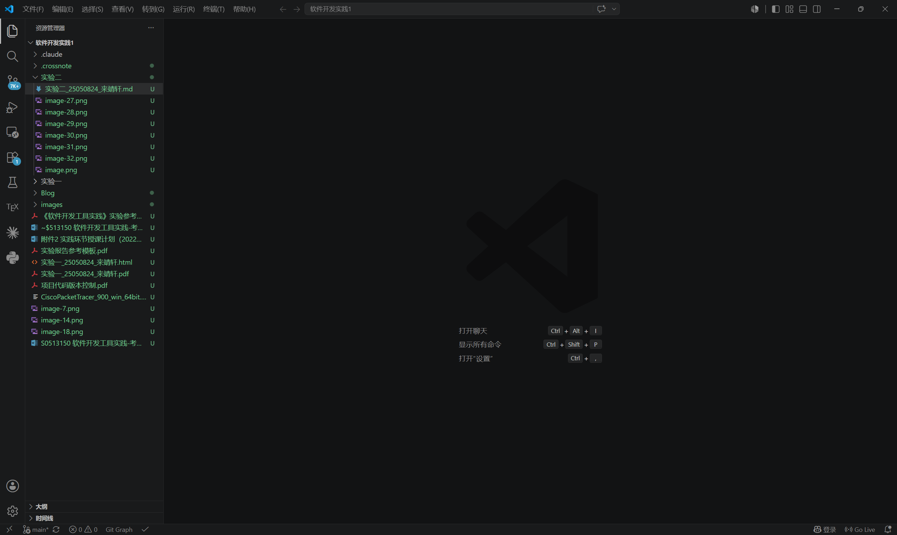
*△ 图 1 · VS Code主界面布局*

---

### 步骤二 安装 Markdown 相关插件

点击左侧活动栏的 **扩展** 图标（四个方块），或 `Ctrl+Shift+X` 打开扩展面板。

**▸ 插件 ① · Markdown All in One** `Ctrl+Shift+X` → 搜索 → 安装

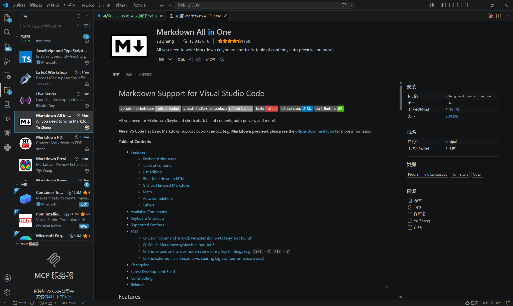
*△ 图 2 · VS Code Markdown All in One插件*

| 功能 | 快捷键 | 效果 |
|:--|:--:|:--:|
| 自动生成目录 | `Ctrl+Shift+P` → *Create Table of Contents* | 在文档顶部插入 `[TOC]`，保存后自动展开为目录树 |
| 加粗 / 斜体 | `Ctrl+B` / `Ctrl+I` | 选中文字 → 自动包裹 `**` 或 `*` |
| 列表自动延续 | 回车 | 换行时自动补 `-` 或 `1.` |
| 键盘快捷格式化 | `Alt+Shift+F` | 表格对齐、列表缩进修复 |

> ✨ 这个插件的「列表自动延续」功能是日常写 Markdown 最舒服的地方 —— 写列表项时回车会自动补上下一项的标号，不用手动敲。

**▸ 插件 ② · Markdown Preview Enhanced** `Ctrl+Shift+X` → 搜索 → 安装

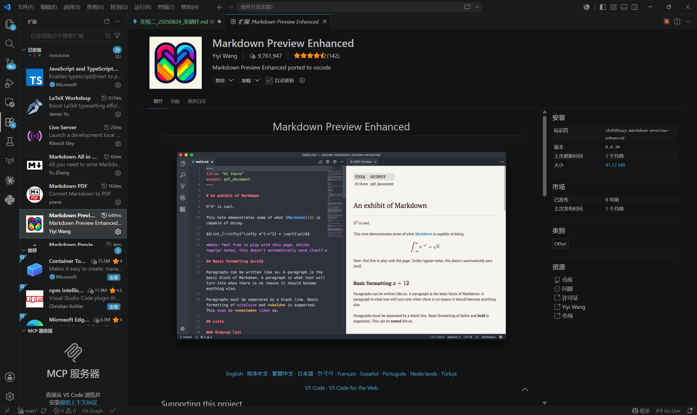
*△ 图 3 · VS Code Markdown Preview Enhanced插件*

此插件是整个 Markdown 工作流的核心。安装后：

```bash
Ctrl+K V               # 右侧打开实时预览（分屏）
Ctrl+Shift+V           # 新标签页打开预览（同屏）
```

预览窗口右键菜单额外提供：
- **导出为 HTML / PDF / PNG**（基于 Puppeteer 的无头 Chrome 渲染）
- **打开在浏览器**（方便用浏览器自带的打印功能调排版）
- **Mermaid / PlantUML / LaTeX** 图表渲染（原生支持，零配置）

**▸ 插件 ③ · Paste Image** `Ctrl+Shift+X` → 搜索 → 安装

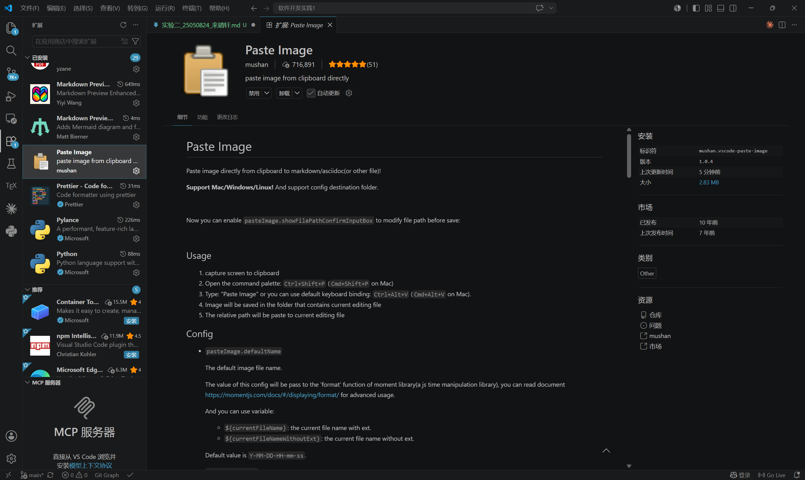
*△ 图 4 · VS Code Paste Image插件*

截图后直接 `Ctrl+Alt+V` 粘贴到 Markdown 文件 —— 图片自动保存到同目录的 `images/` 子文件夹，自动生成 `` 引用。

> ⚠️ 安装后需配置路径为相对路径：`Ctrl+,` 打开设置 → 搜索 `Paste Image: Path` → 设为 `${currentFileDir}/images/`。否则导出 PDF 时图片可能因绝对路径而丢失。

**▸ 插件 ④ · markdownlint** `Ctrl+Shift+X` → 搜索 → 安装

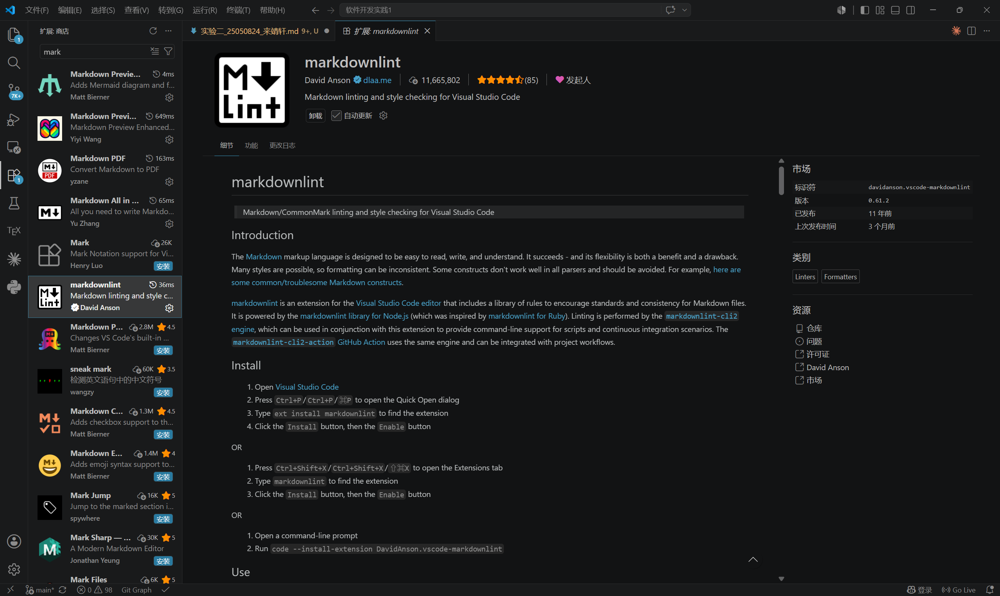
*△ 图 5 · VS Code markdownlint插件*

实时检查 Markdown 语法规范。常见提示：
- `MD032`：列表前后需要空行
- `MD022`：标题前后需要空行
- `MD031`：代码块前后需要空行

波浪下划线标出违规处，鼠标悬停查看规则说明。

---

### 步骤三 配置编辑器优化写作体验

`Ctrl+,` 打开设置界面，修改以下三项：

| 设置项 | 值 | 效果 |
|:--:|:--:|:--:|
| `files.autoSave` | `afterDelay` | 文件修改后 1 秒自动保存，告别 `Ctrl+S` 肌肉记忆 |
| `editor.wordWrap` | `on` | 长文本自动折行，不用左右滚动 |
| `Paste Image: Path` | `${currentFileDir}/images/` | 粘贴图片自动存到当前文件同级的 `images/` 目录 |

---

### 步骤四 Markdown 语法全解

`Ctrl+N` → `Ctrl+S` 保存为 `test.md`。以下逐一覆盖 Markdown 从基础到高级的全部常用语法 —— 每一类语法都可直接在 VS Code 右侧预览窗口实时查看效果。

#### 4.1 标题与段落

Markdown 提供六级标题（对应 HTML `<h1>` ~ `<h6>`），用 `#` 数量控制层级：

```markdown
# 一级标题
## 二级标题
### 三级标题
#### 四级标题
##### 五级标题
###### 六级标题
```
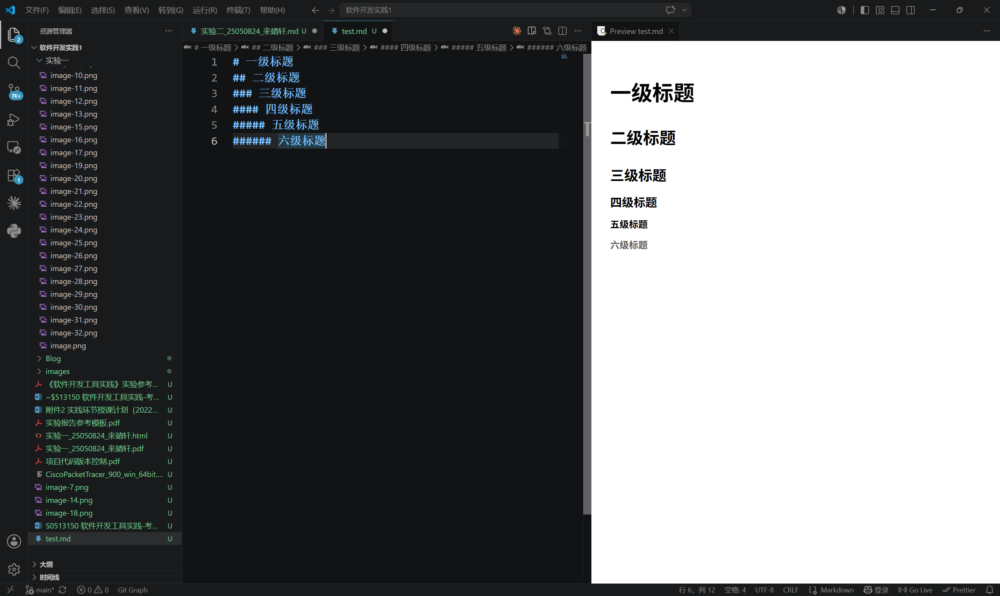
*△ 图 6 · 标题与段落渲染*

段落直接书写，中间用一个**空行**分隔。若只换行而不空行，渲染器不会另起段落 —— 这一规则初学时常踩坑：

```markdown
这是第一段。

这是第二段（中间有空行，会分段）。
这是同一段的续行（中间只换行，不会分段）。
```

> 💡 若想在段内强制换行，在行末加**两个空格**再回车。

---

#### 4.2 文本样式

| 语法 | 渲染效果 | 使用场景 |
|:--|:--|:--|
| `**粗体**` 或 `__粗体__` | **粗体文本** | 强调关键概念、术语 |
| `*斜体*` 或 `_斜体_` | *斜体文本* | 书名、作品名、引用短语 |
| `***粗斜体***` | ***粗斜体*** | 极强调 |
| `~~删除线~~` | ~~删除线~~ | 表示已废弃或勘误 |
| `==高亮==` | ==高亮标记== | 重点突出（部分渲染器支持） |
| `<u>下划线</u>` | <u>下划线文本</u> | Markdown 无原生下划线，用 HTML 实现 |
| `H~2~O` / `x^2^` | H~2~O / x² | 上下标（部分渲染器支持） |

---

#### 4.3 列表

**无序列表**用 `-`、`*` 或 `+` 开头：

```markdown
- 第一项
- 第二项
  - 缩进两个空格 → 子项
  - 第二个子项
- 第三项
```

*△ 图 7 · 无序列表渲染*

**有序列表**用 `1.` 开头（数字本身不重要，自动递增）：

```markdown
1. 第一步
2. 第二步
   1. 子步骤（缩进三个空格）
   2. 另一个子步骤
3. 第三步
```

*△ 图 8 · 有序列表渲染*

**任务列表**（扩展语法，GitHub / VS Code 均支持）：

```markdown
- [x] 安装 VS Code
- [x] 安装插件
- [ ] 学习 Markdown 语法
- [ ] 完成实验报告
```
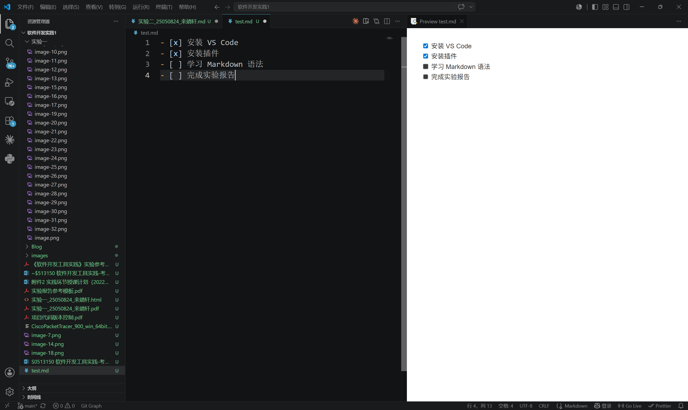
*△ 图 9 · 任务列表渲染*

渲染后 `[x]` 显示为已勾选 ☑，`[ ]` 为空复选框 ☐，适合做 TODO 清单。

---

#### 4.4 引用

```markdown
> 这是一层引用

> > 这是嵌套引用 —— 两层缩进

> **📌 提示：** 引用块中可以使用
> 任何其他 Markdown 语法 ——
> 包括列表、代码、甚至表格。
```
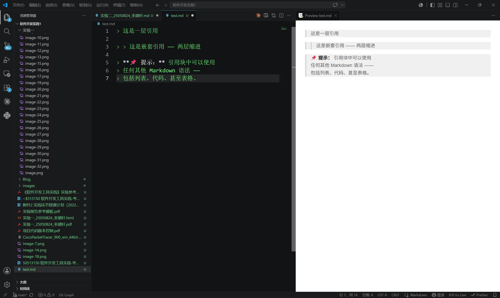
*△ 图 10 · 引用渲染*

---

#### 4.5 分隔线

三个或以上的 `---`、`***` 或 `___` 独占一行：

```markdown
段落A

---

段落B
```

*△ 图 11 · 分割线渲染*

> ⚠️ `---` 上方若有文字且中间无空行，可能被解析为 YAML Front-matter 或二级标题下划线，建议前后各空一行。

---

#### 4.6 超链接与图片

```markdown
[链接文字](https://example.com)
[带鼠标悬停提示的链接](https://example.com "悬停会显示这段文字")
```
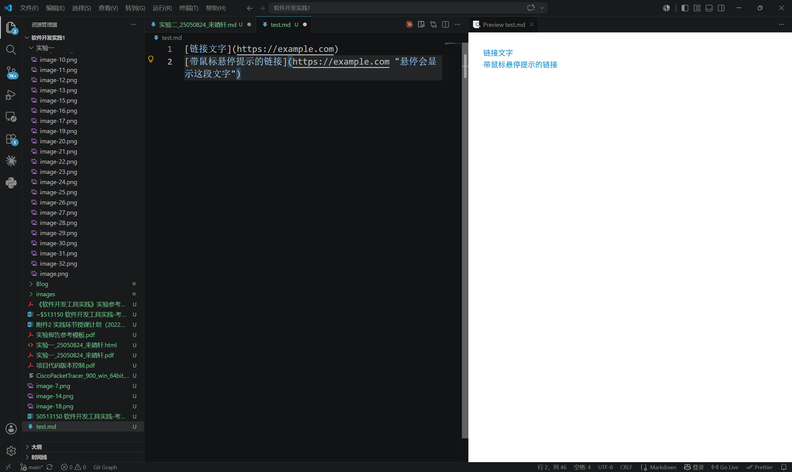
*△ 图 12 · 超链接与图片渲染*

**引用式链接**（适合长文档中多次引用同一 URL）：

```markdown
[GitHub][1] 和 [Gitee][2] 都是代码托管平台。

[1]: https://github.com
[2]: https://gitee.com
```
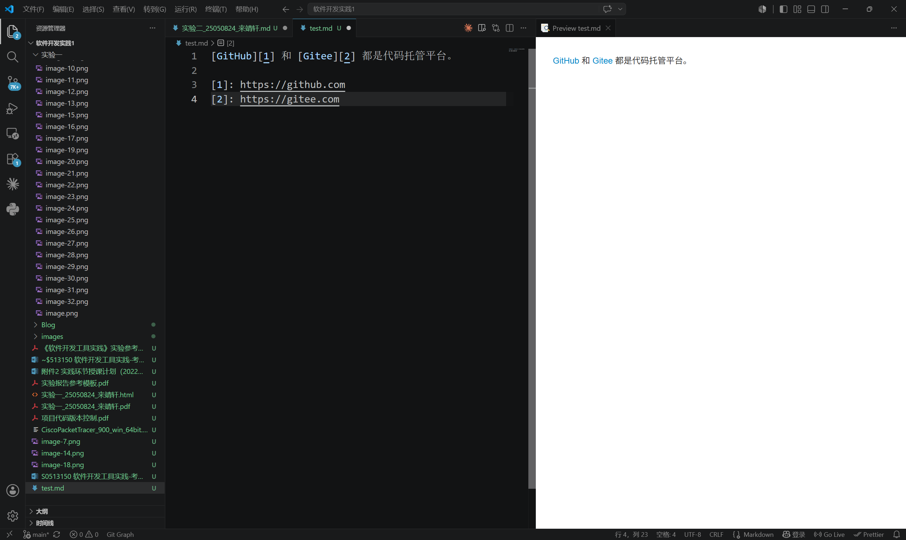
*△ 图 13 · 引用式链接渲染*

**图片**语法与链接类似，前面多一个 `!`：

```markdown


```
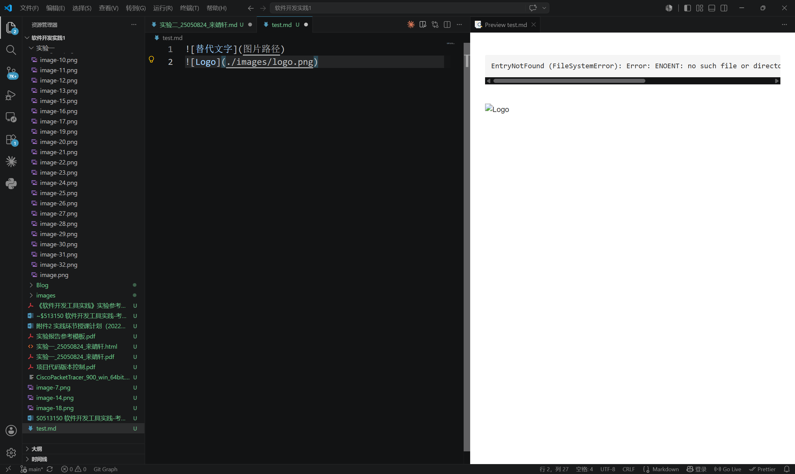
*△ 图 14 · 图片渲染*

Markdown Preview Enhanced 中可直接 `Ctrl+Alt+V`（需安装 Paste Image）将剪贴板图片粘贴为文件并自动插入引用。

---

#### 4.7　代码

**行内代码**用一对反引号：

```markdown
使用 `console.log()` 输出调试信息。
```
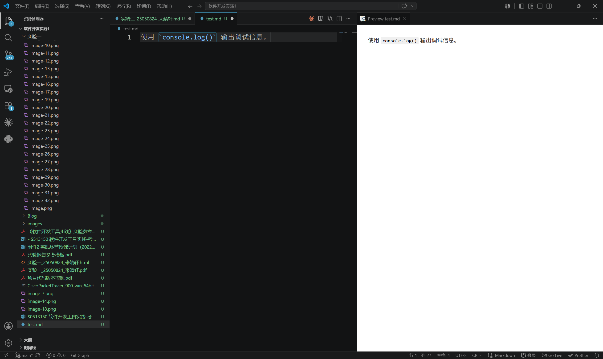
*△ 图 15 · 行内代码渲染*

**围栏代码块**用三反引号包裹，标注语言标签以获得语法高亮：

````markdown
```javascript
function hello() {
    console.log("Hello, Markdown!");
}
```
````
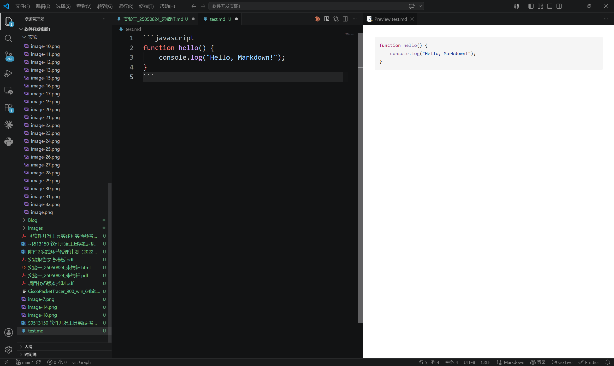
*△ 图 16 · 围栏代码块渲染*

常用语言标签：`python`、`java`、`cpp`、`bash`、`html`、`css`、`json`、`yaml`、`sql`。

代码块中若需显示反引号本身，外层用更多反引号包裹或改用 `~~~`：

````markdown
````
这是一个包含 `` `code` `` 的代码块。
````
````

---

#### 4.8 表格

```markdown
| 左对齐 | 居中 | 右对齐 |
|:---|:---:|---:|
| 内容 | 内容 | 内容 |
| `代码` | **粗体** | *斜体* |
```

*△ 图 17 · 表格渲染*

| 冒号位置 | 效果 |
|:--|:--|
| `:---` | 左对齐 |
| `:---:` | 居中对齐 |
| `---:` | 右对齐 |
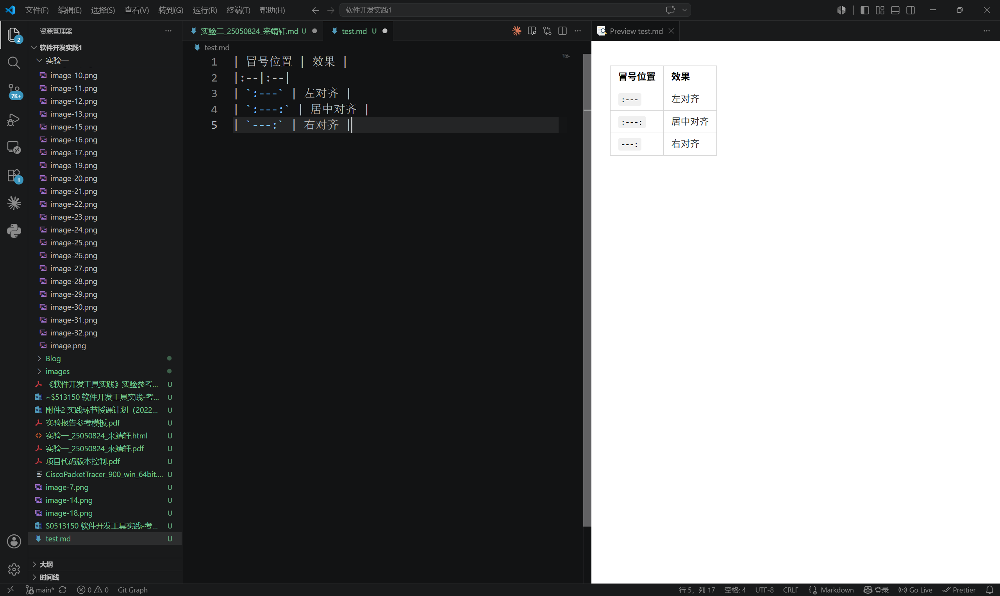
*△ 图 18 · 表格渲染*

> 💡 表格的竖线无需手动对齐，VS Code 中 `Alt+Shift+F` 可一键格式化表格，自动对齐所有列。

---

#### 4.9　脚注（扩展语法）

```markdown
Markdown 由 John Gruber 在 2004 年创建[^1]。

[^1]: John Gruber, "Daring Fireball: Markdown", 2004.
```
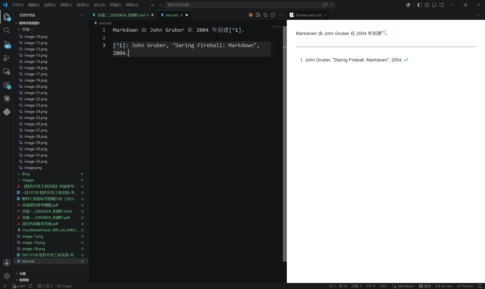
*△ 图 19 · 脚注（扩展语法）渲染*

脚注内容通常放在文末，渲染时自动编号并在鼠标悬停或页面底部显示。

---

#### 4.10　LaTeX 数学公式

Markdown Preview Enhanced 内置 **KaTeX** 渲染引擎，支持 LaTeX 数学公式 —— 无需安装任何额外插件。

**行内公式**用单个 `$` 包裹：

```markdown
质能方程 $E = mc^2$ 是爱因斯坦最著名的公式。
勾股定理 $a^2 + b^2 = c^2$。
行内分数 $\frac{1}{2}$ 和求和 $\sum_{i=1}^{n} x_i$。
```
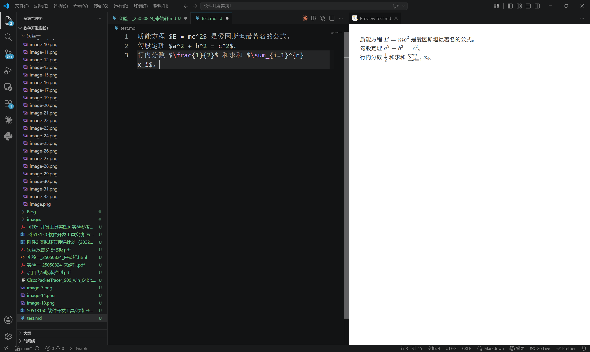
*△ 图 20 · 行内公式渲染*

**块级公式**用双 `$$` 包裹，独占一行且居中：

```markdown
$$
f(x) = \int_{-\infty}^{\infty} \hat{f}(\xi) \, e^{2\pi i \xi x} \, d\xi
$$
```
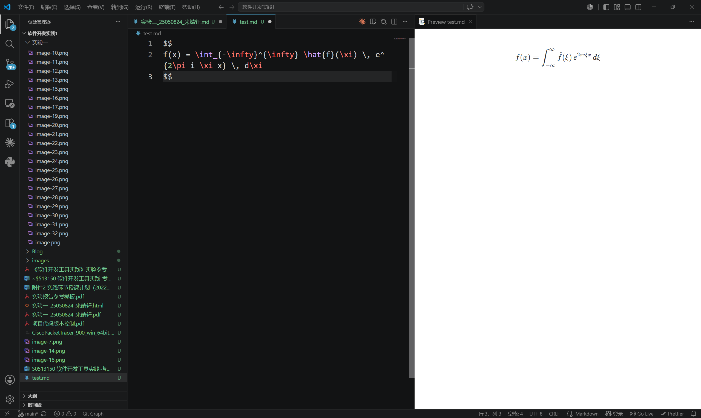
*△ 图 21 · 块级公式渲染*

**常用 LaTeX 符号速查：**

| 类别 | 语法 | 渲染 |
|:--:|:--:|:--:|
| 上标 / 下标 | `x^2` / `x_i` | $x^2$ / $x_i$ |
| 分数 | `\frac{a}{b}` | $\frac{a}{b}$ |
| 根号 | `\sqrt{x}` / `\sqrt[n]{x}` | $\sqrt{x}$ / $\sqrt[n]{x}$ |
| 求和 / 求积 | `\sum_{i=1}^{n}` / `\prod` | $\sum_{i=1}^{n}$ / $\prod$ |
| 积分 | `\int_{a}^{b}` / `\iint` / `\oint` | $\int_{a}^{b}$ / $\iint$ / $\oint$ |
| 极限 | `\lim_{x \to \infty}` | $\lim_{x \to \infty}$ |
| 希腊字母 | `\alpha` `\beta` `\pi` `\theta` `\lambda` | $\alpha$ $\beta$ $\pi$ $\theta$ $\lambda$ |
| 大希腊字母 | `\Gamma` `\Delta` `\Sigma` `\Omega` | $\Gamma$ $\Delta$ $\Sigma$ $\Omega$ |
| 集合 | `\in` `\notin` `\subset` `\cup` `\cap` | $\in$ $\notin$ $\subset$ $\cup$ $\cap$ |
| 逻辑 | `\forall` `\exists` `\implies` `\iff` | $\forall$ $\exists$ $\implies$ $\iff$ |
| 比较 | `\leq` `\geq` `\neq` `\approx` `\equiv` | $\leq$ $\geq$ $\neq$ $\approx$ $\equiv$ |
| 箭头 | `\to` `\rightarrow` `\Rightarrow` `\mapsto` | $\to$ $\rightarrow$ $\Rightarrow$ $\mapsto$ |
| 无穷 | `\infty` / `\partial` / `\nabla` | $\infty$ / $\partial$ / $\nabla$ |

**矩阵：**

```markdown
$$
A = \begin{pmatrix}
a_{11} & a_{12} & \cdots & a_{1n} \\
a_{21} & a_{22} & \cdots & a_{2n} \\
\vdots & \vdots & \ddots & \vdots \\
a_{m1} & a_{m2} & \cdots & a_{mn}
\end{pmatrix}
$$
```
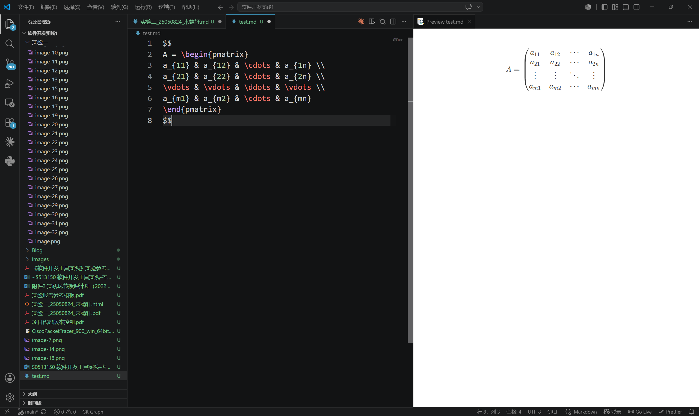
*△ 图 22 · 矩阵渲染*

矩阵类型对照：`pmatrix` = 圆括号、`bmatrix` = 方括号 `[]`、`vmatrix` = 行列式 `||`、`Bmatrix` = 花括号 `{}`。

**分段函数：**

```markdown
$$
f(x) = \begin{cases}
x^2,  & x \geq 0 \\
-x^2, & x < 0
\end{cases}
$$
```

*△ 图 23 · 分段函数渲染*

**多行对齐公式：**

```markdown
$$
\begin{aligned}
y &= (x+1)^2 \\
  &= x^2 + 2x + 1
\end{aligned}
$$
```

*△ 图 24 · 多行对齐公式渲染*

---

#### 4.11　Mermaid 图表

Markdown Preview Enhanced 原生支持 Mermaid，在代码块中使用 `mermaid` 语言标签即可渲染为矢量图表。

**流程图：**

````markdown
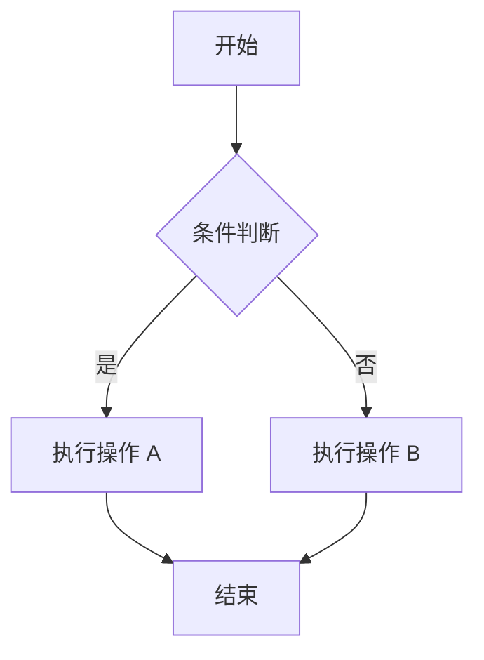
```mermaid
flowchart TD
    A[开始] --> B{条件判断}
    B -->|是| C[执行操作 A]
    B -->|否| D[执行操作 B]
    C --> E[结束]
    D --> E
```
````
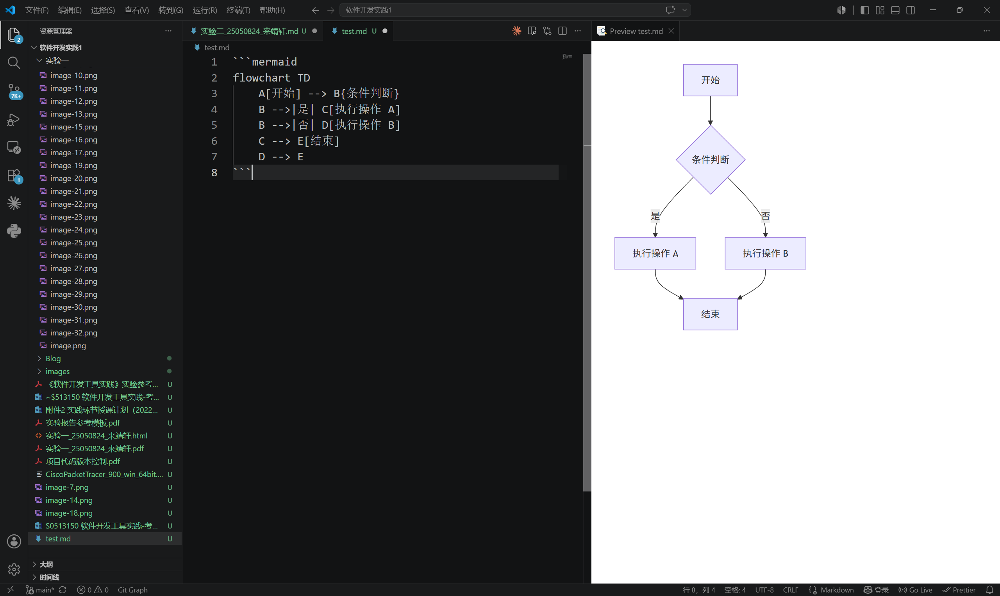
*△ 图 25 · 流程图渲染*

**时序图：**

````markdown
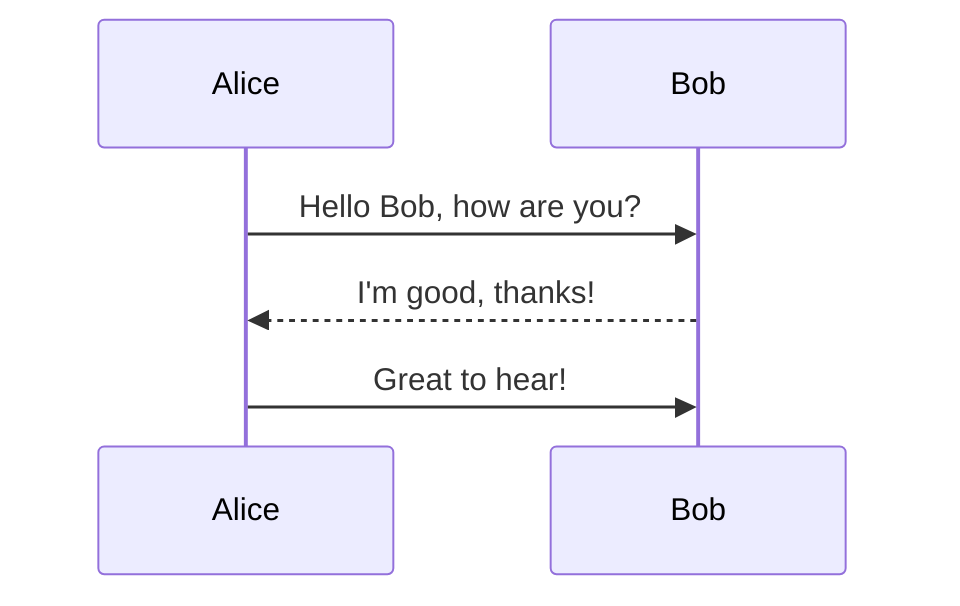
```mermaid
sequenceDiagram
    Alice->>Bob: Hello Bob, how are you?
    Bob-->>Alice: I'm good, thanks!
    Alice->>Bob: Great to hear!
```
````
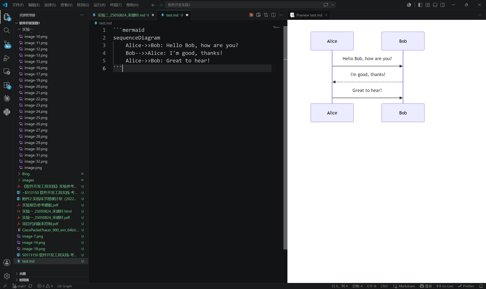
*△ 图 26 · 时序图渲染*

**甘特图：**

````markdown

```mermaid
gantt
    title 项目计划
    dateFormat  YYYY-MM-DD
    section 阶段一
    需求分析      :a1, 2026-07-01, 3d
    方案设计      :a2, after a1, 2d
    section 阶段二
    编码实现      :b1, after a2, 5d
    测试部署      :b2, after b1, 2d
```
````
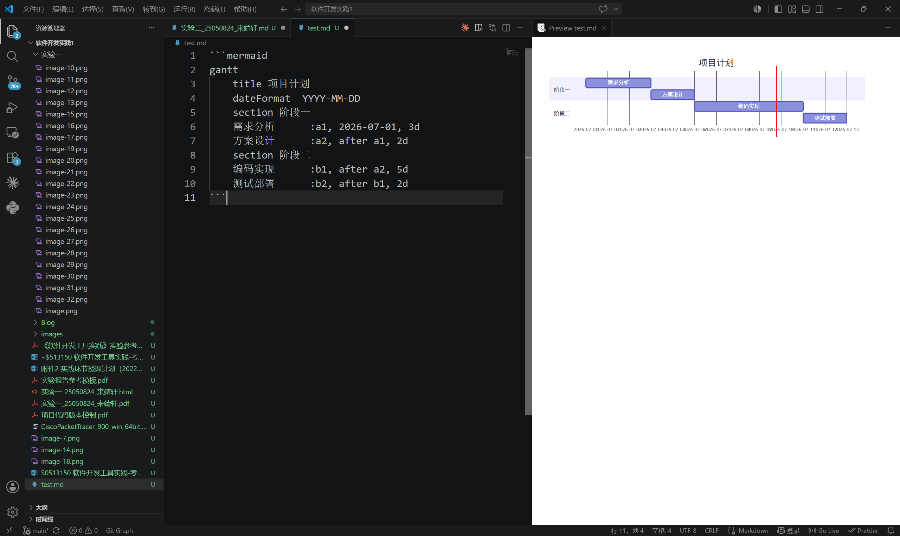
*△ 图 27 · 甘特图渲染*

**类图：**

````markdown
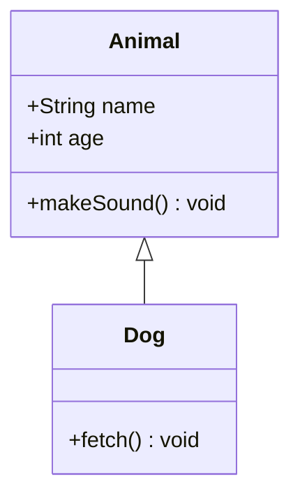
```mermaid
classDiagram
    class Animal {
        +String name
        +int age
        +makeSound() void
    }
    class Dog {
        +fetch() void
    }
    Animal <|-- Dog
```
````
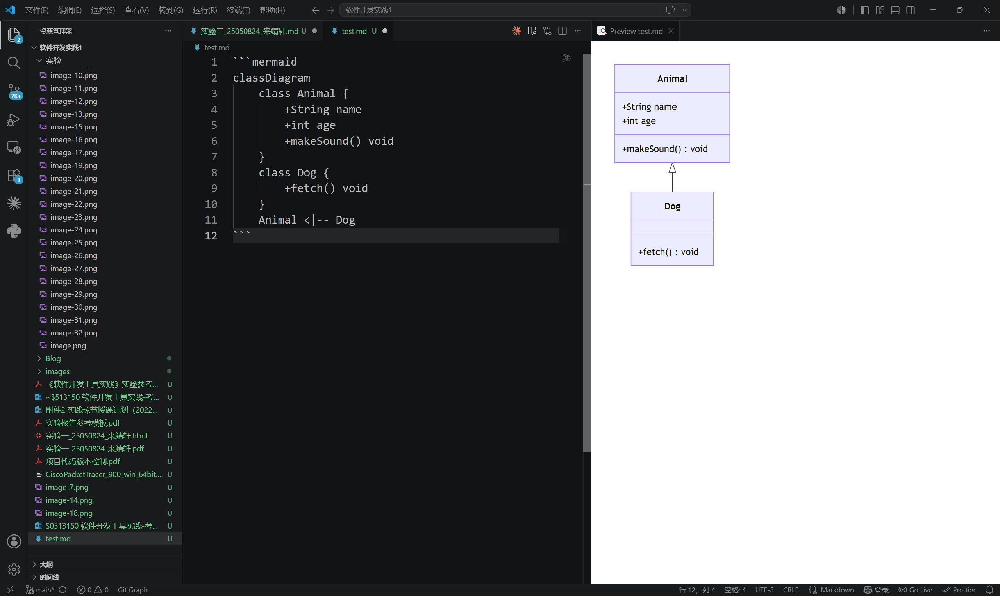
*△ 图 28 · 类图渲染*

**状态图：**

````markdown
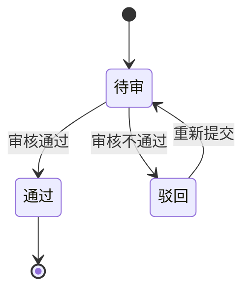
```mermaid
stateDiagram-v2
    [*] --> 待审
    待审 --> 通过 : 审核通过
    待审 --> 驳回 : 审核不通过
    通过 --> [*]
    驳回 --> 待审 : 重新提交
```
````
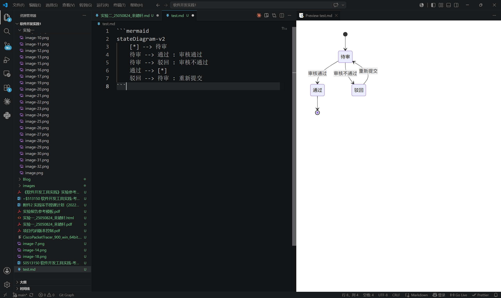
*△ 图 29 · 状态图渲染*

**饼图：**

````markdown
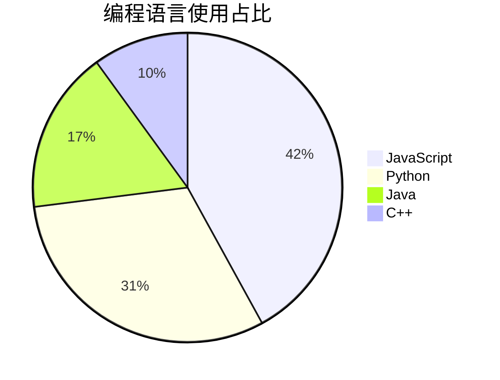
```mermaid
pie
    title 编程语言使用占比
    "JavaScript" : 42
    "Python" : 31
    "Java" : 17
    "C++" : 10
```
````
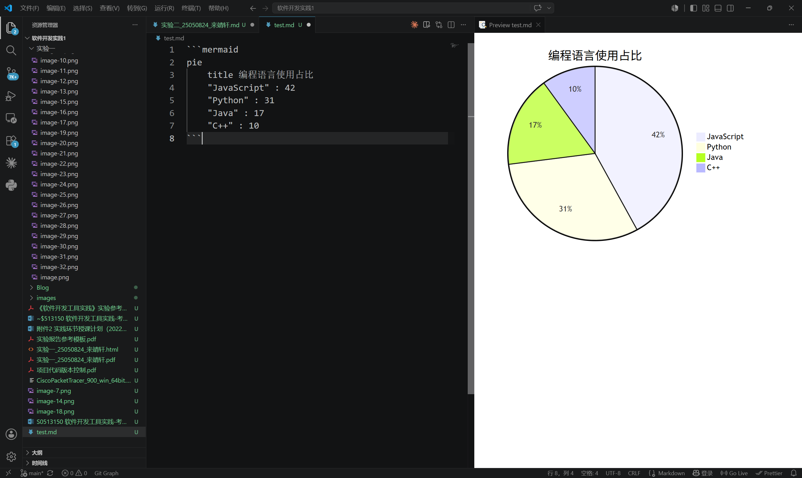
*△ 图 30 · 饼图渲染*

---

#### 4.12　HTML 混编

Markdown 文件中可以直接嵌入 HTML 标签，适合实现 Markdown 原生不支持的排版效果：

```markdown
<details>
<summary>点击展开详情</summary>

这里是被折叠的内容，里面可以有 **Markdown** 语法。

```python
print("代码块也可以放在折叠区内")
```

</details>

<p align="center">这段文字会居中显示</p>

<kbd>Ctrl</kbd> + <kbd>S</kbd> 保存文件
```
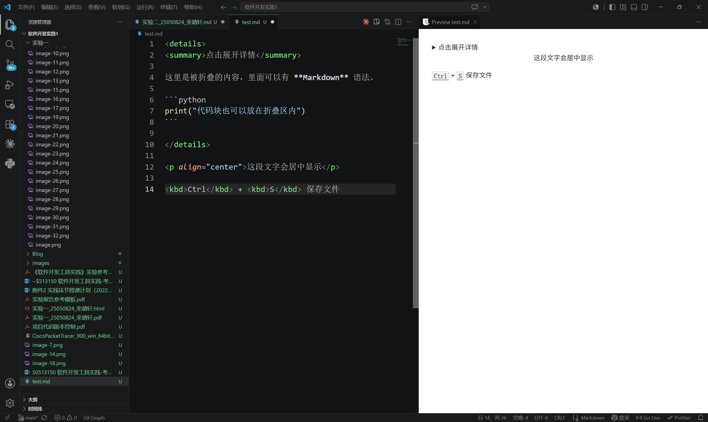
*△ 图 31 · HTML 混编渲染*


`<details>` 折叠框、`<kbd>` 键盘按键样式、`align` 对齐 —— 这些都是纯 Markdown 做不到、需要借助 HTML 实现的排版效果。

保存后，`hexo new` 创建的所有博客文章都可以用这套语法来编写。VS Code 分屏编辑 + 实时预览的体验，让写作从「写 → 编译 → 看效果 → 改」的循环变成「边写边看」的即时反馈。

---

### 步骤五 Git 版本管理

在讲解 Markdown 语法的过程中，我们已经创建了 `test.md` 等多个文件。如何锁定每一次修改的快照、如何在误删之后找回历史版本 —— 这正是 **Git** 要解决的问题。

#### 为什么需要版本控制

设想你在写实验报告，文件夹变成了这样：

```
实验报告_v1.md
实验报告_v2_修改了表格.md
实验报告_final.md
实验报告_final_真最终版.md
```

哪一份才是最新的？「真最终版」到底改了什么？靠文件命名管理版本，混乱且不可回溯 —— 这就是**版本控制系统（VCS）** 存在的理由。

**Git** 是目前全球最流行的分布式版本控制系统，提供三项核心能力：

> 📸 **记录每一次修改** —— 哪怕只改了一个标点，也能精确存档
> ⏪ **随时读档回退** —— 让项目回到过去的任意存档点
> 🤝 **支持团队协作** —— 多人同时开发，智能合并代码

---

#### Git 的三个核心区域


```mermaid
flowchart LR
    Working["📝 工作区<br/>编辑中的文件<br/>（你看到的）"] -->|"git add"| Stage["📦 暂存区<br/>待提交的修改<br/>（购物车）"]
    Stage -->|"git commit"| Repo["🏛️ 仓库<br/>永久版本快照<br/>（档案馆）"]

    style Working fill:#fff3e0,stroke:#f57c00
    style Stage fill:#e8f5e9,stroke:#2e7d32
    style Repo fill:#e3f2fd,stroke:#1565c0
```

| 区域 | 含义 | 类比 |
|:--:|:--:|:--:|
| 工作区（Working Directory） | 在 VS Code 中能看到并直接编辑的文件 | 书桌 —— 正在写的内容 |
| 暂存区（Staging Area） | 确认无误、准备提交的修改集合 | 购物车 —— 挑好待结账的 |
| 仓库（Repository） | 所有文件及完整修改历史的存储 | 档案馆 —— 永久保存 |

Git 最核心的工作循环只有三步：**修改 → 暂存 → 提交**。

---

#### 实操：将本实验项目纳入 Git 管理

**▸ 第一步：暂存文件**

VS Code left sidebar → **源代码管理** 图标（`Ctrl+Shift+G`）。所有未追踪的文件出现在 *"更改"* 列表下，标记为 `U`（Untracked）。鼠标悬停到文件上，点击右侧出现的 **`+`** 号 —— 文件移至 *"已暂存的更改"*，状态变为 `A`（Added）。

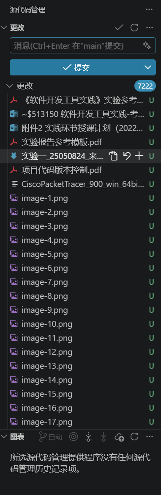
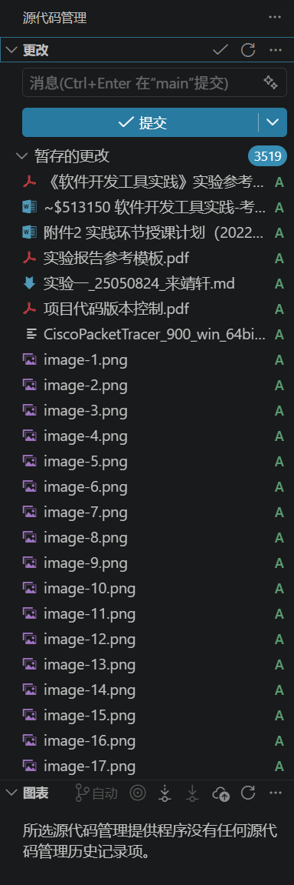
*△ 图 32 图 33 · 暂存文件操作。左侧原始状态（U），右侧点击 + 号后移至暂存区*

```bash
git add .    # 等价 CLI 操作
```

**▸ 第二步：提交**

在面板顶部的 *"消息"* 输入框中填写提交说明，点击上方的 **`✓`**（提交）按钮。*"更改"* 和 *"已暂存的更改"* 列表变空 —— 说明工作区与仓库当前版本已完全同步。

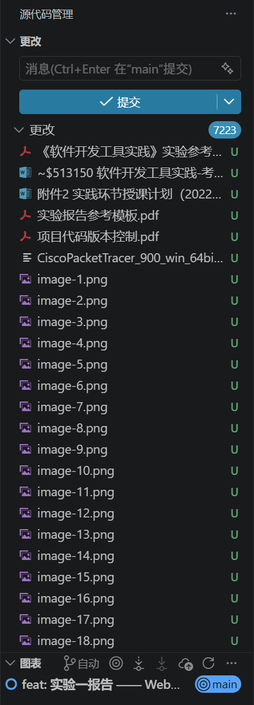
*△ 图 34 · 提交操作 —— 输入提交信息后点击 ✓*

```bash
git commit -m "feat: 完成 Markdown 语法练习"    # 等价 CLI 操作
```

**▸ 第三步：修改后再次提交**

修改任意文件并保存 → 文件出现在更改列表中，标记为 `M`（Modified）→ 点击 `+` 暂存 → 输入说明 → 点击 `✓` 提交。

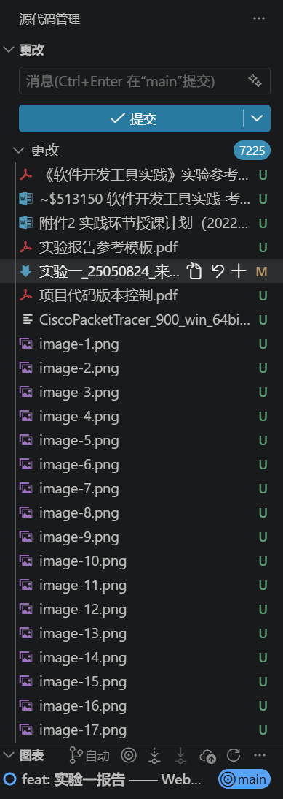
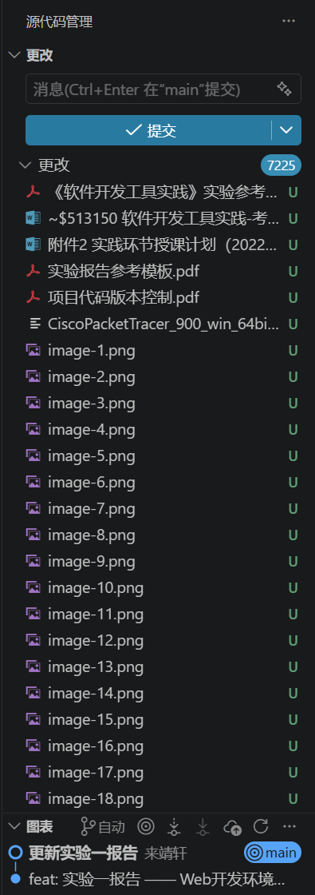
*△ 图 35 36 · 修改文件后，文件状态变为 M（Modified），再次执行暂存 → 提交*

```bash
git add -A
git commit -m "docs: 补充 LaTeX 公式示例"
```

> 🔁 这组操作 —— **修改 → 暂存 → 提交** —— 是本实验以及日后开发中频率最高的工作流。养成「每完成一个小目标就 commit 一次」的习惯，历史记录会干净且可回退。

**提交信息规范建议：**

| 前缀 | 含义 | 示例 |
|:--:|:--:|:--:|
| `feat:` | 新增功能 / 内容 | `feat: 添加 Mermaid 图表教程` |
| `fix:` | 修复错误 | `fix: 修复表格对齐` |
| `docs:` | 文档更新 | `docs: 补全 LaTeX 符号表` |
| `chore:` | 杂项维护 | `chore: 整理截图文件` |

---

#### 查看修改历史

VS Code 中安装 **Git Graph** 插件，点击左侧「源代码管理」面板上方的时间线图标，即可看到以提交时间为纵轴的图形化历史。每一次提交都标注了作者、时间、信息和文件变更清单。

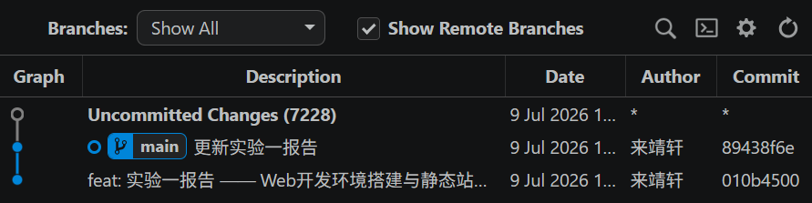
*△ 图 37 · Git Graph 扩展 —— 图形化查看所有提交历史 & 分支图*

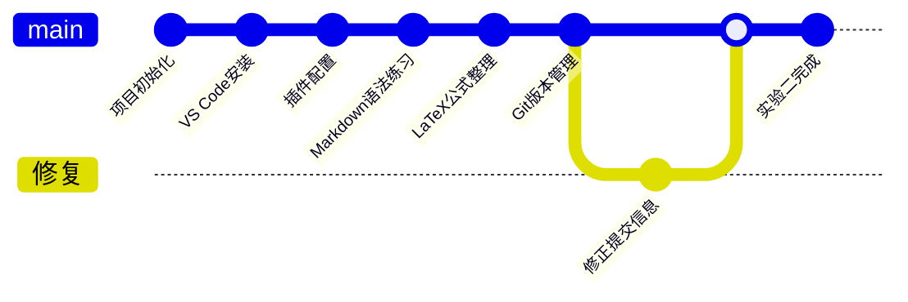
```mermaid
gitGraph
   commit id: "项目初始化"
   commit id: "VS Code安装"
   commit id: "插件配置"
   commit id: "Markdown语法练习"
   commit id: "LaTeX公式整理"
   commit id: "Git版本管理"
   branch "修复"
   commit id: "修正提交信息"
   checkout main
   merge "修复"
   commit id: "实验二完成"
```

---

#### 远程仓库：在云端管理代码

本地仓库解决了个人版本管理问题，但代码只存在本机 = 单点故障。**GitHub**（或国内访问更快的 **Gitee**）提供云端托管：

| 操作 | 含义 | VS Code 入口 | CLI 等价 |
|:--:|:--:|:--:|:--:|
| 推送（Push） | 将本地提交上传到远程 | `...` → 推送 | `git push` |
| 拉取（Pull） | 将远程更新下载到本地 | `...` → 拉取 | `git pull` |
| 克隆（Clone） | 将远程仓库完整下载到本地 | 源代码管理 → 克隆仓库 | `git clone <url>` |

> 📸 Git 的每一次 commit 都是项目历史的快照。回望时，能看到整个实验从零到完成的完整轨迹 —— 这就是版本控制的真正价值。

---

## 4. 实验结果

| 验证项 | 操作 | 预期结果 | 实际结果 |
|:--|:--:|:--:|:--:|
| 界面布局识别 | 依次点击活动栏图标 | 侧边栏内容切换正常 | ✅ 五区域完整 |
| 扩展面板 | `Ctrl+Shift+X` | 搜索框可用，列表加载 | ✅ 插件市场可访问 |
| Markdown All in One | 输入 `[TOC]` → 保存 | 自动生成目录 | ✅ 目录已渲染 |
| Markdown Preview Enhanced | `Ctrl+K V` | 右侧分屏预览 | ✅ 实时同步 |
| Paste Image | `Ctrl+Alt+V` 粘贴截图 | 自动保存图片 + 生成引用 | ✅ 相对路径正确 |
| markdownlint | 故意空行不规范 | 波浪线提示 `MD032` | ✅ 规则已激活 |
| 自动保存 | 修改文件后等待 1s | 标签页白点消失 | ✅ `afterDelay` 生效 |
| 单词折行 | 输入一段长文 | 内容自动换行不溢出 | ✅ `wordWrap` 已开启 |
| Git 暂存 | VS Code 源代码管理面板 → `+` | 文件从 U 变为 A，进入暂存区 | ✅ 暂存成功 |
| Git 提交 | 输入消息 → `✓` | 更改列表清空，`git log` 可见 | ✅ 提交成功 |
| Git Graph | 点击时间线图标 | 图形化显示提交历史 | ✅ 历史可见 |
| Git 修改再提交 | 改文件 → `+` → 输入 → `✓` | 文件从 M 变为已提交 | ✅ 工作流完整 |

**▸ 成果物清单**

```
成果一：test.md                           ← 完整 Markdown 语法练习文档（含 LaTeX + Mermaid）
成果二：VS Code + 4 个插件运行环境         ← 可复用的写作工作流
成果三：实验一报告 .md                     ← 用这套工作流完成的第一份正式文档
成果四：images/ 目录下的粘贴截图            ← Paste Image 自动管理的图片库
成果五：.git/ 仓库 + 多次提交历史           ← Git 版本管理已建立
```

---

## 5. 知识总结
### 5.1 代码编辑器 vs IDE

| 类型 | 典型代表 | 特点 |
|:--|:--:|:--:|
| **代码编辑器** | VS Code、Sublime Text、Notepad++ | 轻量、启动快、以编辑为核心，通过插件扩展功能 |
| **IDE** | IntelliJ IDEA、PyCharm、Eclipse | 功能全面，集成编译 / 调试 / 构建 / 版本控制全套工具链 |

VS Code 的定位是二者的**中间态** —— 安装合适的插件后，它既能当轻量编辑器用，也能提供接近 IDE 的开发体验。

### 5.2 Markdown 语法全表

（详细语法教程见步骤四，此处为速查索引）

**基础排版**　`# ## ###` 标题 · 空行分段 · `**粗体**` `*斜体*` `~~删除线~~`

**列表**　`-` 无序 · `1.` 有序 · `- [ ]` 任务列表 · 两空格缩进子项

**链接与图片**　`[文字](url)` 链接 · `` 图片 · `Ctrl+Alt+V` 粘贴

**代码**　`` `行内` `` · ```` ```lang\n...\n``` ```` 围栏代码块 · 语言标签语法高亮

**表格**　`| 列 | 列 |` + `|---|` 分隔 · `:---` 左对齐 `:---:` 居中 `---:` 右对齐

**引用**　`>` 一层 · `> >` 嵌套 · 引用块内可使用任何 Markdown 语法

**LaTeX 公式**　`$E=mc^2$` 行内 · `$$\sum$$` 块级 · 矩阵 / 分段函数 / 多行对齐 · KaTeX 渲染

**Mermaid 图表**　```mermaid``` 流程图 · 时序图 · 甘特图 · 类图 · 状态图 · 饼图

**HTML 混编**　`<details>` 折叠框 · `<kbd>Ctrl</kbd>` 键盘按键 · `align` 对齐 · 弥补 Markdown 排版短板

---

## 6. 出现问题

| 问题 | 现象 | 原因 | 解决方案 |
|:--:|:--:|:--:|:--:|
| `code` 命令无效 | 终端输入 `code .` 提示「不是内部或外部命令」 | VS Code 安装时未勾选 *添加到 PATH* | 重装勾选 PATH，或手动将 `C:\Users\用户名\AppData\Local\Programs\Microsoft VS Code\bin` 加入环境变量 |
| 预览窗口渲染异常 | `Ctrl+K V` 打开预览后空白或乱码 | Markdown Preview Enhanced 未正确激活 | 在扩展面板确认插件已启用；或右键 `.md` 文件 → *打开方式* → 选择 VS Code |
| 图片粘贴后路径引用失效 | `Ctrl+Alt+V` 粘贴图片，预览中显示裂图 | `Paste Image: Path` 设为绝对路径，换电脑后路径不存在 | 改为 `${currentFileDir}/images/` 相对路径 |
| `[TOC]` 不生成目录 | 文件保存后 `[TOC]` 仍是原样 | 未安装 Markdown All in One 或其未启用 | 安装并启用后，`Ctrl+Shift+P` → *Create Table of Contents* 手动触发 |
| 扩展面板搜索不到插件 | 输入关键词后一直转圈 | ① 网络问题；② 搜索关键词不准确 | 检查网络；使用插件全名（如 `Markdown All in One`）搜索 |
| markdownlint 误报干扰 | 波浪线提示过多，影响写作 | 默认启用了大量语法规则，部分与实际需求冲突 | `.markdownlint.json` 中按需禁用特定规则，例如 `"MD013": false`（关闭行宽限制） |

---

## 7. 心得体会

实验二和实验一其实是互为表里的关系。实验一搭了一条从 Markdown 到 HTML 再到公网的流水线，实验二解决的则是流水线最上游的问题 —— 内容怎么写才高效。VS Code 这个工具本身不复杂，但把四个插件（All in One、Preview Enhanced、Paste Image、markdownlint）串起来之后，写作体验的变化是立竿见影的：左边敲源码，右边看渲染效果，截图 `Ctrl+Alt+V` 直接进文档，保存后 `[TOC]` 自动刷成目录 —— 以前用 Word 打实验报告，排版调字号比写内容还费时间，现在一边写一边看效果，思路完全不会被打断。

这套工具链最打动我的地方在于 —— VS Code 免费、四个插件全部开源、Markdown 本身是一个开放标准。也就是说，任何一个连上网的人，理论上都能零成本获得一套不输商业写作工具的编辑环境。工具的门槛降得越低，能参与创作的人就越多。我自己写完那份实验一报告，就是从 `test.md` 里练出来的语法一样一样往上拼的，最后再导出 PDF 交作业，全程没离开过 VS Code。这个流畅感让人觉得，学这些工具是值得的。