# 实验五：Linux 账户与权限管理
> **姓名**：来靖轩 **学号**：25050824 **完成日期**：2026年7月11日

---

## 1. 实验目的

1. 理解 Linux 多用户模型的设计理念，掌握 `/etc/passwd`、`/etc/shadow`、`/etc/group` 三份核心文件的格式与作用
2. 掌握账户管理的基本操作：创建用户（`useradd`）、修改用户属性（`usermod`）、删除用户（`userdel`）、密码管理（`passwd`）、切换用户（`su` / `sudo`）
3. 掌握用户组管理（`groupadd` / `groupmod` / `groups`），理解主组（Primary Group）与附加组（Supplementary Group）的区别
4. 系统掌握 Linux 文件权限模型：`rwx` 三种权限的语义、符号法（`chmod u+x`）与数字法（`chmod 755`）的等价转换、所有者与所属组的修改（`chown` / `chgrp`）
5. 通过创建多个虚拟用户并设置不同权限来模拟真实的多用户协作场景，直观体会权限隔离的意义

---

## 2. 实验环境

| 项目 | 配置 |
|:---:|:---:|
| 宿主机操作系统 | Windows 11 家庭中文版 25H2 |
| 虚拟机操作系统 | Ubuntu Server 26.04 LTS |
| 远程连接 | SSH（宿主机 PowerShell → node1） |
| 实验节点 | node1（192.168.56.102，用户名 `dev`） |

---

## 3. 实验过程

> 💡 所有命令通过 `ssh dev@192.168.56.102` 远程执行。账户管理类命令大多需要 `sudo` 提权。

---

### 步骤一　理解 Linux 的用户体系

**1.1 三份核心文件**

Linux 的用户信息不在数据库中，而在三份纯文本文件里：

| 文件 | 存了什么 | 权限 |
|:--:|:--:|:--:|
| `/etc/passwd` | 用户账户信息（用户名、UID、主目录、Shell） | `-rw-r--r--` 所有人可读 |
| `/etc/shadow` | 密码哈希 + 过期策略 | `-rw-r-----` 只有 root 可读 |
| `/etc/group` | 用户组信息 | `-rw-r--r--` 所有人可读 |

```bash
# 查看三份文件的权限
ls -l /etc/passwd /etc/shadow /etc/group
```

> 为什么密码不和用户信息放在一起？`/etc/passwd` 对所有人可读（系统需要它做 UID→用户名的转换），如果密码哈希也写在这，任何登录的用户都能把哈希抄走、拿回家暴力破解。所以密码被抽出来单独放到只有 root 能读的 `/etc/shadow` 里。

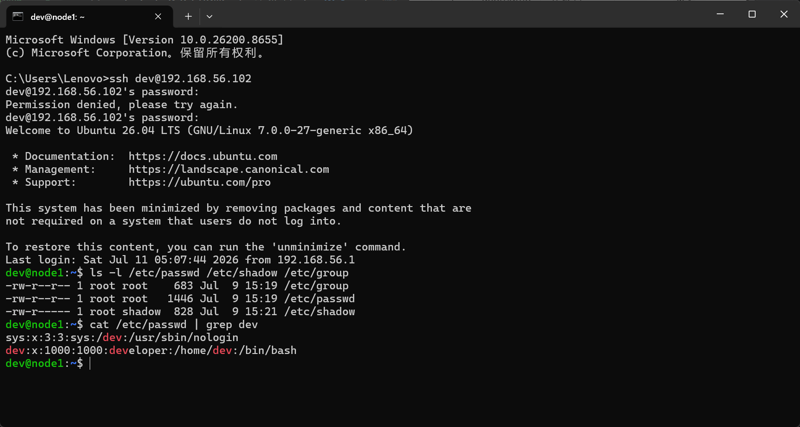
*△ 图 1 · 三份核心文件的权限对比 —— shadow 只对 root 可读*

---

**1.2 逐行读懂 `/etc/passwd`**

```bash
cat /etc/passwd | grep dev
```

输出示例：
```
dev:x:1000:1000:dev:/home/dev:/bin/bash
```

七个冒号分隔的字段，逐一拆解：

| 序号 | 字段名 | 含义 | dev 的值 |
|:--:|:--:|:--|:--:|
| 1 | username | 登录名 | `dev` |
| 2 | password | 密码占位符 | `x`（真实密码在 `/etc/shadow`） |
| 3 | UID | 用户 ID | `1000`（≥1000 为普通用户，0 = root） |
| 4 | GID | 主组 ID | `1000`（对应 `/etc/group` 中的组） |
| 5 | GECOS | 用户全名/备注 | `dev`（通常为空或全名） |
| 6 | home | 主目录 | `/home/dev` |
| 7 | shell | 登录 Shell | `/bin/bash` |

> 系统服务用户（如 `www-data`、`nobody`）的 Shell 通常设为 `/usr/sbin/nologin` 或 `/bin/false` —— 这些账户不能登录，仅用于运行服务进程，即使密码泄露也无法获取 Shell。

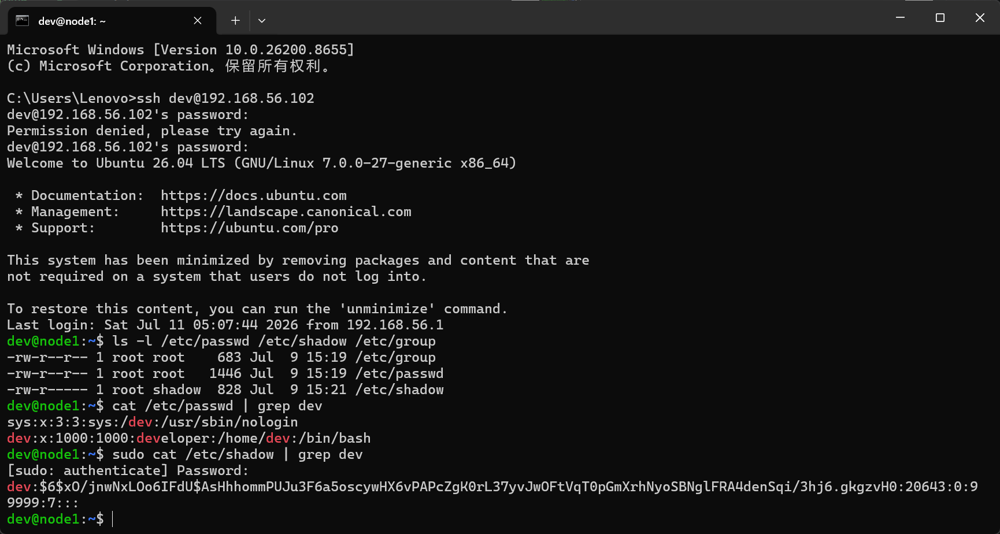
*△ 图 2 · cat /etc/passwd 查看系统中的所有用户*

---

**1.3 逐行读懂 `/etc/shadow`**

```bash
sudo cat /etc/shadow | grep dev
```

输出示例：
```
dev:$y$j9T$...:20012:0:99999:7:::
```

八个冒号分隔的字段：

| 序号 | 字段 | 含义 |
|:--:|:--|:--|
| 1 | username | 登录名 |
| 2 | password | 加密后的密码哈希（`$y$` 开头 = yescrypt 算法，Ubuntu 26.04 默认） |
| 3 | lastchange | 上次修改密码的日期（从 1970-01-01 算起的天数） |
| 4 | min | 两次改密码的最短间隔（0 = 无限制） |
| 5 | max | 密码最长有效期（99999 = 永不过期） |
| 6 | warn | 到期前多少天开始提醒 |
| 7 | inactive | 过期后多少天锁定账户 |
| 8 | expire | 账户到期日期（空 = 永不到期） |

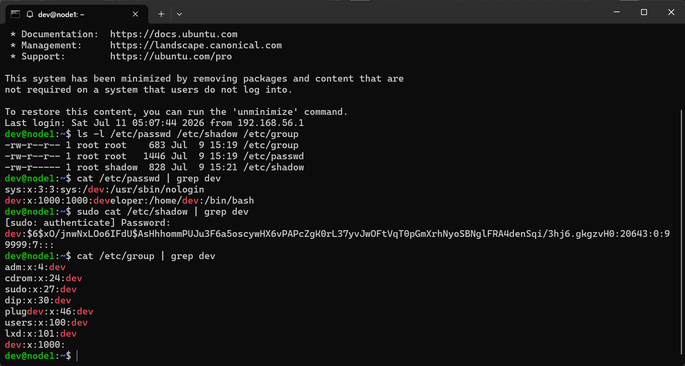
*△ 图 3 · sudo cat /etc/shadow 查看 dev 用户的密码哈希*

---

**1.4 逐行读懂 `/etc/group`**

```bash
cat /etc/group | grep dev
```

输出示例：
```
dev:x:1000:
```

| 序号 | 字段 | 含义 |
|:--:|:--|:--|
| 1 | groupname | 组名 |
| 2 | password | 组密码占位符（几乎不用） |
| 3 | GID | 组 ID |
| 4 | members | 附加成员列表（逗号分隔，主组成员不在此列出） |


*△ 图 4 · cat /etc/group 查看 dev 用户所在的组*

---

### 步骤二 创建用户与组 —— 搭建多用户场景

> 🎯 本步骤的目标：构造一个真实的多用户协作目录结构，为后面的权限实验搭建舞台。

**2.1 创建三个普通用户**

```bash
# 创建 alice 和 bob（普通开发者）
sudo useradd -m -s /bin/bash alice
sudo useradd -m -s /bin/bash bob

# 创建 eve（运维/管理员角色）
sudo useradd -m -s /bin/bash eve

# 给每人设密码（设为 123456，仅实验用）
echo "alice:123456" | sudo chpasswd
echo "bob:123456" | sudo chpasswd
echo "eve:123456" | sudo chpasswd
```

`useradd` 常用选项：

| 选项 | 含义 |
|:--:|:--:|
| `-m` | 自动创建主目录 `/home/用户名` |
| `-s /bin/bash` | 指定登录 Shell |
| `-g 组名` | 指定主组（默认创建同名组） |
| `-G 组1,组2` | 添加到附加组 |
| `-u 数字` | 手动指定 UID |

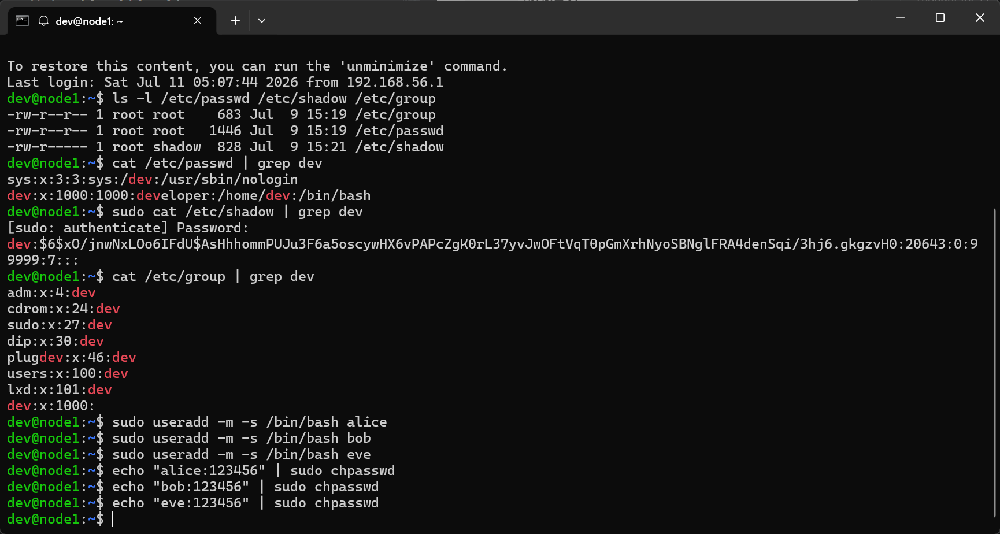
*△ 图 5 · useradd 创建 alice、bob、eve 三个用户*

---

**2.2 创建两个项目组**

```bash
sudo groupadd developers              # 开发组（alice 和 bob 属于这里）
sudo groupadd ops                     # 运维组（eve 属于这里）
```

---

**2.3 把用户加入对应的组**

```bash
# alice 和 bob 加入 developers 组
sudo usermod -aG developers alice
sudo usermod -aG developers bob

# eve 加入 ops 组，同时也可以旁观开发组
sudo usermod -aG ops,developers eve

# 查看各用户属于哪些组
groups alice
groups bob
groups eve
```

> `-aG` 的含义：`-a`（append 追加）+ `-G`（附加组列表）。**只写 `-G` 不带 `-a` 会覆盖掉用户原来的附加组**，比如把 admin 从 sudo 组踢出去，所以务必加 `-a`。

---

**2.4 查看创建结果**

```bash
# 确认三个用户都存在于 /etc/passwd 中
tail -3 /etc/passwd

# 确认两个组都在 /etc/group 中
tail -2 /etc/group
```

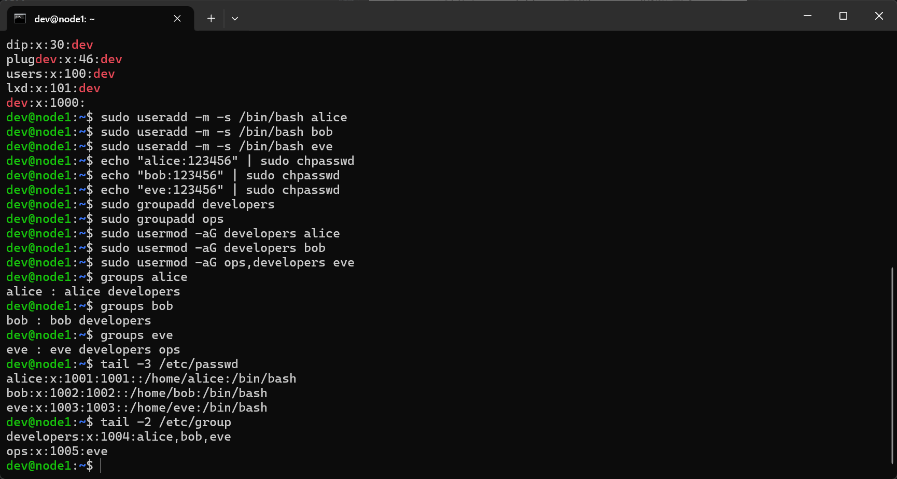
*△ 图 6 · 用户和组创建完成，验证 /etc/passwd 和 /etc/group*

---

### 步骤三 构建共享项目目录

**3.1 创建项目目录并设置组所有权**

```bash
# 创建项目根目录
sudo mkdir -p /shared/project

# 把 owner 改成 dev，group 改成 developers
sudo chown dev:developers /shared/project

ls -ld /shared/project
```

---

**3.2 创建各角色的子目录**

```bash
# 源码目录 —— 开发组可写
sudo mkdir /shared/project/src
sudo chown dev:developers /shared/project/src

# 运维配置目录 —— 只有 ops 组可写
sudo mkdir /shared/project/deploy
sudo chown dev:ops /shared/project/deploy

# 公共文档目录 —— 所有人都能看
sudo mkdir /shared/project/docs
sudo chown dev:developers /shared/project/docs
```

---

**3.3 在各目录中放一些示例文件**

```bash
# 源码文件（属于开发组）
echo 'print("Hello from Alice")' | sudo tee /shared/project/src/main.py
echo 'DATABASE_URL=postgresql://localhost/prod' | sudo tee /shared/project/src/config.ini

# 部署脚本（属于运维组）
echo '#!/bin/bash
# Deploy script - OPS ONLY
docker compose up -d
systemctl restart nginx' | sudo tee /shared/project/deploy/deploy.sh

# 项目文档（公共可读）
echo '# Project Alpha
## Team
- alice: 后端开发
- bob: 前端开发
- eve: 运维部署
## Status
- 当前版本: v1.2.0
- 上线日期: 2026-07-01' | sudo tee /shared/project/docs/README.md
```

---

**3.4 查看目录结构**

```bash
ls -lR /shared/project
```

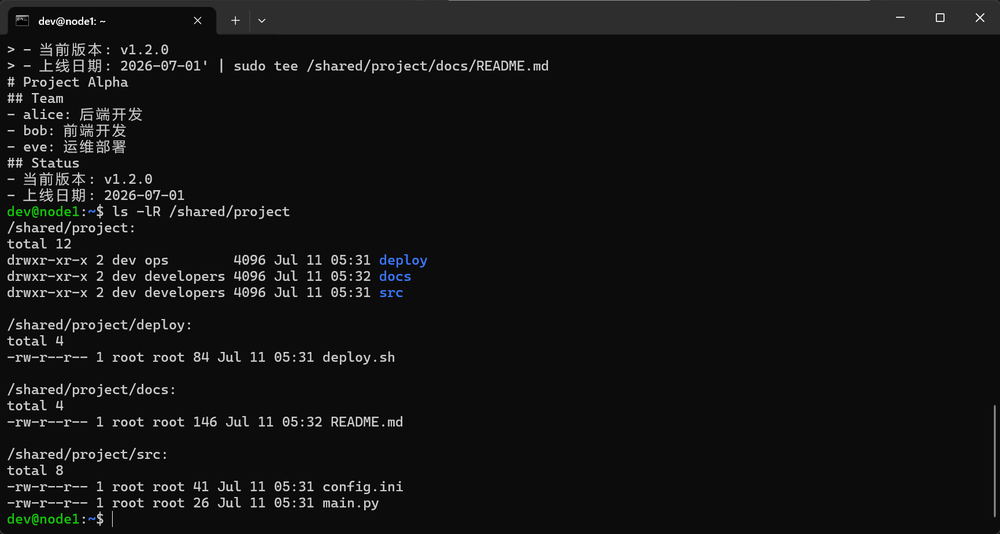
*△ 图 7 · ls -lR 查看 /shared/project 的完整目录结构和默认权限*

---

### 步骤四 文件权限 —— `rwx` 的三种姿态

权限是 Linux 安全模型的基石。每个文件都有三组权限（所有者 · 所属组 · 其他人），每组由 `r` `w` `x` 三个位组成。

**4.1 `rwx` 分别对文件和目录的含义**

| 权限 | 字母 | 数字 | 对文件 | 对目录 |
|:--:|:--:|:--:|:--|:--|
| 读 | `r` | 4 | 可查看文件内容（`cat`） | 可列出目录内容（`ls`） |
| 写 | `w` | 2 | 可修改文件内容 | 可在目录中创建/删除文件 |
| 执行 | `x` | 1 | 可作为程序运行 | 可进入目录（`cd`） |

> 目录权限最容易踩的坑：目录有 `r` 没 `x`，可以 `ls` 看到文件名，但无法 `cd` 进去。目录的 `x` 不是"执行目录"，而是"能否访问这个目录的内部"。Linux 面试中最常被问到的知识点之一。

---

**4.2 符号法修改权限（适合少量微调）**

符号法格式：`chmod [who][+-=][permissions] file`

| who | 含义 | 操作符 | 含义 |
|:--:|:--:|:--:|:--:|
| `u` | user（所有者） | `+` | 添加权限 |
| `g` | group（所属组） | `-` | 移除权限 |
| `o` | others（其他人） | `=` | 设为精确值 |
| `a` | all（以上全部） | | |

```bash
cd /shared/project

# 示例1：给 deploy.sh 加上执行权限
sudo chmod u+x deploy/deploy.sh
ls -l deploy/deploy.sh

# 示例2：撤消其他人对 config.ini 的读权限
sudo chmod o-r src/config.ini
ls -l src/config.ini

# 示例3：把 main.py 设成只有所有者能读写
sudo chmod go-rw src/main.py
ls -l src/main.py
```

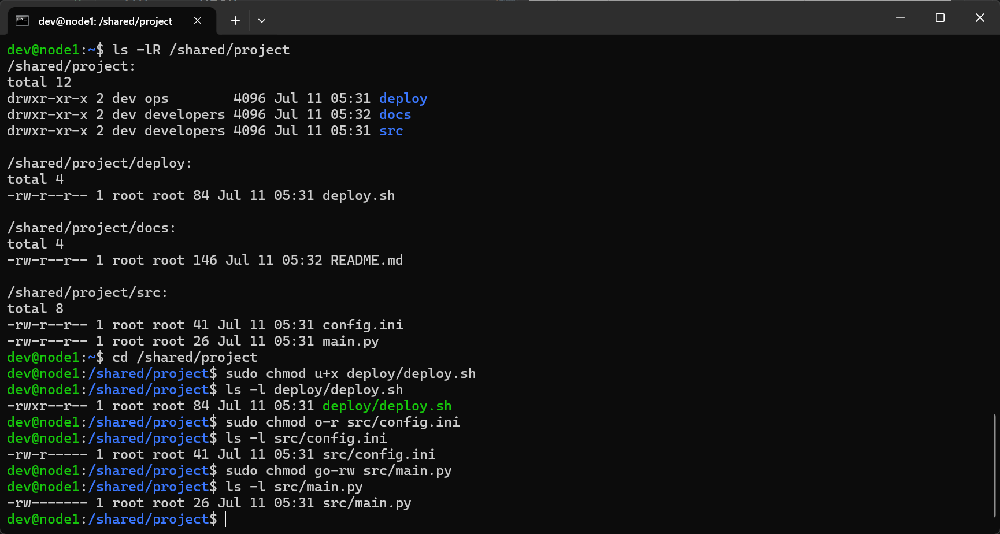
*△ 图 8 · 符号法修改权限 —— 每次改完立刻 ls -l 验证*

---

**4.3 数字法修改权限（批量设置最常用）**

数字法格式：`chmod [三位数字] file`

三位数字分别表示 owner、group、others 的权限，每位 = r(4) + w(2) + x(1)：

| 数字 | 权限 | 含义 |
|:--:|:--:|:--:|
| 7 | `rwx` | 读+写+执行（4+2+1） |
| 6 | `rw-` | 读+写（4+2） |
| 5 | `r-x` | 读+执行（4+1） |
| 4 | `r--` | 只读 |
| 0 | `---` | 无权限 |

常用组合及场景：

```bash
# 755 → 目录标准权限（owner 全权，其他人可读可进）
sudo chmod 755 /shared/project/docs
ls -ld /shared/project/docs

# 644 → 文件标准权限（owner 可写，其他人只读）
sudo chmod 644 /shared/project/docs/README.md
ls -l /shared/project/docs/README.md

# 700 → 私有目录（只有 owner 能进，运维脚本目录应该用这个）
sudo chmod 700 /shared/project/deploy
ls -ld /shared/project/deploy

# 600 → 私有文件（配置文件含密码，只有 owner 可读写）
sudo chmod 600 /shared/project/src/config.ini
ls -l /shared/project/src/config.ini

# 750 → 组内可读写、其他人完全挡在门外
sudo chmod 750 /shared/project/src
ls -ld /shared/project/src
```

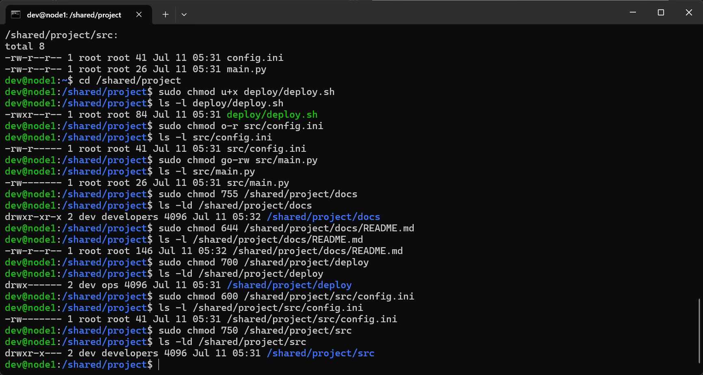
*△ 图 9 · 数字法批量设置权限 —— 755/644/700/600/750 五种常用组合*

---

**4.4 数字法速记口诀**

```
r=4  w=2  x=1
所有者 · 所属组 · 其他人
 第一位    第二位    第三位

755 = 所有者 rwx + 组 r-x + 别人 r-x  → 目录标配
644 = 所有者 rw- + 组 r-- + 别人 r--  → 文件标配
700 = 所有者 rwx + 组 --- + 别人 ---  → 私有目录
600 = 所有者 rw- + 组 --- + 别人 ---  → 私有文件（含密码的配置）
777 = 所有人 rwx（极度危险，永远不要用）
```

---

### 步骤五 修改文件的所有者和所属组

权限只管"谁能做什么"，所有者和所属组决定"你是谁"。

**5.1 `chown` —— 改所有者**

```bash
# 把 deploy.sh 的主人交给 eve
sudo chown eve /shared/project/deploy/deploy.sh
ls -l /shared/project/deploy/deploy.sh

# 把 main.py 的主人交给 alice
sudo chown alice /shared/project/src/main.py
ls -l /shared/project/src/main.py
```

---

**5.2 `chown` 同时改所有者和组**

```bash
# 格式：chown 用户:组 文件
sudo chown bob:developers /shared/project/docs/README.md
ls -l /shared/project/docs/README.md
```

---

**5.3 `chgrp` —— 只改组**

```bash
# 把 deploy.sh 的组改成 ops
sudo chgrp ops /shared/project/deploy/deploy.sh
ls -l /shared/project/deploy/deploy.sh
```

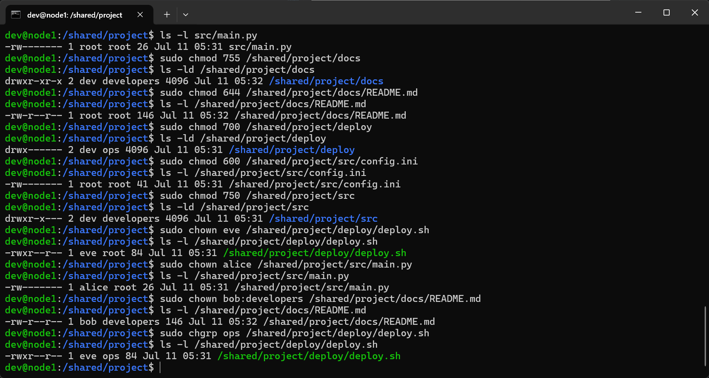
*△ 图 10 · chown 和 chgrp 修改文件的所有者和所属组*

---

### 步骤六 目录的 SetGID —— 让组权限自动继承

目录设了 SetGID 位后，在该目录下创建的任何文件会自动继承目录的所属组。这是**多人协作目录**的标准配置。

```bash
# 1. 给 src 目录设 SetGID 位（g+s）
sudo chmod g+s /shared/project/src
ls -ld /shared/project/src
# 权限位显示 drwxr-s---（组 x 变成了 s）

# 2. 以 dev 身份在 src 下创建文件
touch /shared/project/src/newfile.py
ls -l /shared/project/src/newfile.py
# 文件的组自动变成 developers，而不是 dev
```

> SetGID 的数字表示：`2775`，最前面的 `2` 就是 SetGID 位。对于多人协作项目，`sudo chmod 2770 /shared/project/src` 是标准起手式。

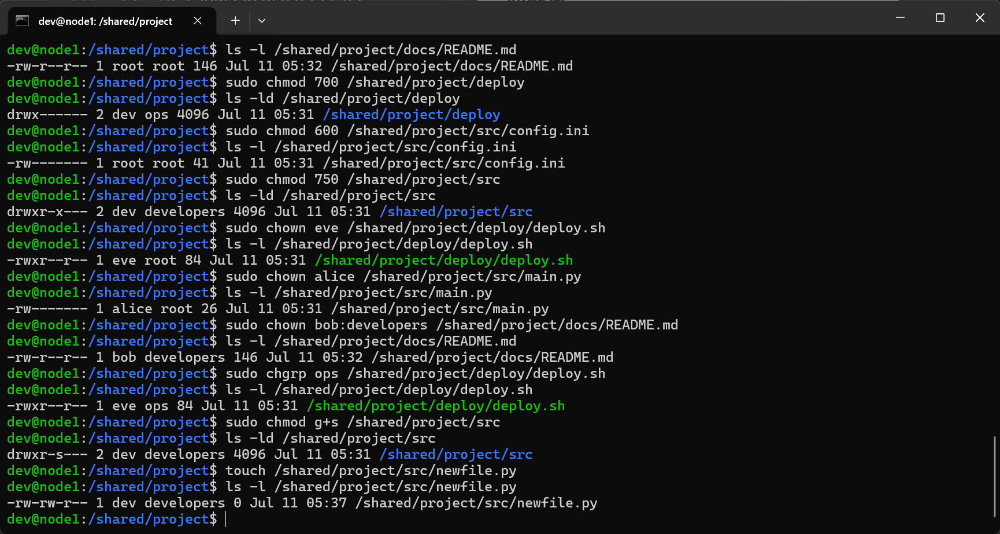
*△ 图 11 · SetGID 位 —— 组权限位出现 s，newfile 自动继承 developers 组*

---

### 步骤七 切换用户验证权限

**7.1 用 `su` 切换身份**

```bash
# 切换到 alice
su - alice
# 输入密码 123456

# 以 alice 身份尝试操作
cat /shared/project/src/main.py        # alice 是 main.py 的 owner，应该能读
cat /shared/project/src/config.ini     # config.ini 设了 o-r，alice 是 owner 吗？
cat /shared/project/deploy/deploy.sh   # deploy 设了 700 + owner=eve，alice 进得去吗？
cd /shared/project/deploy              # 试试看能不能进

# 退出 alice，回到 dev
exit
```

> `su - 用户名` 和 `su 用户名` 的区别：带 `-` 会加载目标用户的环境变量和主目录，等于完整切换；不带 `-` 只换 UID，当前目录和环境变量保持不变。

---

**7.2 以 eve 身份测试运维目录**

```bash
su - eve
# 密码 123456

# deploy 的 owner 就是 eve，700 权限下只有 eve 能进
cd /shared/project/deploy
cat deploy.sh
ls -ld /shared/project/deploy

exit
```

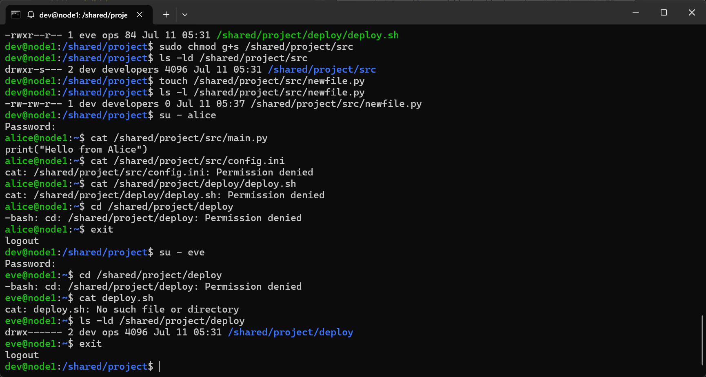
*△ 图 12 · su 切换用户 —— alice 无权限访问 deploy 目录，eve 畅通无阻*

---

**7.3 从 dev 用 `sudo` 临时提权**

`su` 是完全变身，`sudo` 是"借一下 root 的力量跑一条命令"。实验三、四里到处都在用的 `sudo`，背后的配置就在 `/etc/sudoers`：

```bash
# 看看 dev 用户为什么能用 sudo
sudo cat /etc/sudoers | grep -v "^#" | grep -v "^$"
```

> `/etc/sudoers` 不要直接用编辑器修改，要用 `sudo visudo` —— visudo 会在保存前做语法检查，避免因配置语法错误导致所有用户都无法 sudo（那就要进单用户模式救了）。

---

### 步骤八 清理与总结

```bash
# 退出所有 su 身份，回到 dev
exit  # 如果当前在 eve 或 alice 下

# 查看 /shared 的整体权限结构
ls -lR /shared/project
```

---

## 4. 实验结果

| 验证项 | 关键命令 | 预期结果 | 实际结果 |
|:--:|:--:|:--:|:--:|
| 查看三核心文件 | `ls -l /etc/passwd /etc/shadow /etc/group` | shadow 仅 root 可读写 | ✅ 正常 |
| 创建用户 | `sudo useradd -m alice` | 生成 /home/alice + /etc/passwd 条目 | ✅ 正常 |
| 创建组 | `sudo groupadd developers` | /etc/group 新增一行 | ✅ 正常 |
| 加入附加组 | `sudo usermod -aG developers alice` | `groups alice` 含 developers | ✅ 正常 |
| chmod 符号法 | `sudo chmod u+x deploy.sh` | owner 获得 x 权限 | ✅ 正常 |
| chmod 数字法 | `sudo chmod 755 docs` | `drwxr-xr-x` | ✅ 正常 |
| SetGID | `sudo chmod g+s src` | 权限位出现 `s` | ✅ 正常 |
| chown | `sudo chown eve deploy.sh` | owner 改为 eve | ✅ 正常 |
| su 切换 | `su - alice` → 尝试进 deploy | Permission denied | ✅ 正常 |
| sudo 提权 | `sudo cat /etc/shadow` | 查看密码文件 | ✅ 正常 |

---

## 5. 知识总结

### 5.1 权限模型全景图

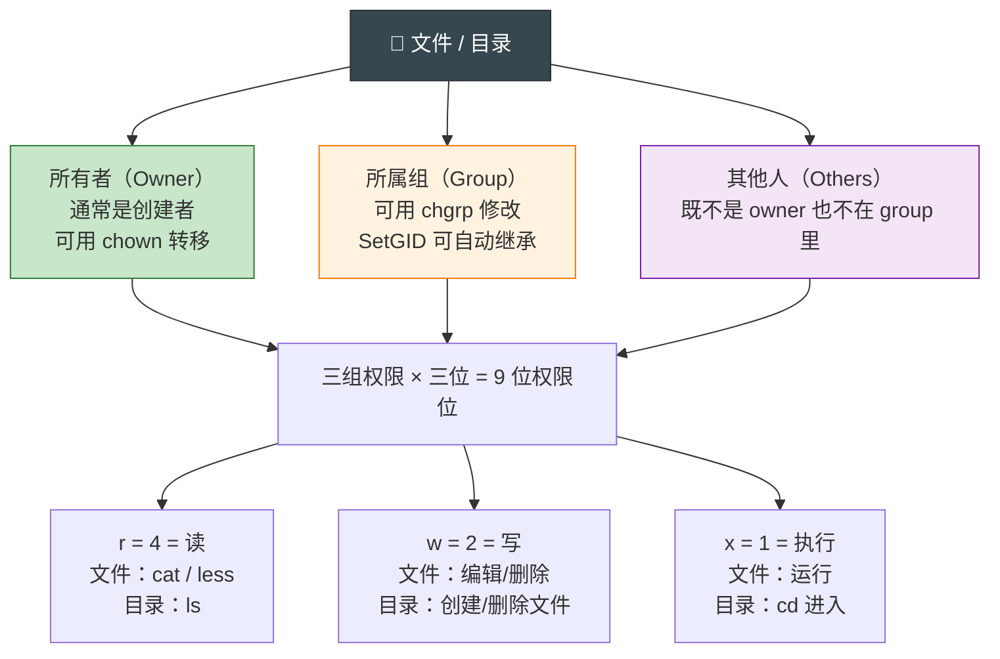

---

### 5.2 数字权限速查

| 数字 | 二进制 | 权限 | 典型用途 |
|:--:|:--:|:--:|:--:|
| 0 | 000 | `---` | 封锁某组用户 |
| 4 | 100 | `r--` | 只读文件 |
| 5 | 101 | `r-x` | 只读可进入的目录 |
| 6 | 110 | `rw-` | 可读写文件 |
| 7 | 111 | `rwx` | 所有者权限；可读写可进的目录 |
| 750 | 111 101 000 | `rwxr-x---` | 项目源码目录（组内可读，外人全挡） |
| 755 | 111 101 101 | `rwxr-xr-x` | 公共目录 |
| 644 | 110 100 100 | `rw-r--r--` | 公共文件 |
| 600 | 110 000 000 | `rw-------` | 含密码的配置文件 |
| 700 | 111 000 000 | `rwx------` | 私有目录/脚本 |
| 2770 | 010 111 111 000 | `rwxrws---` | SetGID 协作目录 |

---

### 5.3 账户管理命令速查

| 任务 | 命令 | 示例 |
|:--:|:--:|:--:|
| 创建用户 | `useradd -m -s /bin/bash` | `sudo useradd -m alice` |
| 设密码 | `passwd` / `chpasswd` | `echo "alice:pw" \| sudo chpasswd` |
| 修改用户 | `usermod` | `sudo usermod -aG sudo alice` |
| 删除用户 | `userdel -r` | `sudo userdel -r alice`（-r 同时删主目录） |
| 创建组 | `groupadd` | `sudo groupadd developers` |
| 查看组 | `groups` | `groups alice` |
| 切换用户 | `su -` | `su - alice` |
| 临时提权 | `sudo` | `sudo cat /etc/shadow` |

---

### 5.4 主组 vs 附加组

| | 主组（Primary Group） | 附加组（Supplementary Group） |
|:--:|:--:|:--:|
| 存储位置 | `/etc/passwd` 第 4 字段（GID） | `/etc/group` 第 4 字段（成员列表） |
| 数量 | 一个用户只有一个 | 一个用户可以属于多个 |
| 影响什么 | 创建文件时默认的所属组 | `sudo` 等权限判断 |
| 用什么命令 | `usermod -g` | `usermod -aG` |

---

## 6. 出现问题

| 问题 | 现象 | 原因 | 解决方案 |
|:--:|:--:|:--:|:--:|
| 目录有 `ls` 但进不去 | `cd dir` 报 Permission denied，但 `ls dir` 能看到文件名 | 目录有 `r` 没 `x` | `sudo chmod o+x dir` |
| 文件删不掉 | `rm file` 报 Permission denied | 不是 owner，且目录没有写权限 | 文件能否被删除取决于**所在目录的写权限**，不是文件本身 |
| `useradd` 未找到 | `useradd: command not found` | 没加 `sudo` 或 PATH 问题 | `sudo useradd ...` |
| `usermod -G` 把用户踢出 sudo | 改了附加组后 `sudo` 失效 | 忘记加 `-a`，覆盖了原有的附加组成员资格 | 进 recovery mode 或用 root 修复：`usermod -aG sudo dev` |
| `/etc/sudoers` 改坏 | `sudo` 全部失效 | 直接用普通编辑器修改，语法错误 | **务必用 `visudo` 编辑**；已坏的只能用 root 或恢复模式修复 |
| `su` 不加载环境 | `su alice` 后 `~` 还是之前的目录 | 忘加 `-` | 用 `su - alice` |
| 用户删不掉 | `userdel alice` 报进程占用 | 该用户还有进程在运行 | `sudo pkill -u alice` 先杀掉所有进程再删 |

---

## 7. 心得体会

实验五和实验四的体感完全不同。实验四是"在一片平坦的荒地上学走路"——看文件、建目录、装软件，操作都是自己的，不会撞到墙。实验五是"在大楼里学开门"——每个房间（目录）都上了锁，你要搞清自己是谁、属于哪个组、钥匙（权限位）在不在手上，走错一步就是 Permission denied。

最直观的收获是：终于弄懂了 `ls -l` 最前面那串 `-rwxr-xr--` 到底什么意思。以前只知道"这串东西跟权限有关"，现在能闭眼翻译成"普通文件、owner 可读写执行、同组可读执行、其他人只读"。从"知道有这么个东西"到"能用它控制谁能访问什么"，这是两个完全不同的层次。

另一个很大的认知转变：目录权限比文件权限更重要。文件能不能删不取决于文件本身的 w，而取决于它所在目录的 w——这个面试必考题，亲手被 Permission denied 拦几次之后就一辈子忘不掉了。权限管理的本质不是记 `chmod 755` 这条命令，而是理解 Linux"以文件为中心"的安全模型：系统中每一个操作——登录、读文件、删文件、装软件——背后都是一次权限检查。
