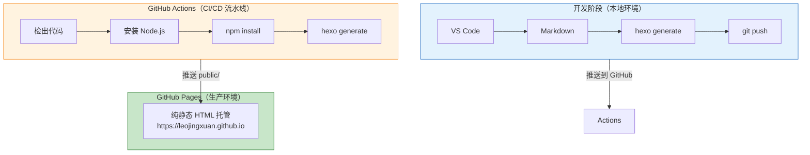
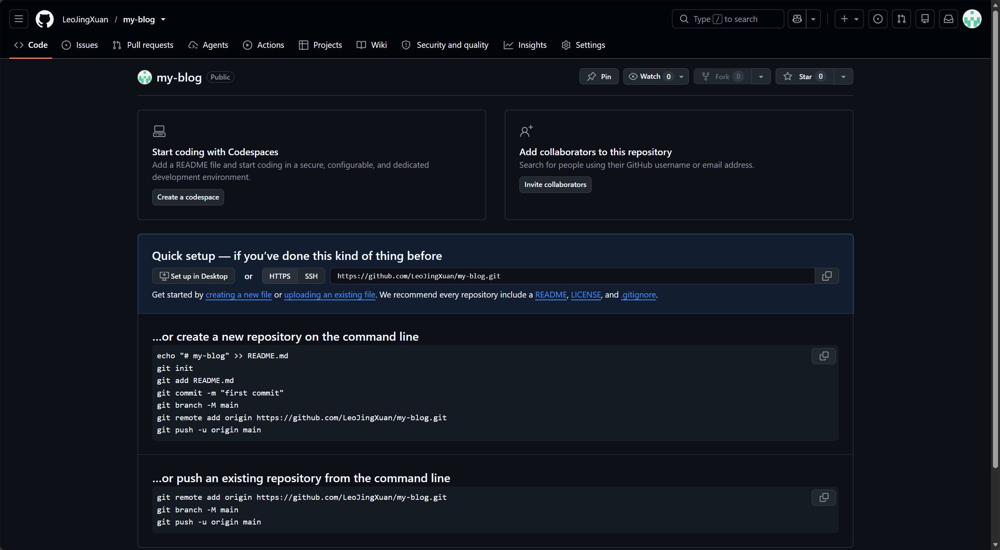
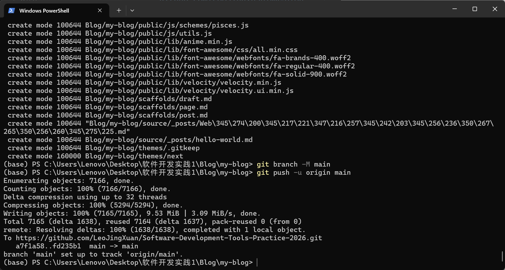
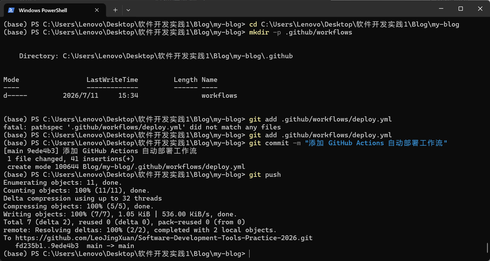
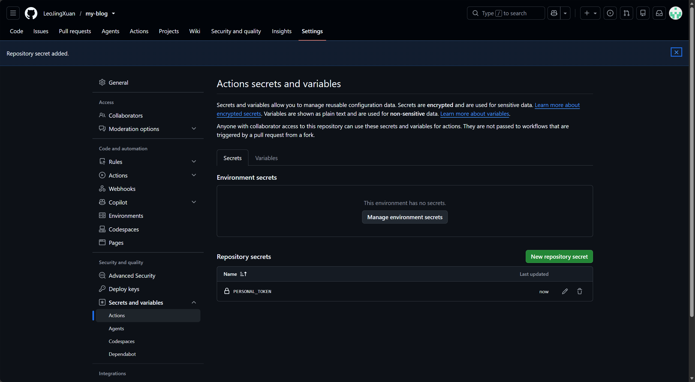
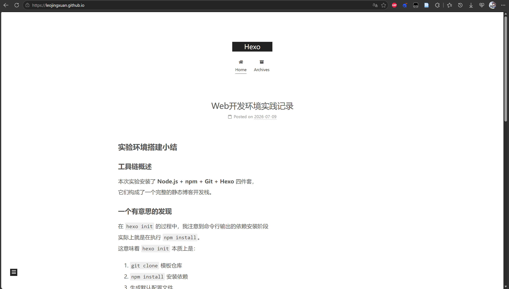
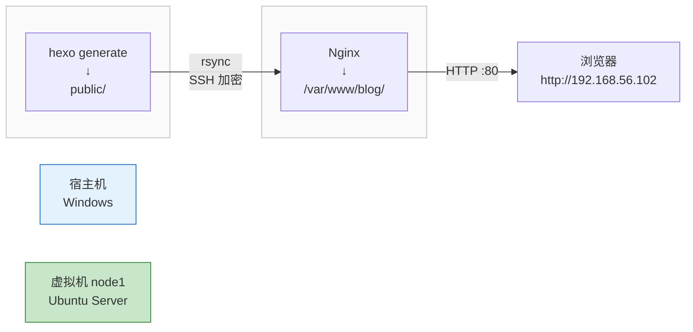
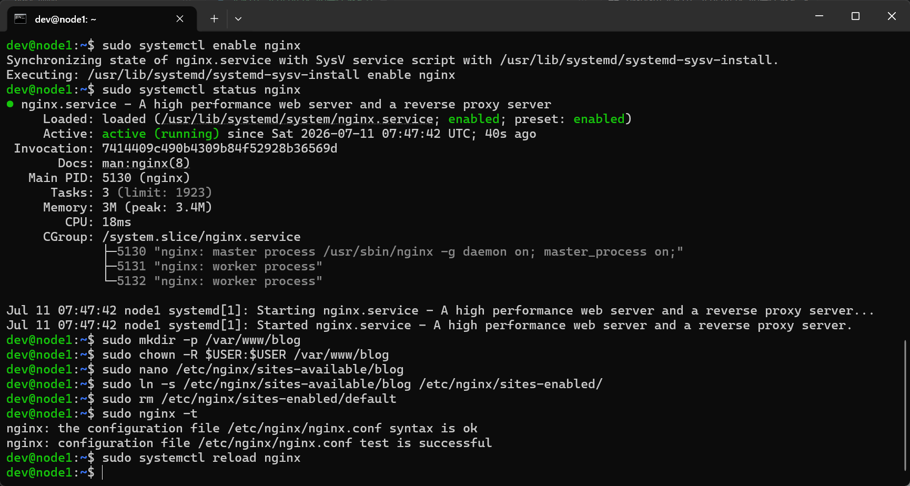
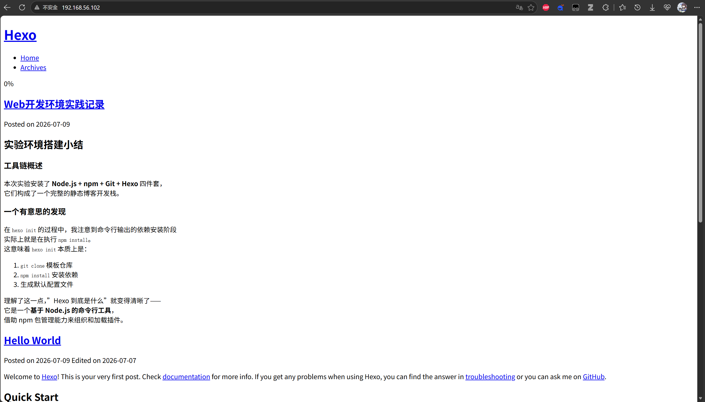
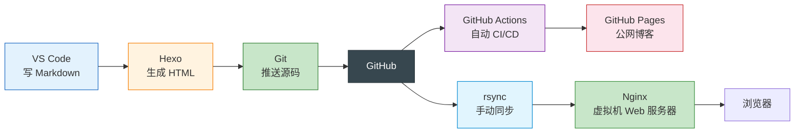

# 实验八：软件部署
> **姓名**：来靖轩 **学号**：25050824 **完成日期**：2026年7月11日

---

## 1. 实验目的

1. 综合运用前七个实验所学的各类工具
2. 构建和模拟一个完整的网络环境
3. 完整体验和实现 Web 静态站点从开发到部署的全过程
4. 掌握自动化部署（CI/CD）的基本概念与实践方法

---

## 2. 实验环境

| 项目 | 配置 |
|:---:|:---:|
| 宿主机操作系统 | Windows 11 家庭中文版 25H2 |
| 虚拟机操作系统 | Ubuntu Server 26.04 LTS |
| 虚拟机节点 | node1（192.168.56.102）充当部署服务器 |
| Web 服务器 | Nginx |
| 静态站点框架 | Hexo |
| 远程同步工具 | rsync（SSH 通道） |
| CI/CD 平台 | GitHub Actions |
| 托管平台 | GitHub Pages |
| GitHub 账号 | `LeoJingXuan` |

---

## 3. 实验过程

> 💡 本实验分为两个独立部分：**第一部分**走 GitHub Actions → GitHub Pages 自动部署；**第二部分**走 rsync → Nginx → 虚拟机手动部署。两部分的 Hexo 博客源码相同，部署目标不同。

---

### 第一部分：GitHub Pages 自动化部署（CI/CD）



---

#### 步骤一　准备工作

> 📍 在 **[宿主机]** PowerShell 中执行。

确认 Hexo 博客正常运行：

```bash
cd C:\Users\Lenovo\Desktop\软件开发实践1\Blog\my-blog
hexo server
# 浏览器打开 http://localhost:4000 —— 确认博客能正常显示
```

确认 Git 已配置全局用户信息：

```bash
git config --global user.name
git config --global user.email
```

---

#### 步骤二　创建两个 GitHub 仓库

| 仓库 | 名称 | 可见性 | 用途 |
|:--:|:--:|:--:|:--:|
| 源码仓库 | `my-blog` | Private（或不限） | 存放 Hexo 源码（Markdown + 主题 + 配置） |
| 部署仓库 | `<用户名>.github.io` | **Public** | 托管生成的静态 HTML 页面 |

> 部署仓库已在实验一中创建（`LeoJingXuan.github.io`），无需重复创建。


*△ 图 1 · GitHub 创建源码仓库 my-blog*

---

#### 步骤三　将本地项目关联到源码仓库

> 📍 在 **[宿主机]** PowerShell 中执行。

```bash
cd C:\Users\Lenovo\Desktop\软件开发实践1\Blog\my-blog

# 创建 .gitignore（排除不需要上传的文件）
echo "node_modules/
.DS_Store
public/
.deploy_git/" > .gitignore

# 关联远程仓库并推送
git remote add origin https://github.com/LeoJingXuan/my-blog.git
git add .
git commit -m "初始化 Hexo 博客源码"
git branch -M main
git push -u origin main
```


*△ 图 2 · git push 推送 Hexo 源码到 GitHub*

---

#### 步骤四　配置 GitHub Actions 自动部署

> 📍 在 **[宿主机]** 博客项目目录中操作，然后 git push 提交到 GitHub。

创建工作流目录和文件：

```bash
cd C:\Users\Lenovo\Desktop\软件开发实践1\Blog\my-blog
mkdir -p .github/workflows
```

创建 `deploy.yml`（请将 `LeoJingXuan` 替换为你的用户名）：

```yaml
name: Deploy to GitHub Pages

on:
  push:
    branches: [main]
  workflow_dispatch:

jobs:
  deploy:
    runs-on: ubuntu-latest
    steps:
      - name: 检出源码
        uses: actions/checkout@v3

      - name: 安装 Node.js
        uses: actions/setup-node@v3
        with:
          node-version: '20'

      - name: 缓存依赖
        uses: actions/cache@v3
        with:
          path: ~/.npm
          key: ${{ runner.os }}-node-${{ hashFiles('**/package-lock.json') }}

      - name: 安装依赖
        run: npm install

      - name: 生成静态文件
        run: npx hexo generate

      - name: 创建 .nojekyll 文件
        run: echo "" > public/.nojekyll

      - name: 部署到 GitHub Pages
        uses: peaceiris/actions-gh-pages@v3
        with:
          personal_token: ${{ secrets.PERSONAL_TOKEN }}
          publish_dir: ./public
          publish_branch: master
          external_repository: LeoJingXuan/LeoJingXuan.github.io
```

各步骤作用：

| 步骤 | 作用 |
|:--|:--|
| `actions/checkout@v3` | 把仓库源码拉取到 CI 运行环境 |
| `actions/setup-node@v3` | 安装指定版本的 Node.js |
| `actions/cache@v3` | 缓存 `node_modules`，下次构建更快 |
| `npm install` | 安装 Hexo 及所有插件依赖 |
| `npx hexo generate` | 编译 Markdown → 静态 HTML（输出到 `public/`） |
| `actions-gh-pages@v3` | 将 `public/` 文件夹推送到部署仓库 |

提交并推送工作流文件：

```bash
git add .github/workflows/deploy.yml
git commit -m "添加 GitHub Actions 自动部署工作流"
git push
```


*△ 图 3 · 创建 GitHub Actions 工作流 + git push 推送到远程*

---

#### 步骤五　生成并配置 Personal Access Token

1. GitHub → 右上角头像 → **Settings**
2. 左侧 **Developer settings** → **Personal access tokens** → **Tokens (classic)**
3. **Generate new token (classic)**
4. 勾选 **repo** 权限（含所有子项）
5. 点击 **Generate token**
6. **立即复制** Token（离开页面后不可见，需重新生成）

> 最小权限原则：Token 只需 `repo`，不要勾选 `admin`、`delete_repo` 等敏感权限。

然后配置到源码仓库的 Secrets：

1. 打开源码仓库 `my-blog` → **Settings** → **Secrets and variables** → **Actions**
2. **New repository secret**
   - Name：`PERSONAL_TOKEN`
   - Secret：粘贴刚才复制的 Token


*△ 图 4 · 生成 Personal Access Token + 配置到仓库 Secrets*

---

#### 步骤六　配置 GitHub Pages 并验证

1. 打开部署仓库 `LeoJingXuan.github.io` → **Settings** → **Pages**
2. **Branch** 选择 `master`，点击 **Save**
3. 回到源码仓库 → **Actions** 页签
4. 手动触发一次 `Deploy to GitHub Pages`（Run workflow）
5. 等待构建完成（约 1-2 分钟，绿色 ✓ 表示成功）
6. 浏览器访问 `https://leojingxuan.github.io`

> `workflow_dispatch` 允许手动触发构建；`on.push.branches: [main]` 则使得以后每次 `git push` 源码都会自动触发部署。


*△ 图 5 · GitHub Actions 构建成功 + GitHub Pages 线上博客验证*

---

### 第二部分：部署到云服务器（虚拟机）

第二部分将 Hexo 生成的静态文件通过 rsync 推送到虚拟机中的 Nginx 服务器。



---

#### 步骤七　在虚拟机上安装和配置 Nginx

> 📍 在 **[node1]** 上执行。

```bash
sudo apt update
sudo apt install nginx -y
sudo systemctl start nginx
sudo systemctl enable nginx
sudo systemctl status nginx           # 确认 active (running)
```

创建站点目录：

```bash
sudo mkdir -p /var/www/blog
sudo chown -R $USER:$USER /var/www/blog
```

创建 Nginx 站点配置：

```bash
sudo nano /etc/nginx/sites-available/blog
```

写入以下内容：

```nginx
server {
    listen 80;
    server_name _;
    root /var/www/blog;
    index index.html;
}
```

启用站点：

```bash
sudo ln -s /etc/nginx/sites-available/blog /etc/nginx/sites-enabled/
sudo rm /etc/nginx/sites-enabled/default   # 移除默认站点（可选）
sudo nginx -t                               # 测试配置语法
sudo systemctl reload nginx                 # 重载配置
```

> Nginx 的 `sites-available/` vs `sites-enabled/` 设计：前者是所有可用站点的"菜谱"，后者是正在上菜的"餐桌"。用软链接决定启用哪个，方便测试和回滚。


*△ 图 6 · 安装 Nginx + 创建站点配置 + nginx -t 语法测试 + 重载服务*

---

#### 步骤八　使用 rsync 部署静态文件

> 📍 在 **[宿主机]** PowerShell 或 CMD 中执行。Windows 不自带 rsync，使用 scp 代替（效果一致，首次部署无旧文件问题）：

```bash
cd C:\Users\Lenovo\Desktop\软件开发实践1\Blog\my-blog

# 生成静态文件
hexo generate

# scp 同步到虚拟机（走 SSH 加密通道，等价于 rsync 效果）
scp -r public/* dev@192.168.56.102:/var/www/blog/
```

| 选项 | 含义 |
|:--:|:--|
| `-a` | 归档模式（保留权限和时间戳） |
| `-v` | 显示传输详情 |
| `-z` | 传输时压缩（节省带宽） |
| `-e ssh` | 走 SSH 加密通道 |
| `--delete` | 目标端多余的旧文件会被删除（保持完全同步） |

> 注意 `public/` 末尾的斜杠：带 `/` 表示同步该目录内的内容到目标；不带 `/` 则连目录本身也复制过去——二者语义不同。

部署完成后，在宿主机浏览器访问：`http://192.168.56.102`

> 若无法访问，检查：① Windows 防火墙是否放行 80 端口入站；② `ping 192.168.56.102` 是否通；③ node1 上 `systemctl status nginx` 是否 running。


*△ 图 7 · hexo generate + rsync 部署 + 浏览器访问 Nginx 上的博客*

---

## 4. 实验结果

| 验证项 | 关键操作 | 预期结果 | 实际结果 |
|:--:|:--:|:--:|:--:|
| Hexo 本地运行 | `hexo server` | `localhost:4000` 正常显示 | ✅ 正常 |
| 源码推送 GitHub | `git push -u origin main` | `my-blog` 仓库收到源码 | ✅ 正常 |
| GitHub Actions 构建 | Actions 页签查看 | 构建成功（绿色 ✓） | ✅ 正常 |
| GitHub Pages 公网访问 | 浏览器访问 `.github.io` | 博客正常显示 | ✅ 正常 |
| Nginx 安装运行 | `sudo systemctl status nginx` | `active (running)` | ✅ 正常 |
| Nginx 站点配置 | `sudo nginx -t` | `syntax is ok` + `test is successful` | ✅ 正常 |
| rsync 部署 | `rsync -avz ... public/ dev@...:/var/www/blog/` | 文件同步到虚拟机 | ✅ 正常 |
| 虚拟机 Web 访问 | 浏览器访问 `http://192.168.56.102` | Nginx 显示博客首页 | ✅ 正常 |

---

## 5. 知识总结

### 5.1 CI/CD 核心概念

| 概念 | 含义 | 本实验中的体现 |
|:--:|:--:|:--:|
| 持续集成（CI） | 代码变更后自动进行构建和测试 | 推送代码后自动执行 `hexo generate` |
| 持续部署（CD） | 构建通过后自动部署到生产环境 | 静态文件自动推送到 GitHub Pages |

手动部署的痛点：改一篇文章 → 本地 `hexo g` → 手动 `rsync` 上传 → 一天写三四篇就要反复操作。CI/CD 的价值：改完直接 `git push`，剩下的构建、部署、上线全由机器自动完成。

### 5.2 两种部署方式对比

| | GitHub Pages（自动） | Nginx 虚拟机（手动） |
|:--|:--|:--|
| 触发方式 | `git push` 自动触发 | 手动 `hexo g` + `rsync` |
| 服务器 | GitHub 免费托管 | 自己的 Ubuntu 虚拟机 |
| 访问地址 | `https://xxx.github.io` | `http://192.168.56.102` |
| 面向人群 | 全网公网可访问 | 仅 Host-Only 私网内可见 |
| 适用场景 | 个人博客、文档站 | 内网服务、需要完全控制服务器的场景 |
| 学习价值 | 理解 CI/CD 自动化流程 | 理解 Web 服务器（Nginx）工作原理 |

### 5.3 本实验中的工具链全景



---

## 6. 出现问题

| 问题 | 现象 | 原因 | 解决方案 |
|:--:|:--:|:--:|:--:|
| GitHub Actions 失败 | Actions 页签显示红色 ✗ | Token 权限不足或 Workflow 文件语法错误 | 检查 Token 是否勾选 `repo`；检查 `deploy.yml` 的 YAML 缩进 |
| GitHub Pages 显示 404 | 浏览器打开 `.github.io` 出 404 | 仓库命名不正确或 Pages 分支未设置 | 仓库名必须是 `用户名.github.io`；Settings → Pages → Branch 选 main |
| 部署后页面样式丢失 | 页面内容在但无 CSS | `_config.yml` 中 `url` 字段配置错误 | 确保 `url: https://用户名.github.io` |
| rsync 连接被拒绝 | `rsync` 报 `Connection refused` | node1 的 SSH 服务未运行 | `sudo systemctl start ssh` |
| Nginx 仍显示默认页 | 访问 IP 显示 "Welcome to nginx" | 站点配置未生效或默认站点未移除 | `sudo rm /etc/nginx/sites-enabled/default` + `sudo systemctl reload nginx` |
| `nginx -t` 报语法错 | `test failed` | 配置文件分号漏写或括号不匹配 | 逐行核对 `server` 块的大括号和分号 |

---

## 7. 拓展与进阶

### 7.1 Docker 容器化 Nginx

如果不想在虚拟机上直接装 Nginx，可以用 Docker 一行启动：

```bash
docker run -d --name blog -p 80:80 -v /var/www/blog:/usr/share/nginx/html:ro nginx
```

### 7.2 使用自定义域名

如果拥有自己的域名，在 GitHub Pages 的 Settings 中添加 Custom domain，在 DNS 服务商处加一条 CNAME 记录指向 `用户名.github.io`。

---

## 8. 心得体会

实验八是整门课的最后一块拼图。回过头看，八个实验是一条完整的链子：实验一装 Node.js → 实验二写 Markdown + Git → 实验三搭虚拟机 → 实验四学 Linux 命令 → 实验五管权限 → 实验六配环境 → 实验七通 SSH + rsync → 实验八把所有东西串在一起，一个 `git push` 就能让博客自动上线。

最震撼的是 GitHub Actions 那部分。修改一篇文章、`git push`、等两分钟刷新浏览器——新文章已经在公网上了。这种"改完即上线"的体验让我第一次真正明白 CI/CD 不是 PPT 上的三个字母，而是一条我亲手配的、实实在在的自动化流水线。另一面，rsync + Nginx 的手动部署又让我体会到"扎扎实实自己搭服务器"的踏实感——每一个 `systemctl reload nginx` 都是我自己的机器在干活。

从大一就把这八件工具摸一遍，以后做课设、打比赛、甚至实习写项目的时候，配环境、连服务器、调部署不会再是拦路虎——因为已经完完整整走过一遍了。
