# 实验六：Linux 环境配置
> **姓名**：来靖轩 **学号**：25050824 **完成日期**：2026年7月11日

---

## 1. 实验目的

1. 使用命令行进行 Linux 系统的基础操作，巩固文件导航、文件增删改查、系统状态查看等基本技能
2. 了解和简单管理常用系统配置文件（`/etc/passwd`、`/etc/group`、`/etc/profile` 等），理解每份文件的作用与格式
3. 了解和简单管理用户配置文件（`~/.bashrc`、`~/.profile` 等），能独立完成用户级个性化配置
4. 掌握环境变量的查看、临时设置与永久设置方法，理解用户级（`~/.bashrc`）与系统级（`/etc/environment`、`/etc/profile.d/`）的区别与适用场景

---

## 2. 实验环境

| 项目 | 配置 |
|:---:|:---:|
| 宿主机操作系统 | Windows 11 家庭中文版 25H2 |
| 虚拟机操作系统 | Ubuntu Server 26.04 LTS |
| 远程连接 | SSH（宿主机 PowerShell → node1） |
| 实验节点 | node1（192.168.56.102，用户名 `dev`） |

---

## 3. 实验过程

> 💡 所有命令通过 `ssh dev@192.168.56.102` 远程执行。

---

### 第一部分：系统基础操作

---

#### 步骤一　登录与查看系统信息

```bash
whoami                              # 查看当前用户
uname -a                            # 查看内核版本与架构
lsb_release -a                      # 查看 Ubuntu 发行版详情
hostname                            # 查看主机名
pwd                                 # 查看当前工作目录
```

| 命令 | 功能 | 典型输出 |
|:--:|:--:|:--:|
| `whoami` | 当前登录的用户名 | `dev` |
| `uname -a` | 内核名称、版本、硬件架构 | `Linux node1 7.0.0-27-generic ... x86_64` |
| `lsb_release -a` | Ubuntu 发行版号和代号 | `Ubuntu 26.04 LTS` |
| `hostname` | 主机名 | `node1` |
| `pwd` | 当前所在目录的完整路径 | `/home/dev` |

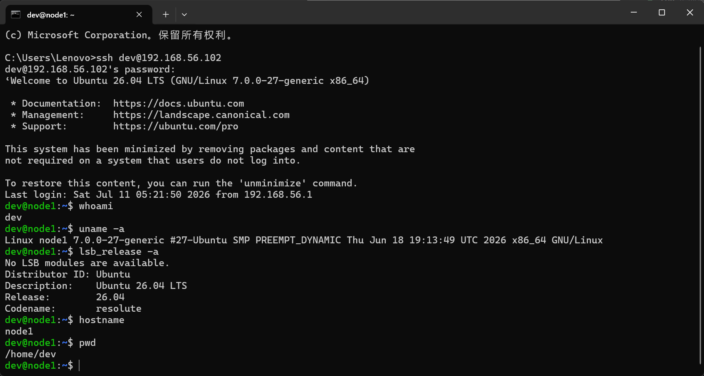
*△ 图 1 · 登录后查看系统信息 —— whoami + uname + lsb_release + hostname + pwd*

---

#### 步骤二　文件与目录的基本操作

```bash
ls -lh                              # 列出文件（详细信息，人类可读的大小）
cd ~                                # 切换到主目录
mkdir test_dir                      # 创建目录
touch test.txt                      # 创建空文件
cp test.txt test_copy.txt           # 复制文件
mv test.txt /tmp/                   # 移动文件
rm -f test.txt                      # 强制删除文件
```

| 命令 | 功能 | 常用选项 |
|:--:|:--:|:--:|
| `ls -lh` | 列出目录内容 | `-l` 详细信息，`-h` 人类可读大小，`-a` 含隐藏文件 |
| `cd ~` | 切换目录 | `~` 主目录，`..` 上级，`-` 上一次的目录 |
| `mkdir` | 创建目录 | `-p` 递归创建父目录 |
| `touch` | 创建空文件 / 更新时间戳 | |
| `cp` | 复制文件 | `-r` 递归复制目录 |
| `mv` | 移动 / 重命名 | |
| `rm` | 删除文件 | `-r` 递归删目录，`-f` 强制不提示 |

> 🔥 `rm -rf` 是 Linux 最危险的命令之一，没有回收站。`sudo rm -rf /` 会让系统自毁。**永远不要在实际机器上尝试。**

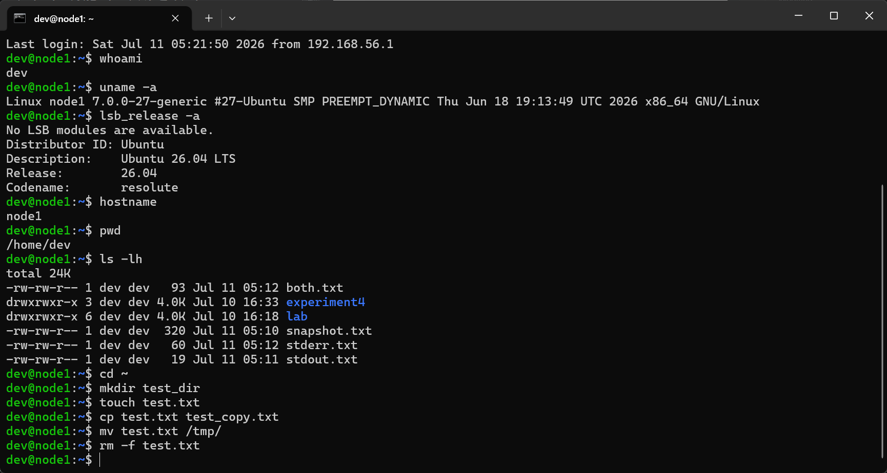
*△ 图 2 · 文件与目录基本操作 —— mkdir + touch + cp + mv + rm*

---

#### 步骤三　查看系统资源状态

```bash
free -h                             # 查看内存使用情况
df -h                               # 查看磁盘使用情况
top -n 1 | head -10                 # 查看进程和资源占用（快照模式）
du -sh *                            # 查看当前目录下各子目录的大小
```

| 命令 | 功能 | 关键字段 |
|:--:|:--:|:--:|
| `free -h` | 内存使用 | `total` / `used` / `free` / `available` |
| `df -h` | 磁盘使用 | `Filesystem` / `Size` / `Used` / `Avail` / `Use%` |
| `top` | 实时进程监控 | `PID` / `%CPU` / `%MEM` / `COMMAND`（按 Q 退出） |
| `du -sh` | 目录大小 | `-s` 只显示总计，`-h` 人类可读 |

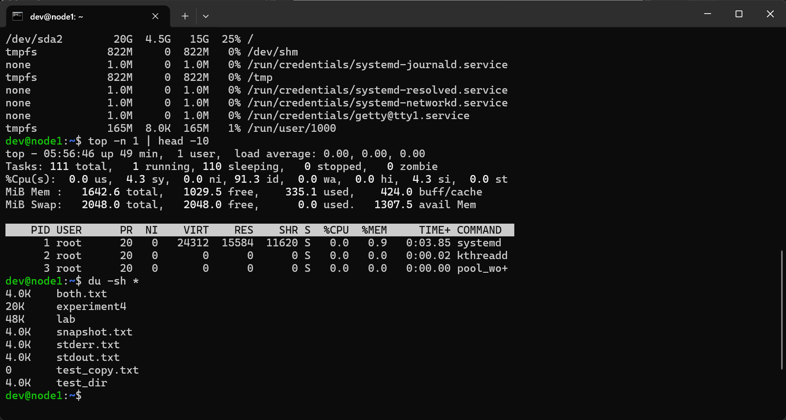
*△ 图 3 · 系统资源状态 —— free -h + df -h + top + du -sh*

---

### 第二部分：用户管理

---

#### 步骤四　查看用户与组配置文件

```bash
cat /etc/passwd                     # 用户账户信息
sudo cat /etc/shadow                # 加密密码信息（仅 root 可读）
cat /etc/group                      # 用户组信息
id                                  # 查看当前用户的 UID、GID 和所属组
```

**`/etc/passwd` 每行格式：**

```
dev:x:1000:1000:dev:/home/dev:/bin/bash
 |   |   |    |    |        |        └─ 登录 Shell（/bin/bash = 可登录，/usr/sbin/nologin = 不可登录）
 |   |   |    |    |        └─ 主目录
 |   |   |    |    └─ 用户全名 / 描述（GECOS 字段）
 |   |   |    └─ 主组 ID（GID，对应 /etc/group）
 |   |   └─ 用户 ID（UID，0=root，1000+=普通用户）
 |   └─ 密码占位符（x 表示真实密码在 /etc/shadow）
 └─ 用户名
```

> `/etc/passwd` 对所有人可读，密码哈希被抽到只有 root 能读的 `/etc/shadow` 里——这层隔离是为防止普通用户把哈希抄走离线破解。

**`/etc/group` 每行格式：**

```
developers:x:1002:alice,bob
     |      |   |      └─ 附加成员列表（逗号分隔，主组成员不在此列出）
     |      |   └─ 组 ID（GID）
     |      └─ 组密码占位符（几乎不用）
     └─ 组名
```

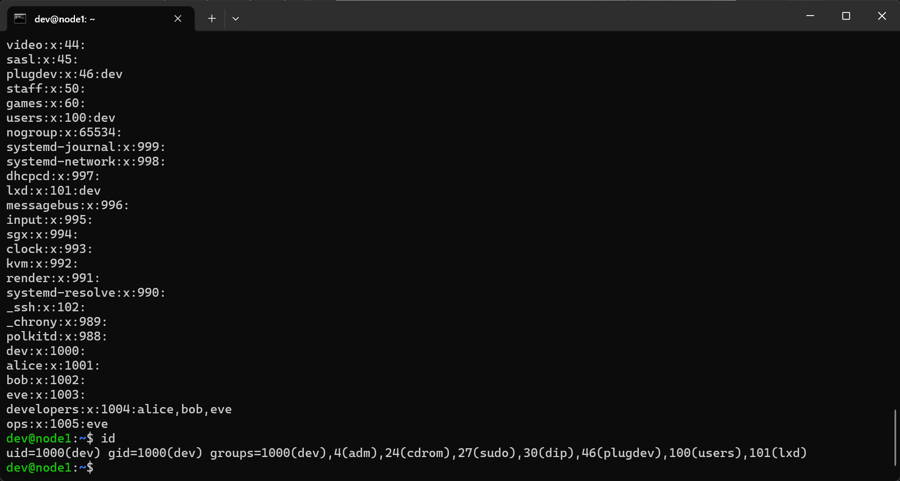
*△ 图 4 · 查看 /etc/passwd + /etc/shadow + /etc/group + id*

---

#### 步骤五　创建和管理用户

```bash
sudo adduser testuser               # 创建新用户（交互式，会提示设密码和填信息）
sudo passwd testuser                # 修改用户密码
sudo usermod -aG sudo testuser      # 将用户加入 sudo 组（赋予管理员权限）
groups testuser                     # 查看用户所属的所有组
su - testuser                       # 切换用户（带 - 加载目标用户环境）
exit                                # 退出当前用户，回到上一层
sudo deluser --remove-home testuser # 删除用户并清理其主目录
```

| 命令 | 功能 | 注意 |
|:--:|:--:|:--:|
| `adduser` | 创建用户 | Debian/Ubuntu 推荐，交互式；等效命令 `useradd` 需手动指定选项 |
| `passwd` | 修改密码 | root 可改他人密码，普通用户只能改自己的 |
| `usermod -aG` | 追加附加组 | **务必加 `-a`**（append），只写 `-G` 会覆盖掉原有附加组 |
| `groups` | 查看所属组 | 第一个组是主组，后面都是附加组 |
| `su -` | 切换用户 | 带 `-` 完整切换环境，不带 `-` 只换 UID |
| `deluser --remove-home` | 删除用户 | `--remove-home` 同时删主目录；等效命令 `userdel -r` |

> 主组（Primary Group）vs 附加组（Supplementary Group）：主组在 `/etc/passwd` 第 4 字段的 GID 定义，新建文件默认属于主组；附加组在 `/etc/group` 第 4 字段列出，一个用户可以同时属于多个附加组。

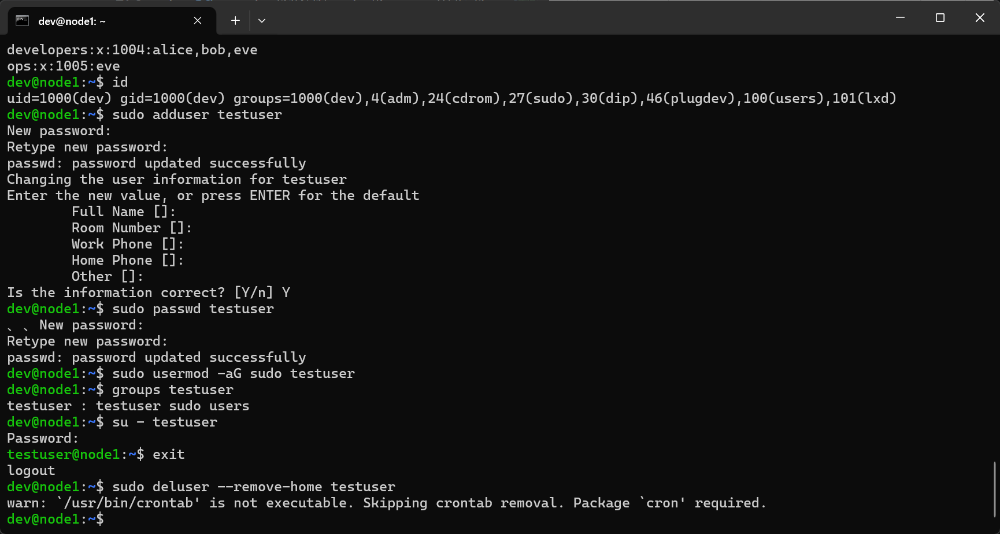
*△ 图 5 · 创建 testuser → 加入 sudo 组 → groups 验证 → su 切换测试*

---

#### 步骤六　文件权限管理

权限数字对照表：

| 数字 | 权限 | 含义 |
|:--:|:--:|:--:|
| 7 | `rwx` | 读 + 写 + 执行 |
| 6 | `rw-` | 读 + 写 |
| 5 | `r-x` | 读 + 执行 |
| 4 | `r--` | 只读 |
| 0 | `---` | 无权限 |

数字 = `r(4) + w(2) + x(1)`，三位数字依次表示所有者、所属组、其他人。

```bash
cd ~
touch test.txt

# 数字法 —— 批量设置权限
chmod 755 test.txt                  # rwxr-xr-x（所有者全权，其他人只读可执行）
ls -l test.txt

# 符号法 —— 精细微调权限
chmod u+x test.txt                  # 给所有者（u）增加（+）执行权限（x）
chmod g-w test.txt                  # 去掉所属组（g）的写权限（w）
chmod o-r test.txt                  # 去掉其他人（o）的读权限（r）
ls -l test.txt

# 修改所有者和所属组
sudo chown root:root test.txt       # 同时改所有者和组
ls -l test.txt
sudo chown dev:dev test.txt         # 改回去
sudo chgrp www-data test.txt        # 仅修改所属组
ls -l test.txt
```

| 常用组合 | 权限 | 典型用途 |
|:--:|:--:|:--|
| `755` | `rwxr-xr-x` | 目录标配、可执行脚本 |
| `644` | `rw-r--r--` | 普通文件标配 |
| `700` | `rwx------` | 私有脚本 / 目录 |
| `600` | `rw-------` | 含密码/密钥的配置文件 |

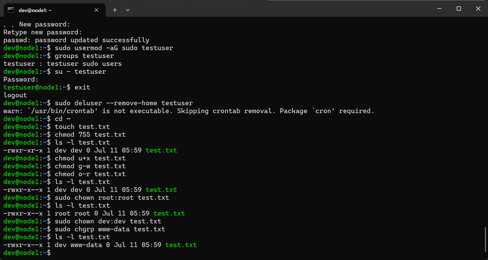
*△ 图 6 · chmod 数字法 + 符号法 + chown + chgrp*

---

### 第三部分：环境变量与配置文件

---

#### 步骤七　查看环境变量

```bash
env                                 # 查看当前 Shell 的所有环境变量
echo $PATH                          # 查看 PATH（可执行文件搜索路径）
echo $HOME                          # 查看主目录路径
echo $USER                          # 查看当前用户名
echo $SHELL                         # 查看当前 Shell 类型
```

| 变量 | 含义 | 示例值 |
|:--:|:--|:--|
| `PATH` | 命令搜索路径（冒号分隔） | `/usr/local/sbin:/usr/local/bin:/usr/sbin:/usr/bin` |
| `HOME` | 当前用户主目录 | `/home/dev` |
| `USER` | 当前用户名 | `dev` |
| `SHELL` | 当前 Shell | `/bin/bash` |
| `PWD` | 当前工作目录 | `/home/dev` |
| `LANG` | 系统语言和编码 | `en_US.UTF-8` |

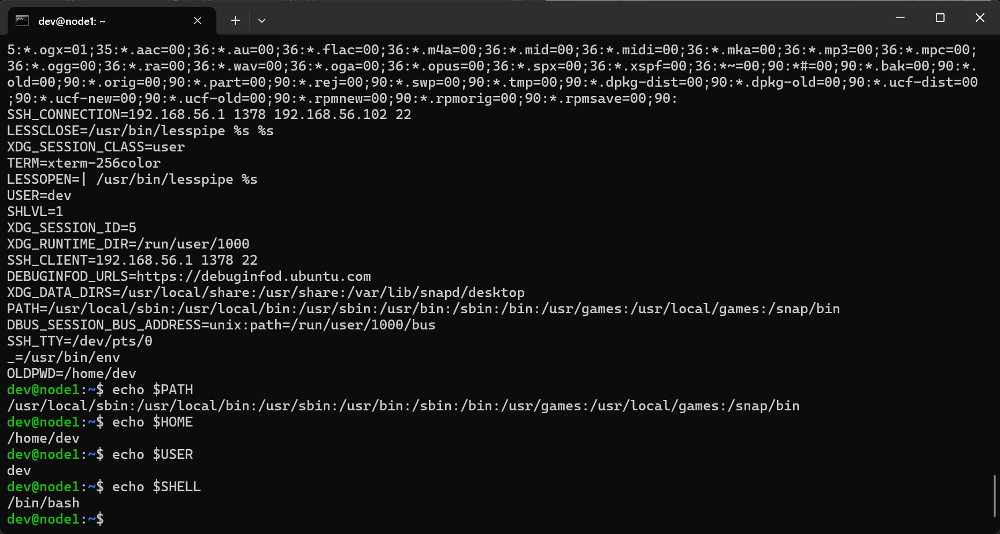
*△ 图 7 · env + echo PATH HOME USER SHELL*

---

#### 步骤八　临时设置环境变量

临时设置的环境变量仅在当前 Shell 会话有效，关掉终端即消失：

```bash
# 临时添加 PATH
export PATH=$PATH:/home/dev/mybin
echo $PATH

# 临时创建变量
export MY_VAR="Hello World"
echo $MY_VAR                         # 验证变量存在

# 验证子进程能否继承（export 过的变量子进程可见）
bash -c 'echo $MY_VAR'               # 有输出 —— 子 Shell 可以继承

# 删除变量
unset MY_VAR
echo $MY_VAR                         # 输出为空 —— 已被删除
```

> `export` 的作用：把 Shell 本地变量"升格"为环境变量，使其能被子进程继承。不加 `export` 的变量只在当前 Shell 可见，子进程拿不到。

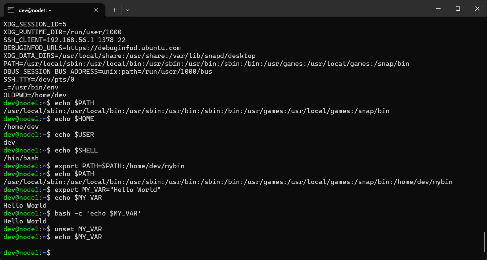
*△ 图 8 · 临时 export 变量 + 子进程继承验证 + unset 删除*

---

#### 步骤九　永久设置环境变量（用户级）

编辑 `~/.bashrc`，在末尾追加自定义配置：

```bash
# 备份原文件（好习惯）
cp ~/.bashrc ~/.bashrc.backup

# 编辑配置文件
nano ~/.bashrc
```

在文件末尾添加以下内容：

```bash
# === 自定义环境变量 ===
export PATH=$PATH:/home/dev/mybin
export MY_CUSTOM_VAR="自定义变量"

# === 自定义别名 ===
alias ll='ls -alF'
alias ..='cd ..'
alias update='sudo apt update && sudo apt upgrade -y'
```

保存（Ctrl+O → 回车 → Ctrl+X），使配置立即生效：

```bash
source ~/.bashrc

# 验证
echo $MY_CUSTOM_VAR
ll
alias | grep ll
```

> `~/.bashrc` 每次打开新终端时都会自动执行。`source ~/.bashrc` 让改动立即生效而不必退出重登录。

| 配置文件 | 加载时机 | 作用范围 |
|:--:|:--|:--:|
| `~/.bashrc` | 每次打开新终端 | 当前用户 |
| `~/.profile` | 用户登录时执行一次 | 当前用户 |
| `~/.bash_profile` | 用户登录时执行（优先于 `.profile`） | 当前用户 |

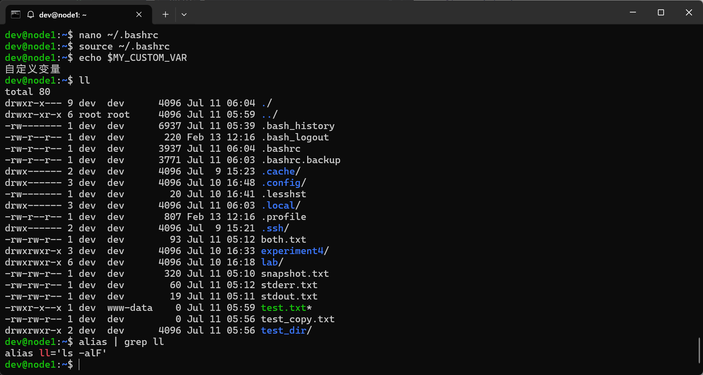
*△ 图 9 · nano 编辑 ~/.bashrc → source 立即生效 → echo 验证*

---

#### 步骤十　永久设置环境变量（系统级）

系统级配置对所有用户生效，需要 `sudo`。

**方法一：`/etc/environment`（需要重启）**

```bash
sudo nano /etc/environment
```

添加（注意：此处不使用 `export` 关键字，直接写键值对）：

```
PATH="/usr/local/sbin:/usr/local/bin:/usr/sbin:/usr/bin:/sbin:/bin"
APP_ENV="development"
```

重启后生效。

**方法二：`/etc/profile`（所有用户登录时执行）**

```bash
sudo nano /etc/profile
```

在末尾添加：

```bash
export JAVA_HOME=/usr/lib/jvm/java-11-openjdk-amd64
export PATH=$PATH:$JAVA_HOME/bin
```

保存后：

```bash
source /etc/profile
echo $JAVA_HOME
```

**方法三（推荐）：`/etc/profile.d/`**

不直接改 `/etc/profile`（系统升级可能覆盖），而是往 `/etc/profile.d/` 下放独立脚本：

```bash
sudo nano /etc/profile.d/myenv.sh
```

写入：

```bash
export MY_GLOBAL_VAR="全局共享变量"
```

```bash
source /etc/profile.d/myenv.sh
echo $MY_GLOBAL_VAR
```

> 三种方法的选用原则：单个用户 → `~/.bashrc`；所有用户 + 简单键值对 → `/etc/environment`；所有用户 + 复杂逻辑/路径 → `/etc/profile.d/*.sh`（推荐，模块化、易维护、不会被升级覆盖）。

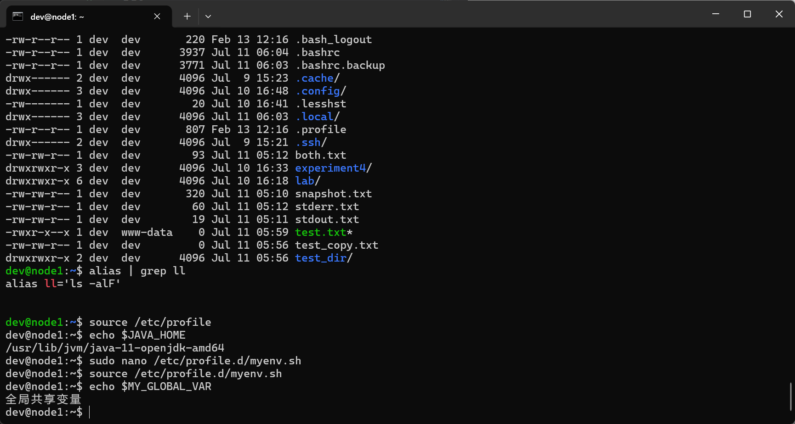
*△ 图 10 · /etc/environment + /etc/profile + /etc/profile.d/ 三种系统级配置方式*

---

## 4. 实验结果

| 验证项 | 关键命令 | 预期结果 | 实际结果 |
|:--:|:--:|:--:|:--:|
| 系统信息查看 | `whoami` / `uname -a` / `lsb_release -a` | 正确显示 | ✅ 正常 |
| 文件基本操作 | `mkdir` / `touch` / `cp` / `mv` / `rm` | 创建、复制、移动、删除成功 | ✅ 正常 |
| 系统资源查看 | `free -h` / `df -h` / `top` / `du -sh` | 显示内存/磁盘/进程信息 | ✅ 正常 |
| 查看用户配置 | `cat /etc/passwd` / `id` | 显示用户信息 | ✅ 正常 |
| 创建管理用户 | `adduser` / `usermod -aG` / `groups` | 用户创建并加入 sudo 组 | ✅ 正常 |
| 权限管理 | `chmod 755` / `chmod u+x` / `chown` | 权限和所有者正确变更 | ✅ 正常 |
| 查看环境变量 | `env` / `echo $PATH` | 显示所有环境变量 | ✅ 正常 |
| 临时设置变量 | `export MY_VAR=...` / `unset` | 设置后可用，删除后消失 | ✅ 正常 |
| 用户级永久配置 | 编辑 `~/.bashrc` → `source` | 重新登录后变量/别名仍在 | ✅ 正常 |
| 系统级永久配置 | `/etc/environment` / `/etc/profile.d/` | 所有用户可用 | ✅ 正常 |

---

## 5. 知识总结

### 5.1 配置文件加载层级

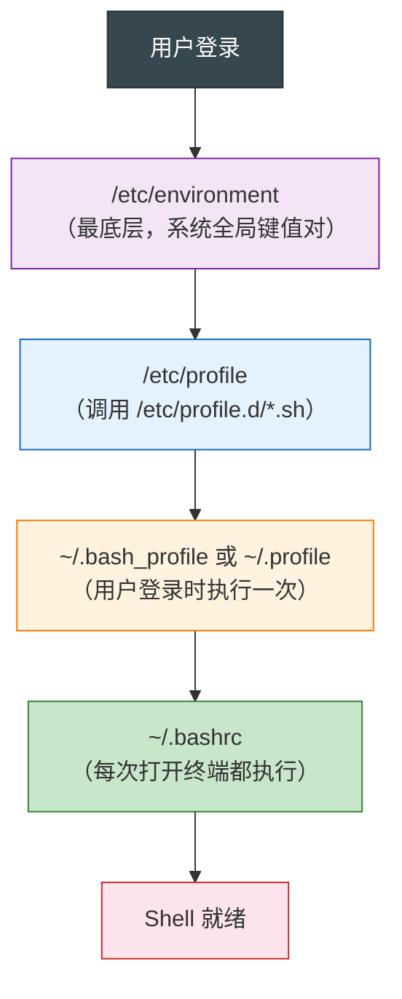

---

### 5.2 环境变量配置方式的选用指南

| 场景 | 方法 | 生效时机 |
|:--:|:--:|:--:|
| 只影响自己，日常使用 | `~/.bashrc` | 打开新终端 / `source` |
| 只影响自己，登录时执行一次 | `~/.profile` | 下次登录 |
| 所有用户，简单键值对 | `/etc/environment` | 重启 |
| 所有用户，带逻辑/路径/脚本 | `/etc/profile.d/*.sh` | 新登录 / `source` |
| 所有用户，临时补丁 | `export` 在命令行 | 仅当前会话 |

---

### 5.3 命令分类速查

| 分类 | 命令 |
|:--:|:--:|
| 系统信息 | `whoami` `uname -a` `lsb_release -a` `hostname` `pwd` |
| 文件操作 | `ls -lh` `cd` `mkdir` `touch` `cp` `mv` `rm -f` |
| 资源监控 | `free -h` `df -h` `top` `du -sh` |
| 用户管理 | `adduser` `passwd` `usermod -aG` `groups` `su -` `deluser` |
| 权限管理 | `chmod`（数字法 + 符号法） `chown` `chgrp` |
| 环境变量 | `env` `echo $VAR` `export` `unset` `source` |

---

## 6. 出现问题

| 问题 | 现象 | 原因 | 解决方案 |
|:--:|:--:|:--:|:--:|
| `sudo: command not found` | `sudo` 命令无法使用 | 当前用户不在 sudo 组中 | 以 root 登录，`usermod -aG sudo 用户名` |
| `Permission denied` | 操作文件 / 系统目录被拒绝 | 权限不足 | 使用 `sudo` 提权，或 `chmod` 修改文件权限 |
| 修改 `~/.bashrc` 后不生效 | 变量/别名拿不到 | 未执行 `source` | `source ~/.bashrc` |
| 修改 `/etc/environment` 后不生效 | 重启之前变量不可用 | 该文件只在新登录会话中加载 | 重启系统或重新登录 |
| `su` 切换后环境不变 | `su testuser` 后 `~` 仍是旧路径 | 忘加 `-` | 使用 `su - testuser` |
| `usermod` 把用户踢出 sudo | `-G` 覆盖了原有附加组 | 忘记加 `-a`（append） | 用 root 修复：`usermod -aG sudo 用户名` |
| `rm: cannot remove`: Is a directory | `rm dir` 报错 | `rm` 默认不能删目录 | 使用 `rm -r dir` 或 `rm -rf dir` |

---

## 7. 拓展与进阶

### 7.1 自定义命令提示符（PS1）

```bash
# 临时修改——显示用户名、主机名、时间和当前目录
export PS1="[\t] \u@\h:\w\$ "

# 写回默认
export PS1="\u@\h:\w\$ "
```

| 转义符 | 含义 |
|:--:|:--|
| `\u` | 用户名 |
| `\h` | 主机名 |
| `\w` | 完整路径 |
| `\t` | 24小时时间 |

---

### 7.2 历史命令时间戳

```bash
echo 'export HISTTIMEFORMAT="%F %T "' >> ~/.bashrc
source ~/.bashrc
history | tail -5
```

---

## 8. 心得体会

实验六把前几次实验零散敲过的命令——`ls`、`mkdir`、`chmod`、`export`——整合成了三个清晰的知识块：系统操作、用户管理、环境配置。这种"回头看"式的练习让我意识到：很多当时只是"照敲"的命令，现在开始理解它们在 Linux 体系中的位置了。比如 `chmod 755` 不只是"让脚本能跑"，而是所有者 rwx + 组 r-x + 其他人 r-x 这个精确的权限模型；`export` 不只是"设个变量"，而是决定了当前位置的 Shell 能不能把信息传递给子进程。

最实用的是 `/etc/profile.d/` 这个推荐做法。之前我一直以为改系统环境变量就是直接动大文件，很容易出问题。手册给出的方法论很清晰：系统级用 `/etc/profile.d/*.sh`，用户级用 `~/.bashrc`。这种模块化思想跟写代码时不把所有逻辑塞进一个 main 函数的道理完全一样，让我对"环境配置"这件事有了工程化的认知。
