# 实验四：Linux 基本操作
> **姓名**：来靖轩 **学号**：25050824 **完成日期**：2026年7月11日

---

## 1. 实验目的

1. 通过 SSH 远程登录 Ubuntu Server 26.04 虚拟机，在真实 Linux 终端中完成全套命令行操作实践，摆脱对图形界面的依赖
2. 系统掌握 Linux 文件系统导航（`pwd` / `cd` / `ls`）、文件增删改查（`touch` / `mkdir` / `cp` / `mv` / `rm`）、内容检索（`grep` / `find`）三类核心命令，理解绝对路径与相对路径、文件权限字串、管道与重定向等基础概念
3. 掌握 APT 包管理器的完整工作流（`update → search → install → remove → purge`），理解 `apt` 与 `dpkg` 的层级关系以及 Linux 软件包管理的设计思想
4. 建立进程管理（`ps` / `top` / `kill`）、系统监控（`uname` / `free` / `df` / `du`）的基本操作能力，为后续实验五（权限管理）和实验七（远程管理）打好命令行基础

---

## 2. 实验环境

| 项目 | 配置 |
|:---:|:---:|
| 宿主机操作系统 | Windows 11 家庭中文版 25H2 |
| 虚拟机操作系统 | Ubuntu Server 26.04 LTS |
| 远程连接方式 | SSH（宿主机 PowerShell / CMD → 虚拟机 node1） |
| 实验节点 | node1（192.168.56.102，用户名 `dev`） |

---

## 3. 实验过程

> 💡 所有命令在宿主机通过 `ssh dev@192.168.56.102` 远程执行，可直接从报告中复制粘贴。每条命令的含义都以注释或说明方式给出，建议读完解释再敲，理解大于记忆。

---

### 步骤一 登录 Linux 并了解 Shell

**1.1 从宿主机远程登录**

```bash
ssh dev@192.168.56.102
```

输入密码后，终端前缀变为 `dev@node1:~$`。

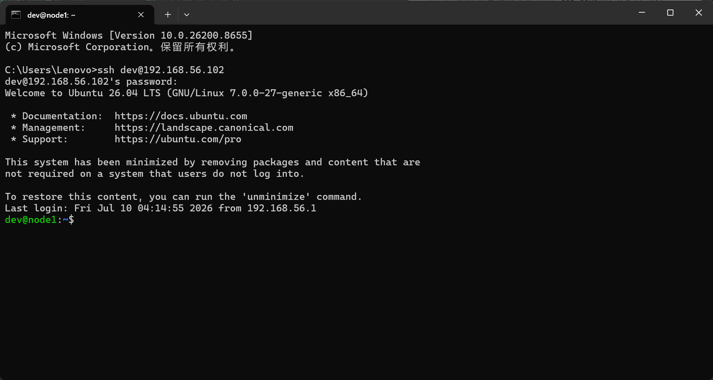
*△ 图 1 · SSH 远程登录 node1 成功*

格式拆解：

```
dev      → 当前用户名
node1    → 主机名
~        → 当前所在目录（~ 是 /home/dev 的缩写）
$        → 普通用户提示符（# 代表 root 超级用户）
```

---

**1.2 理解 Shell —— 你和内核之间的翻译官**

Shell（壳）是裹在 Linux 内核外面的一层命令解释器。你敲的命令通过 Shell 翻译成系统调用（system call），再由内核去操作硬件。常见的 Shell：

| Shell | 提示符 | 特点 |
|:--:|:--:|:--:|
| bash | `$` | Linux 标配，使用最广 |
| zsh | `$` | 兼容 bash，主题/插件丰富 |
| sh | `$` | 最原始、最轻量的 POSIX Shell |

`echo $SHELL` 可查看当前使用的 Shell。

```bash
echo $SHELL                         # 当前 Shell（输出 /bin/bash）
```

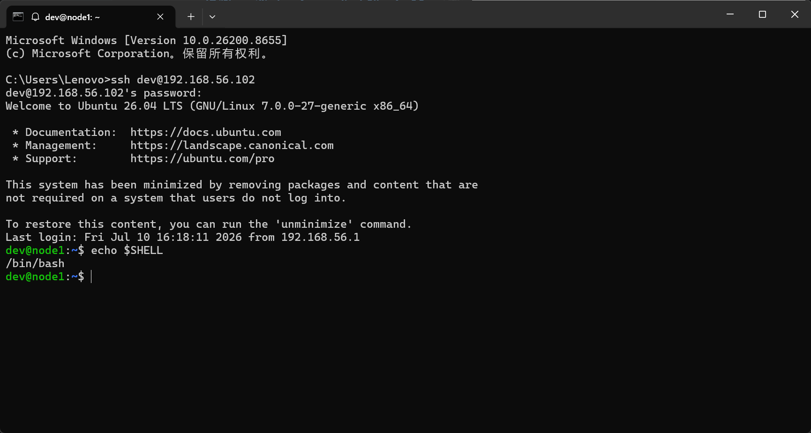
*△ 图 2 · `echo $SHELL` 查看当前 Shell 类型*

---

### 步骤二 文件系统导航 —— 在 Linux 里找路

Linux 没有 C 盘 D 盘，一切从根目录 `/` 开始，往下挂载整个文件系统。理解这一点是后续所有操作的基础。

**2.1 我在哪里：`pwd`**

```bash
pwd                                 # Print Working Directory，打印当前所在目录
```
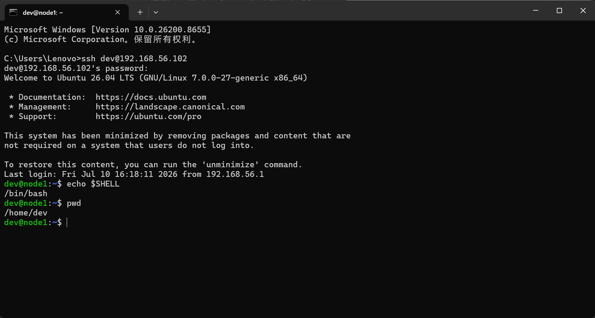
*△ 图 3 · `pwd` 查看当前所在位置*

---

**2.2 看看周围：`ls`**

`ls`（List）是最常敲的命令，没有之一：

```bash
ls                                  # 列出当前目录下的非隐藏文件
ls -l                               # long format：权限 · 硬链接数 · 所有者 · 组 · 大小 · 修改时间 · 文件名
ls -la                              # 含隐藏文件（文件/目录名以 . 开头即为隐藏）
ls -lh                              # human-readable：文件大小 32K / 4.0M 而不是 32768 / 4194304
ls -ltr                             # 按修改时间排序（t），倒序（r），最近改的在最下面
```

`ls -l` 输出的每一列含义：

```
-rw-r--r--  1  dev  dev   4096  Jul 10 10:00  hello.txt
|           |  |    |     |      |            |
权限字串    硬链接 所有者 组   文件大小  最后修改时间  文件名
```

权限字串 `-rw-r--r--` 拆解（共 10 位）：

| 位 | 含义 | 取值 |
|:--:|:--:|:--:|
| 1 | 文件类型 | `-` 普通文件 / `d` 目录 / `l` 符号链接 |
| 2-4 | 所有者权限 | `r` 读 `w` 写 `x` 执行 |
| 5-7 | 同组用户权限 | 同上 |
| 8-10 | 其他人权限 | 同上 |

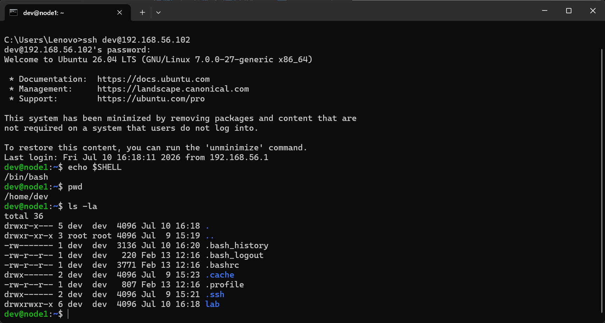
*△ 图 4 · `ls -la` 输出详解 —— 权限字串、硬链接数、所有者、文件大小*

---

**2.3 换目录：`cd`**

```bash
cd /                                # 跳到根目录
ls                                  # 观察根目录下有哪些标准子目录
cd ~                                # 回到主目录（/home/dev）
cd ..                               # 上一级目录
cd -                                # 回到"上一次所在的目录"（在两个目录间反复横跳的快捷键）
```

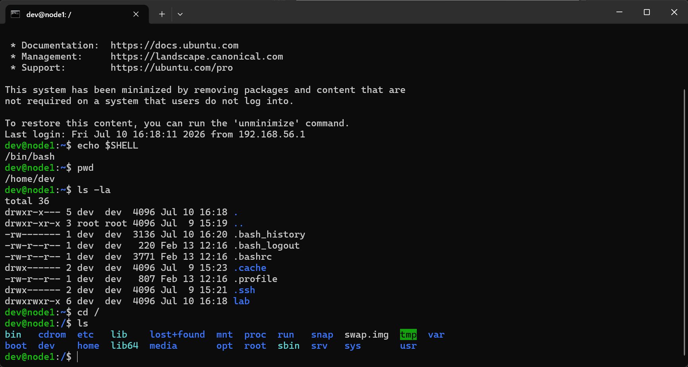
*△ 图 5 · `cd /` 跳转到根目录，`ls` 查看 Linux 标准文件系统结构*

---

**2.4 Linux 根目录下每个文件夹是干嘛的？**

| 目录 | 全称 | 存了什么 |
|:--:|:--:|:--:|
| `/bin` | Binaries | 系统基础命令（`ls`、`cp`、`cat` 等） |
| `/boot` | Boot | 内核镜像、引导加载器 |
| `/dev` | Devices | 设备文件（磁盘、终端、鼠标等，一切皆文件） |
| `/etc` | Editable Text Config | 系统级配置文件（网络、SSH、用户密码等） |
| `/home` | Home | 每个普通用户的个人目录（`/home/dev`） |
| `/lib` | Libraries | 系统库文件（`.so`，类似 Windows 的 `.dll`） |
| `/mnt` | Mount | 临时挂载点（U 盘、共享文件夹） |
| `/opt` | Optional | 第三方商业软件（如 VMware Tools） |
| `/proc` | Process | 虚拟文件系统，存进程和内核运行信息 |
| `/root` | Root | root 超级用户的主目录 |
| `/tmp` | Temporary | 临时文件，重启后自动清空 |
| `/usr` | Unix System Resources | 用户级程序、库、文档（最大的目录之一） |
| `/var` | Variable | 日志、缓存、数据库等可变数据 |

安装 `tree` 以树形图直观感受目录层级：

```bash
sudo apt install tree -y            # 安装 tree
tree /etc/netplan                   # 用树形图展示 netplan 配置目录
tree -L 1 /                         # 只展开根目录第一层（-L 限制深度）
```

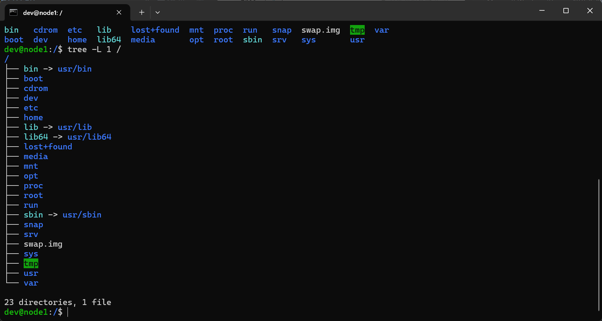
*△ 图 6 · `tree` 命令以树形图展示目录结构*

---

### 步骤三 文件与目录的增删改查

这是日常使用频率最高的一组命令。`touch` / `mkdir` / `cp` / `mv` / `rm` / `cat` 六兄弟。

**3.1 创建**

```bash
cd ~                                # 回到主目录
mkdir experiment4                   # 创建一个目录
cd experiment4

mkdir -p a/b/c                      # 递归创建嵌套目录（-p：父目录不存在时自动创建）
ls -R                               # 递归显示所有层级

touch readme.txt                    # 创建空文件
touch a/data{1,2,3}.log            # 一次性创建多个文件（data1.log data2.log data3.log）
```

`touch` 的真正用途：更新文件的访问/修改时间戳。如果文件不存在就顺便新建一个。"touch" 的中文直觉是"碰一下"，把时间戳碰成当前时间。

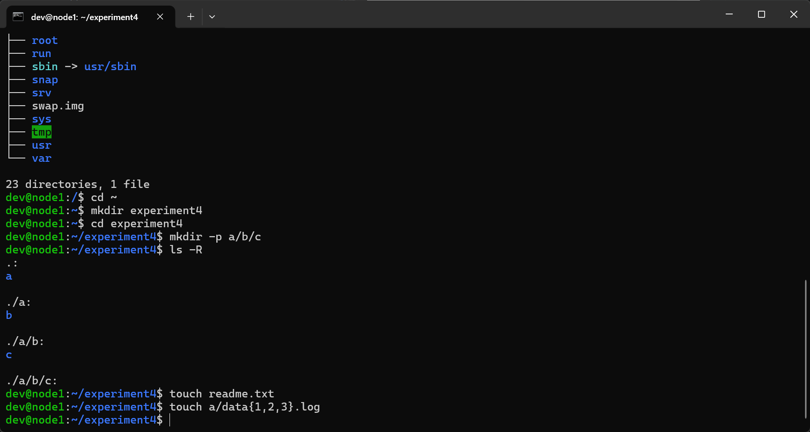
*△ 图 7 · `mkdir` 创建目录 + `touch` 创建文件*

---

**3.2 写入内容**

```bash
echo "Hello, Linux!" > readme.txt   # 写入（单 > 覆盖原内容）
echo "第二行文字" >> readme.txt      # 追加（双 >> 追加到末尾）
cat readme.txt                      # 查看文件内容
```

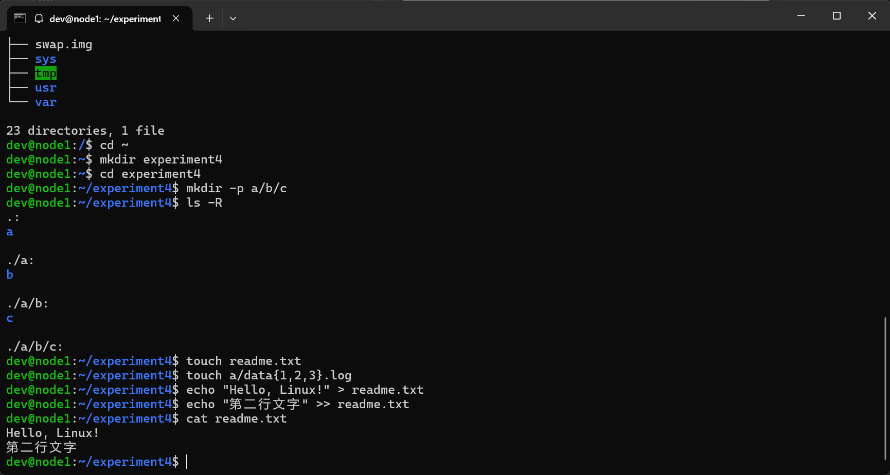
*△ 图 8 · `echo` 写入内容 + `cat` 查看文件内容*

---

**3.3 复制**

```bash
cp readme.txt readme.bak            # 复制文件
cp -r a a_backup                    # 递归复制目录（-r 必不可少）
```
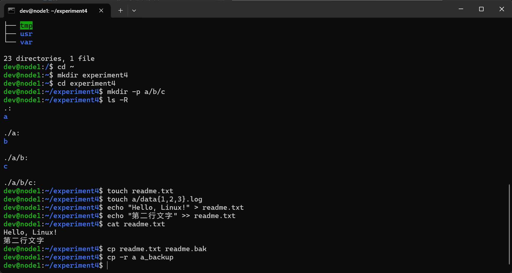
*△ 图 9 · `cp` 复制内容*

---

**3.4 移动与重命名**

Linux 里没有专门的"重命名"命令，`mv` 同时承担移动和重命名两个职责：

```bash
mv readme.bak readme_new.txt        # 改名（源和目标在同一目录就是重命名）
mv readme_new.txt a/                # 把文件移入目录 a
```
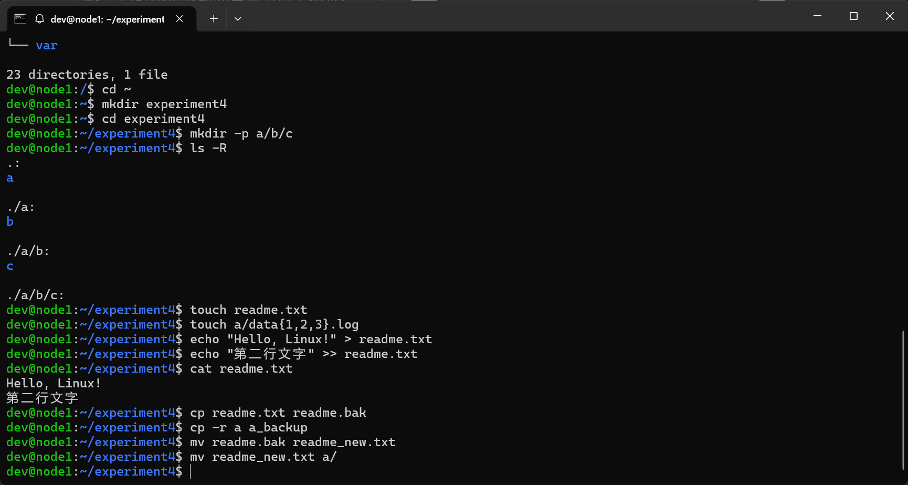
*△ 图 10 · `mv` 重命名*

---

**3.5 删除**

```bash
rm a/data1.log                      # 删除单个文件
rm -i a/data2.log                   # 删除前确认（-i 安全选项，防止误删）
rm -r a_backup                      # 递归删除目录（-r）
rm -rf a/b/c                        # 递归 + 强制删除，不提示确认
```

> 🔥 `rm -rf` 是 Linux 最危险的命令之一，没有回收站。`sudo rm -rf /` 会让系统自毁，所有文件被清空，机器变砖。**永远不要在你的机器上试。**
> 
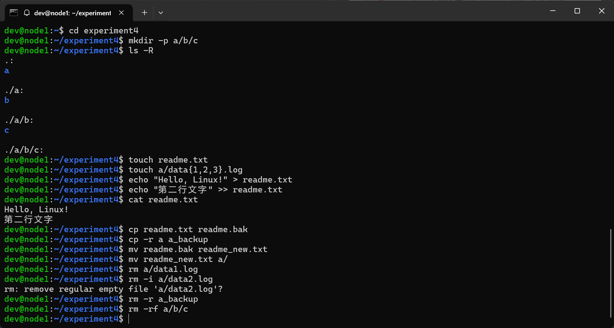
*△ 图 11 · `rm` 删除操作*

---

**3.6 查看文件内容的多种姿势**

```bash
cat /etc/passwd                     # 一口气输出全部内容（小文件用）
head -n 5 /etc/passwd               # 只看前 5 行
tail -n 5 /etc/passwd               # 只看后 5 行
less /etc/passwd                    # 分页浏览（Space翻页 / Q退出 / /搜索）
wc -l /etc/passwd                   # 统计文件有多少行
```
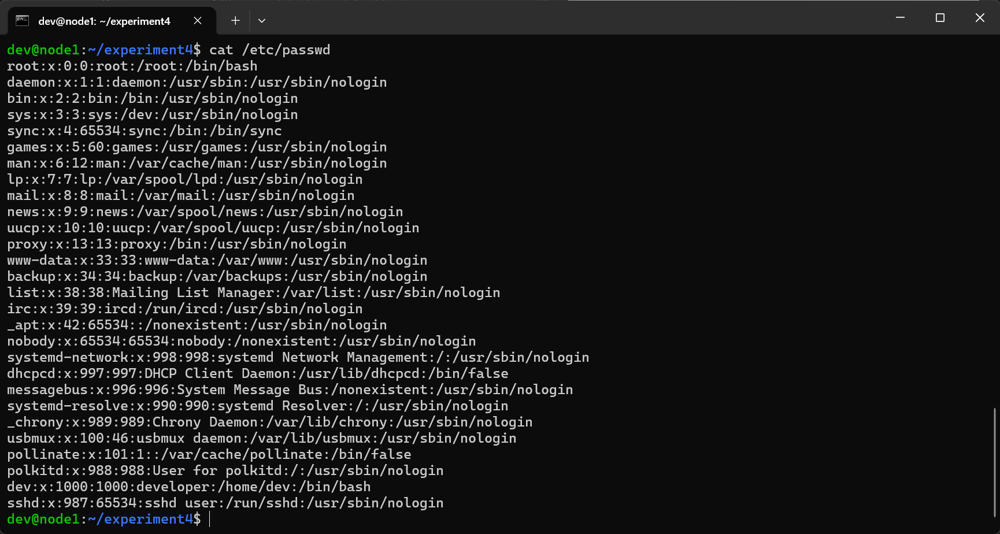
*△ 图 12 · `cat` 查看文件内容*

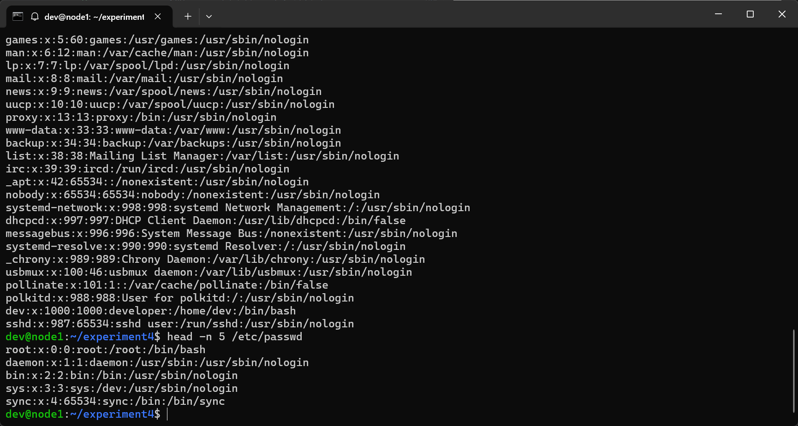
*△ 图 13 · `head` 查看文件内容*

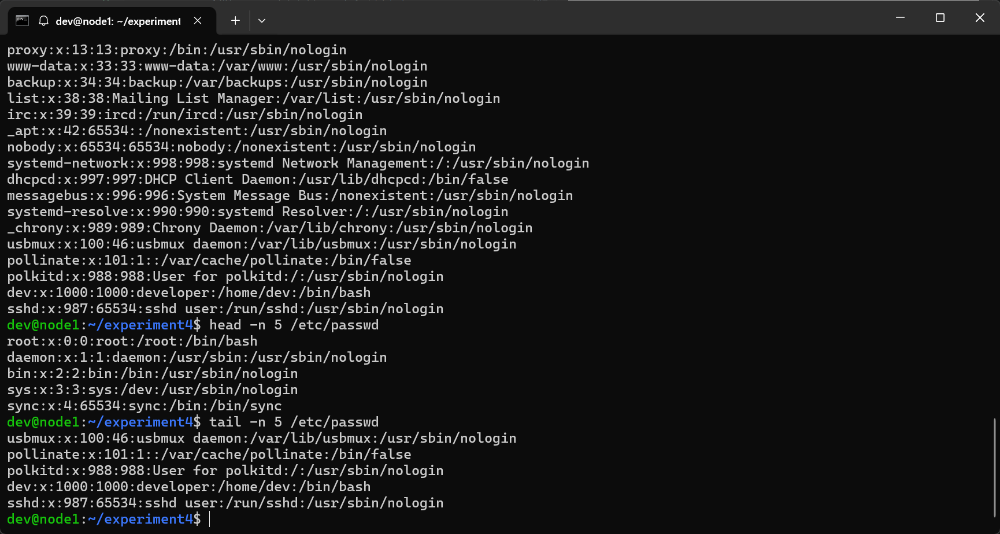
*△ 图 14 · `tail` 查看文件内容*

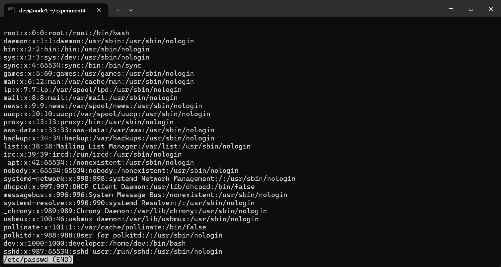
*△ 图 15 · `less` 查看文件内容*

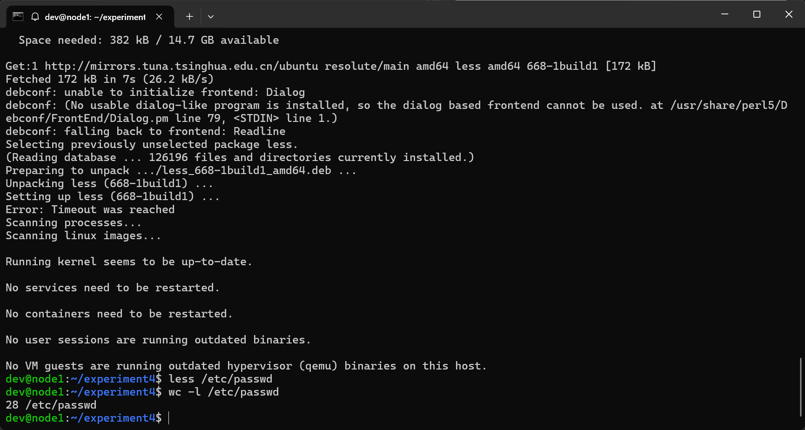
*△ 图 16 · `wc` 查看文件内容*

---

### 步骤四 搜索与检索 —— 大海捞针

**4.1 `grep`：从文件内容中搜索**

`grep`（Global Regular Expression Print）是文本搜索的事实标准，日常使用频率极高。

```bash
grep "dev" /etc/passwd              # 在文件中搜索含 "dev" 的行
grep -r "netplan" /etc/             # 递归搜索 /etc/ 下所有文件
grep -n "root" /etc/passwd          # 显示行号
grep -v "nologin" /etc/passwd       # 反向匹配：排除含 "nologin" 的行
grep -i "Error" /var/log/syslog     # 忽略大小写
grep -c "ssh" /var/log/syslog       # 只统计匹配行数
```

`/etc/passwd` 每行格式：
```
dev:x:1000:1000:dev:/home/dev:/bin/bash
 |   |   |    |    |        |        └─ Shell
 |   |   |    |    |        └─ 主目录
 |   |   |    |    └─ 用户全名（GECOS）
 |   |   |    └─ 用户组 ID（GID）
 |   |   └─ 用户 ID（UID 1000+ = 普通用户，0 = root）
 |   └─ 密码占位符（真实密码在 /etc/shadow）
 └─ 用户名
```

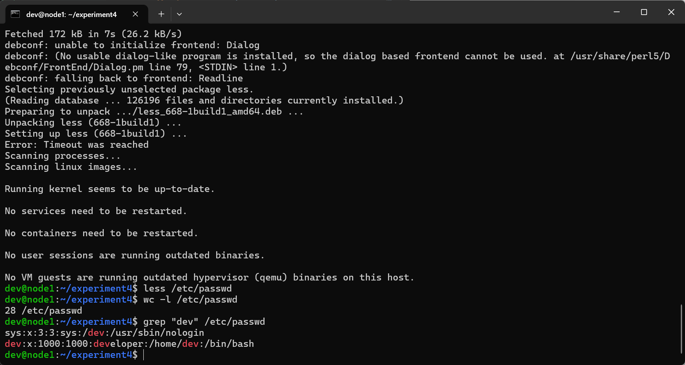
*△ 图 17 · `grep` 搜索 /etc/passwd 含"dev"的行*

---

**4.2 `find`：按文件名/大小/时间查找文件**

`grep` 搜内容，`find` 搜文件本身。

```bash
find /etc -name "*.yaml"            # 按文件名通配符查找
find /etc -type f -size +100k       # 查找大于 100KB 的普通文件
find /home -type d -name "exp*"     # 查找目录名以 exp 开头的目录
find /tmp -mtime -1                 # 查找最近 1 天内修改过的文件
```

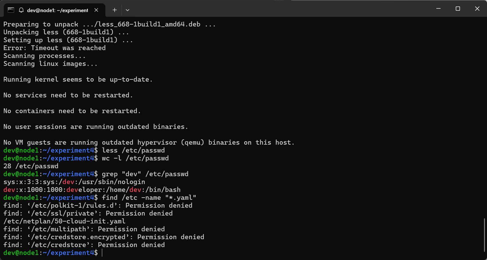
*△ 图 18 · `find` 按文件名查找 /etc 下的 yaml 文件*

---

### 步骤五 APT 包管理器 —— Linux 的软件商店

Linux 安装软件不靠 `.exe` 安装向导，靠**包管理器**。Ubuntu 系用的是 APT（Advanced Package Tool）。APT 自动解决依赖关系：你要装软件 A，它发现 A 需要 B 和 C，就一起装好。

**5.1 更新软件包索引**

```bash
sudo apt update                     # 从软件源拉取最新包列表（不安装任何东西）
```

> `/etc/apt/sources.list` 是软件源配置文件。`apt update` 实质是 `wget` 下载每个源的包索引文件。若下载极慢 → 换国内镜像源（实验一讲过）。

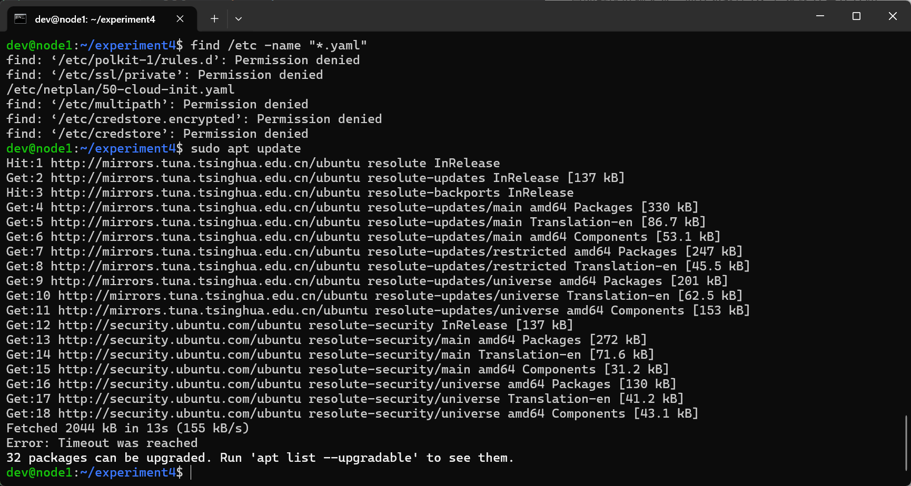
*△ 图 19 · `sudo apt update` 更新软件包索引*

---

**5.2 搜索**

```bash
apt search nginx                    # 搜含 nginx 关键词的包
apt-cache show nginx                # 查看包的详细描述和依赖关系
```
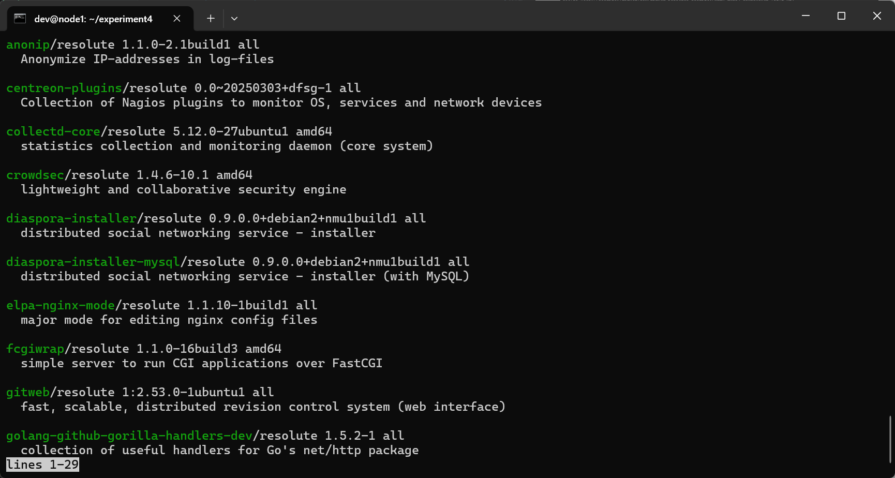
*△ 图 20 · `apt search nginx` 搜含 nginx 关键词的包*

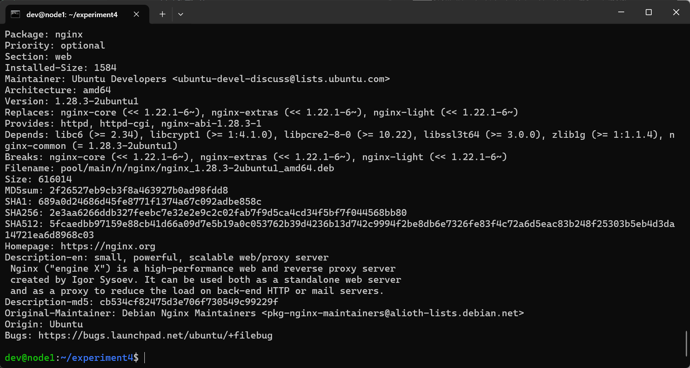
*△ 图 21 · `apt-cache show nginx` 查看包的详细描述和依赖关系*

---

**5.3 安装**

```bash
sudo apt install nginx -y           # 安装 nginx（Web 服务器）
```

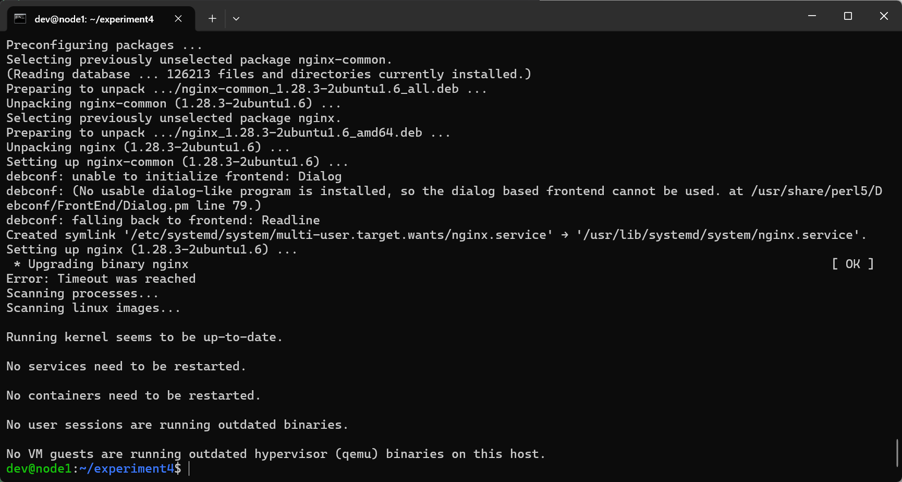
*△ 图 22 · apt search nginx → `apt install nginx` 安装过程*

---

**5.4 查看已装了什么**

```bash
apt list --installed | head -20     # 已安装包的前 20 行
dpkg -l | grep openssh              # 另一种查看方式（dpkg 是 apt 的底层工具）
```
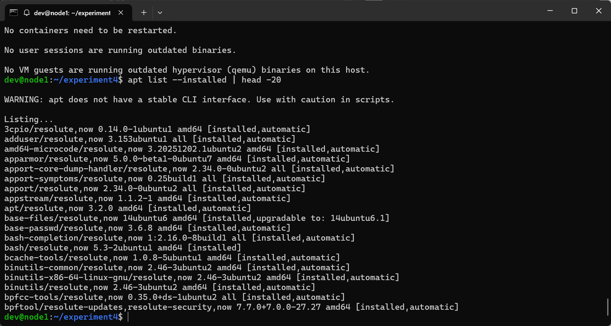
*△ 图 23 · `apt list --installed` 查看已装了什么*

---

**5.5 卸载**

```bash
sudo apt remove nginx -y            # 卸载（保留配置文件）
sudo apt purge nginx -y             # 彻底清除（连配置文件一起删）
sudo apt autoremove -y              # 清理不再需要的依赖包（系统瘦身）
```

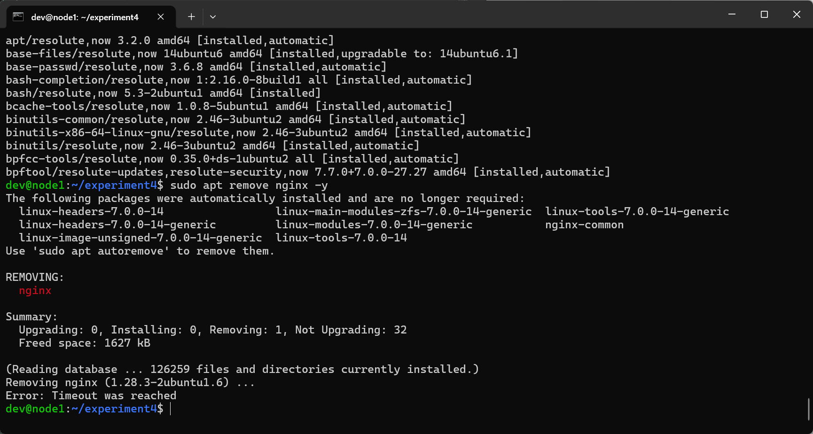
*△ 图 24 · `apt remove`删除 → dpkg -l查看卸载状态*

---

### 步骤六 系统信息快速查看

```bash
uname -a                            # 内核版本 + 架构
whoami                              # 当前登录用户
hostname                            # 主机名
uptime                              # 系统跑了多久 + 平均负载
free -h                             # 内存：总计 / 已用 / 可用 / 缓存
df -h                               # 各磁盘分区的使用率
du -sh /var/log                     # 某个目录总共占了多少空间
```

负载（Load Average）三个数字的含义——`uptime` 最后一列：

```
load average: 0.00, 0.01, 0.00
              ────  ────  ────
              1分钟   5分钟  15分钟平均负载
```

数值越接近 CPU 核数，系统越繁忙。

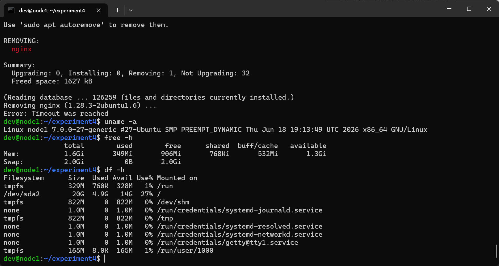
*△ 图 25 · `uname -a` + `free -h` + `df -h` 系统信息三连*

---

### 步骤七 进程管理 —— 看看谁在跑

**7.1 查看进程**

```bash
ps aux | head -10                   # 所有进程的前 10 行
ps -u dev                           # 只看 dev 用户的进程
```
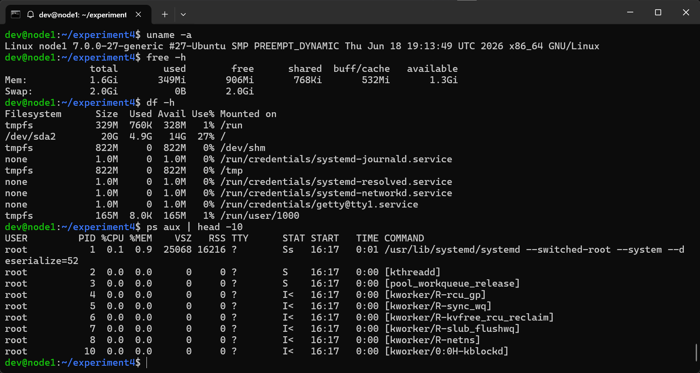
*△ 图 26 · `ps aux` 查看所有进程*

`ps aux` 各列含义：

| 列 | 含义 |
|:--:|:--:|
| USER | 进程所有者 |
| PID | 进程 ID（唯一标识，kill 要用） |
| %CPU | CPU 占用百分比 |
| %MEM | 内存占用百分比 |
| VSZ | 虚拟内存大小 |
| RSS | 物理内存大小 |
| STAT | 状态码（S=睡眠 R=运行 Z=僵尸） |
| START | 启动时间 |
| TIME | 累计 CPU 时间 |
| COMMAND | 命令名 |

---

**7.2 实时监控**

```bash
top -n 1 | head -10                 # 截取当前时刻的进程排行榜
```
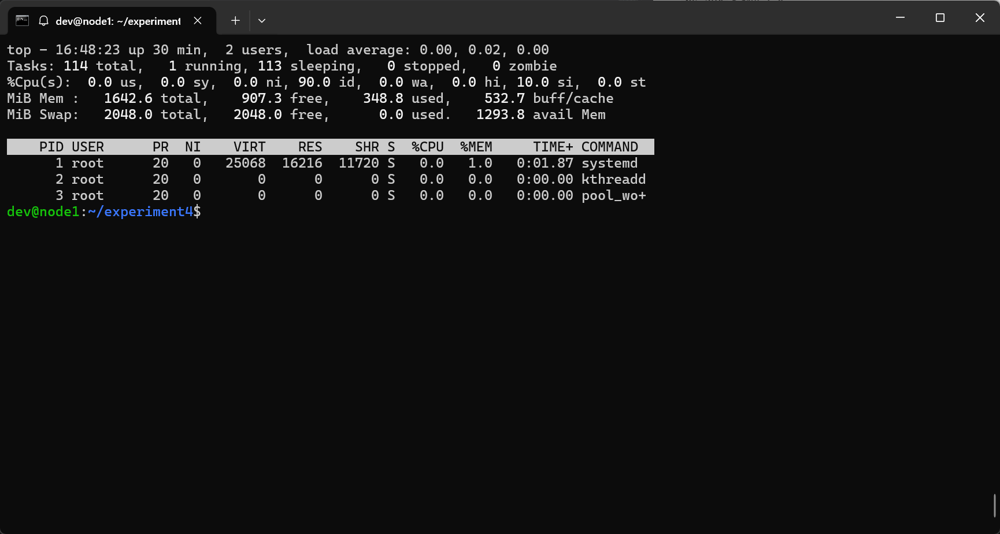
*△ 图 27 · `top` 查看所有进程*

---

**7.3 终止进程**

```bash
sleep 1000 &                        # 后台启动一个 sleep 进程
jobs                                # 查看后台任务
kill <PID>                          # 用 PID 终止（优雅退出，给进程清理机会）
kill -9 <PID>                       # 强制终止（不给机会，类似任务管理器"结束任务"）
```
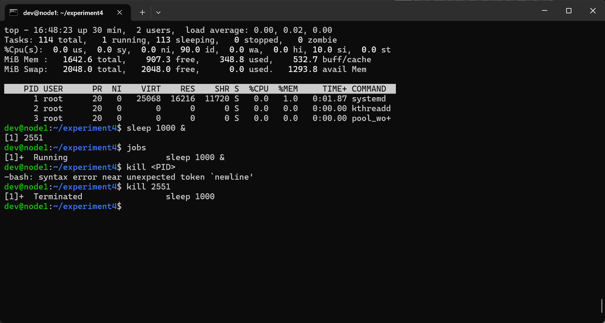
*△ 图 28 · `sleep`启动进程 + `job`查看后台任务 + `kill` 终止任务*

---

### 步骤八 管道与重定向 —— 命令行的灵魂

管道和重定向是 Linux 命令行最强大的组合技。如果说前面的命令是"单词"，管道和重定向就是"语法"——学会了它们，你才能说出一句完整的 Linux 句子。


**8.1 理解 stdin / stdout / stderr**

Linux 下每个程序都有三条"默认通道"：

| 通道 | 编号 | 全称 | 默认流向 | 比喻 |
|:--:|:--:|:--:|:--:|:--:|
| 标准输入 | 0 | stdin | 键盘 | 嘴巴 —— 程序从这里"吃"数据 |
| 标准输出 | 1 | stdout | 终端屏幕 | 正常说话 —— 程序往这里输出结果 |
| 标准错误 | 2 | stderr | 终端屏幕 | 咳嗽/骂人 —— 错误信息也走屏幕，但走不同通道 |

理解这三个通道是掌握重定向的前提。

```bash
# 正常输出走 stdout（通道1）
echo "这是一条正常消息"

# 错误走 stderr（通道2），需要故意触发一个错误
ls /nonexistent
# ls: cannot access '/nonexistent': No such file or directory
```

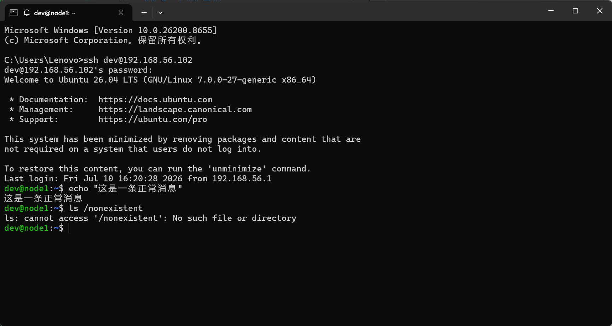
*△ 图 29 · `stdout` 正常输出 vs `stderr` 错误输出 —— 两条通道一目了然*

---

**8.2 什么是管道**

管道符 `|` 把左边命令的 stdout 直接接到右边命令的 stdin。数据从左到右，像流水线一样传递。

> 💡 **补充：管道 `|` 的原理是什么？**
> 答：Shell 创建一条匿名管道（pipe）——内核中的一块环形缓冲区。左边进程往管道的写端写数据，右边进程从管道的读端读数据。当一个命令的输出速率远快于另一个的输入速率时，内核会自动"刹车"（阻塞），保证数据不丢失。

用 `lab/logs/error.log`（之前建的实验日志）来跑两条实例：

```bash
# 示例1：列出 /etc 下所有文件，只保留含 "net" 的
ls /etc | grep net

# 示例2：统计 lab 目录下有多少条目（含隐藏文件）
ls -la ~/lab | wc -l

# 示例3：查看 error.log 里所有 ERROR 日志
cat ~/lab/logs/error.log | grep ERROR
```

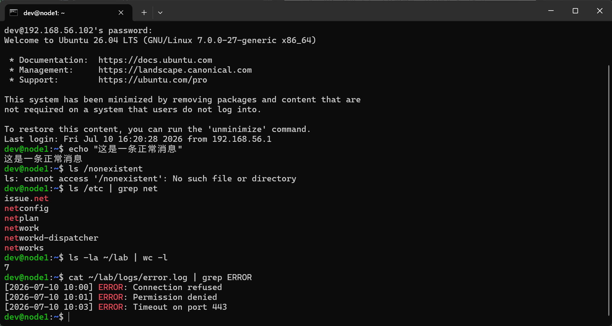
*△ 图 30 · 管道三连：`ls` + `grep`、`ls` + `wc`、`cat` + `grep`*

继续进阶——管道可以级联任意长度：

```bash
# 三级管道：列出所有文件 → 过滤含"log"的 → 统计行数
ls -la ~/lab | grep log | wc -l

# 从进程列表找到 SSH
ps aux | grep ssh | head -5
```

> 💡 **补充：管道 `|` 和 `>` 有什么区别？**
> 答：`|` 把输出传给**另一个命令**；`>` 把输出存到**文件**。一个流向程序，一个流向磁盘。

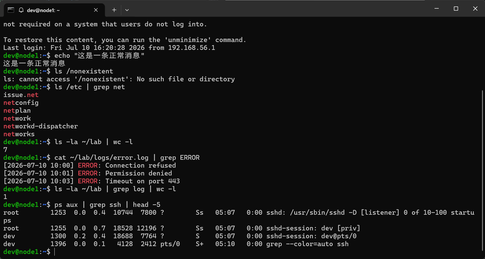
*△ 图 31 · 三级管道：`ls` → `grep` → `wc`，数据经过两次传递*

---

**8.3 输出重定向 `>` 和 `>>`**

管道把数据喂给程序，重定向把数据存到文件：

```bash
cd ~
# 单 > 覆盖写入（文件原有内容会被清空）
ls -la ~/lab > snapshot.txt
cat snapshot.txt

# 双 >> 追加写入（在文件末尾续写，不覆盖）
echo "=== 快照时间: $(date) ===" >> snapshot.txt
cat snapshot.txt
```

> 💡 **补充：`>` 和 `>>` 的区别？**
> 答：`>` 覆盖写入（先清空文件再写），`>>` 追加写入（保留旧内容，在末尾续写）。

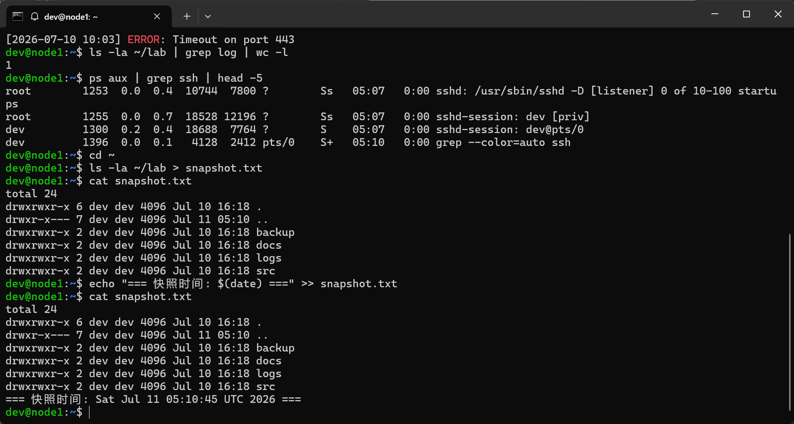
*△ 图 32 · 输出重定向 —— `>`覆盖 vs `>>`追加*

---

**8.4 输入重定向 `<`**

大多数命令可以从文件读取，不需要 `<`（如 `cat file` 本身就支持文件名参数）。但 `wc` 这类命令走 stdin 更自然：

```bash
# 两种等价写法
wc -l /etc/passwd                    # 传文件名
wc -l < /etc/passwd                  # 输入重定向（只输出行数，不输出文件名）
```

区别：传文件名时 `wc` 会同时打印文件名，输入重定向不会。

> 💡 **补充：`grep "foo" file` 和 `grep "foo" < file` 的区别？**
> 答：结果一样，但 `< file` 是 Shell 打开的，文件不存在时 Shell 会报错；传文件名是 grep 自己打开的，grep 报错。权限不足时行为也略有差异。

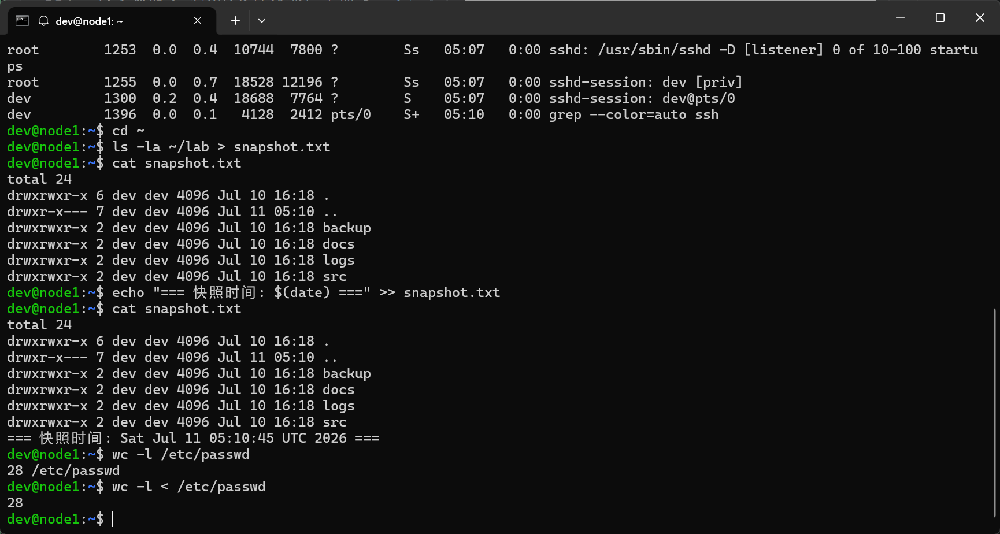
*△ 图 33 · 输入重定向 `<`——`wc -l` 传文件名 vs 重定向*

---

**8.5 stderr 重定向**

错误信息和正常输出走不同的通道，可以分开处理：

```bash
# 只重定向 stdout（错误仍然打印到屏幕）
ls /etc/netplan 1> stdout.txt
cat stdout.txt

# 只重定向 stderr（正常输出仍然打印到屏幕）
ls /nonexistent 2> stderr.txt
cat stderr.txt

# 把 stdout 和 stderr 都丢到同一个文件
ls /etc/netplan /nonexistent > both.txt 2>&1
cat both.txt
```

> 💡 **补充：解释 `command > file 2>&1` 这个写法的含义和顺序为什么不能颠倒。**
> 答：`> file` 先把 stdout 重定向到 file，`2>&1` 再把 stderr 重定向到"stdout 当前指向的地方"（也就是 file）。如果写成 `2>&1 > file`，stderr 会重定向到"旧的 stdout"（终端），只有 stdout 进 file —— 这就是常见的"错误还在终端打印"的坑。

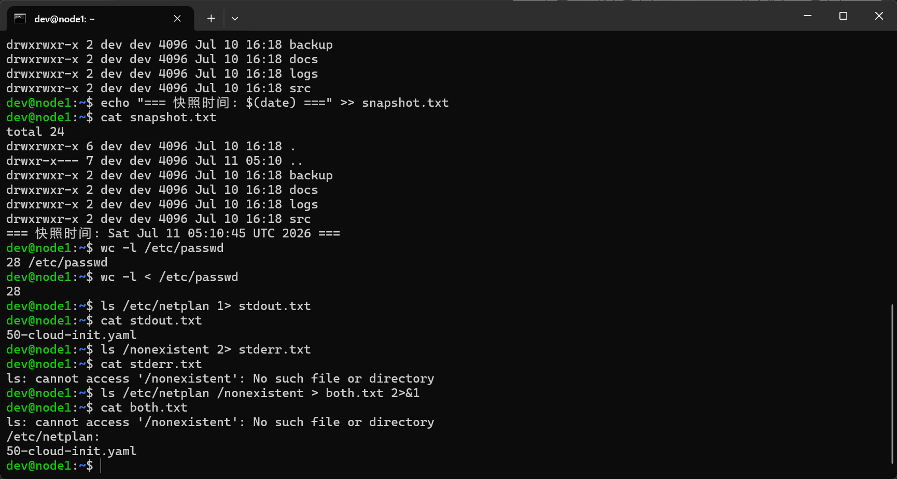
*△ 图 34 · `stderr` 重定向 —— 分开捕获正常输出和错误输出*

---

**8.6 `/dev/null` —— 黑洞**

`/dev/null` 是一个特殊的"黑洞文件"：写进去的数据直接消失，读永远是空的。常用于**丢弃不需要的输出**：

```bash
# 只要结果（退出码），不要输出
ping -c 2 8.8.8.8 > /dev/null && echo "网络通" || echo "网络不通"

# 丢弃错误信息，只看正常结果
find /etc -name "hosts" 2>/dev/null
```

> 💡 **补充：`/dev/null` 是什么？有什么用途？**
> 答：是 Linux 的伪设备文件，写入其中的数据会被立即丢弃。常见用途：① 丢弃不需要的输出（静默执行）；② 清空文件内容（`cat /dev/null > file`）；③ 作为测试输入源（读取时永远返回 EOF）。

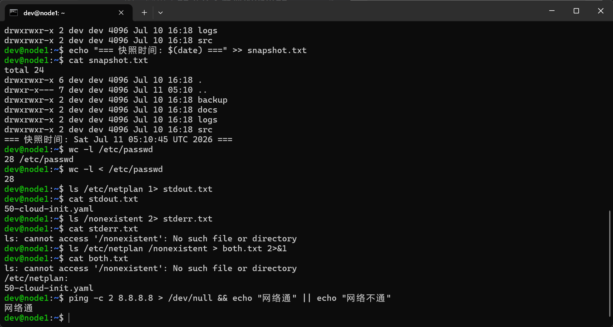
*△ 图 35 · `/dev/null` 黑洞 —— 静默 ping 测试，只保留退出码判断结果*

---

## 4. 实验结果

| 验证项 | 关键命令 | 预期结果 | 实际结果 |
|:--:|:--:|:--:|:--:|
| 路径查看 | `pwd` | 显示 `/home/dev` | ✅ 正常 |
| 目录列表 | `ls -la` | 列出含权限详情的所有条目 | ✅ 正常 |
| 目录切换 | `cd /` → `cd ~` → `cd -` | 正确切换并返回 | ✅ 正常 |
| 创建目录 | `mkdir -p a/b/c` | 嵌套创建三层目录 | ✅ 正常 |
| 创建文件 | `touch hello.txt` | 生成空文件 | ✅ 正常 |
| 写入文件 | `echo "..." > file` | 内容写入正确 | ✅ 正常 |
| 复制 | `cp -r dir backup` | 目录完整复制 | ✅ 正常 |
| 移动/重命名 | `mv old new` | 重命名生效 | ✅ 正常 |
| 删除 | `rm file` / `rm -r dir` | 指定文件/目录被删除 | ✅ 正常 |
| 内容搜索 | `grep "dev" /etc/passwd` | 返回匹配行 | ✅ 正常 |
| 文件查找 | `find /etc -name "*.yaml"` | 列出匹配文件路径 | ✅ 正常 |
| 包安装 | `sudo apt install tree -y` | 安装成功，`tree` 可运行 | ✅ 正常 |
| 系统信息 | `uname -a` / `free -h` / `df -h` | 正确显示系统状态 | ✅ 正常 |
| 进程查看 | `ps aux \| grep ssh` | 筛选出 SSH 进程 | ✅ 正常 |
| 管道操作 | `ls /etc \| wc -l` | 统计出文件数量 | ✅ 正常 |
| 重定向 | `ls > out.txt; cat out.txt` | 文件内容为命令输出 | ✅ 正常 |

---

## 5. 知识总结

### 5.1 Linux 文件系统核心概念

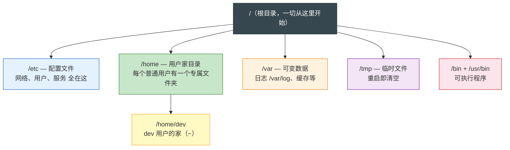
```mermaid
flowchart TB
    ROOT["/（根目录，一切从这里开始）"]
    ETC["/etc — 配置文件<br/>网络、用户、服务 全在这"]
    HOME["/home — 用户家目录<br/>每个普通用户有一个专属文件夹"]
    VAR["/var — 可变数据<br/>日志 /var/log、缓存等"]
    TMP["/tmp — 临时文件<br/>重启即清空"]
    BIN["/bin + /usr/bin<br/>可执行程序"]

    ROOT --> ETC
    ROOT --> HOME
    ROOT --> VAR
    ROOT --> TMP
    ROOT --> BIN
    HOME --> DEV["/home/dev<br/>dev 用户的家（~）"]

    style ROOT fill:#37474f,color:#fff,stroke:#263238
    style ETC fill:#e3f2fd,stroke:#1565c0
    style HOME fill:#c8e6c9,stroke:#2e7d32
    style VAR fill:#fff3e0,stroke:#f57c00
    style TMP fill:#f3e5f5,stroke:#7b1fa2
    style BIN fill:#fce4ec,stroke:#c62828
    style DEV fill:#fff9c4,stroke:#f9a825
```

---

### 5.2 命令分类速查表

| 分类 | 命令 | 一句话功能 |
|:--:|:--:|:--:|
| 位置 | `pwd` | 我在哪个目录 |
| 导航 | `cd` | 去某个目录 |
| 列表 | `ls -la` | 这目录里有什么 |
| 创建文件 | `touch` | 新建空文件 |
| 创建目录 | `mkdir -p` | 新建目录（含父目录） |
| 复制 | `cp -r` | 复制文件 / 目录 |
| 移动 | `mv` | 移动或重命名 |
| 删除 | `rm -r` | 删除文件 / 目录 |
| 查看 | `cat` / `less` / `head` / `tail` | 看文件内容 |
| 搜索内容 | `grep -r` | 文件里有没有这段文字 |
| 搜索文件 | `find` | 文件在哪 |
| 安装软件 | `sudo apt install` | 装软件 |
| 卸载软件 | `sudo apt remove/purge` | 卸软件 |
| 进程列表 | `ps aux` | 现在谁在跑 |
| 实时监控 | `top` | 持续看谁在跑 |
| 终止进程 | `kill PID` | 结束某个进程 |
| 管道 | `\|` | 把左边结果传给右边 |
| 重定向 | `>` / `>>` | 把输出存到文件 |
| 权限 | `chmod` | 谁能读写执行 |

---

### 5.3 绝对路径 vs 相对路径

| 类型 | 写法 | 特点 |
|:--:|:--:|:--:|
| 绝对路径 | `/home/dev/experiment4/readme.txt` | 从 `/` 出发，无论你在哪都能找到 |
| 相对路径 | `./readme.txt` 或 `../dev/readme.txt` | 从当前位置出发，路径短但依赖你站在哪 |

脚本中尽量用绝对路径 —— "我在哪"是会变的。

---

### 5.4 APT 包管理器架构

```
apt（上层命令行）
   ↓ 调用
dpkg（底层 .deb 安装器）
   ↓ 安装
.deb 包（二进制软件包）
```

- `apt`：自动解析依赖，"你要 A 我就把 B 和 C 一起拉下来"
- `dpkg`：只装指定的包，不处理依赖
- `snap`：Ubuntu 力推的新一代包格式（自带依赖，沙箱隔离），本实验不涉及

---

## 6. 出现问题

| 问题 | 现象 | 原因 | 解决方案 |
|:--:|:--:|:--:|:--:|
| `tree: command not found` | 输入 `tree` 提示命令不存在 | 最小化安装不包含 tree | `sudo apt install tree -y` |
| `rm: cannot remove 'xxx': Is a directory` | `rm xxx` 报错 | 默认 `rm` 不能删目录 | 用 `rm -r xxx` 递归删除 |
| `Permission denied` | 操作 `/etc` 下文件时报权限拒绝 | 普通用户无权修改系统配置 | 加 `sudo` 临时提权 |
| `apt update` 极慢或超时 | `sudo apt update` 卡住不动 | Ubuntu 默认源在海外 | 参考实验一切换国内镜像：`sudo sed -i 's/archive.ubuntu.com/mirrors.ustc.edu.cn/g' /etc/apt/sources.list` |
| `grep` 匹配到不相关的行 | `grep ssh` 把 `ssh-agent` 也搜到了 | 关键词太短 | `grep -w "ssh"` 精确匹配整个词 |
| `mkdir` 父目录不存在 | `mkdir a/b/c` 报错 `No such file or directory` | 缺少 `-p` | `mkdir -p a/b/c`，-p 自动创建不存在的父目录 |

---

## 7. 心得体会

实验四的操作量不小，但命令按"导航 → 操作文件 → 搜索 → 装软件 → 看系统 → 管进程 → 玩管道"这条线走下来，逻辑很清楚。

最大的认知转变是：Linux 桌面其实可有可无，命令行才是本体。`ls -la` 看权限比 Windows 资源管理器那密密麻麻的属性页快得多，`grep -r "关键字" /etc/` 搜配置比任何全文搜索工具都快。一个鼠标都懒得够的服务器运维，所有操作都在这个黑色窗口里完成——我现在有点理解那种感觉了。

`|` 管道是我认为整个实验最漂亮的设计。它让命令行变成了一套"数据流水线"——你不需要中间变量、不需要临时文件、不需要写代码，就把一个个原子化的小命令像乐高积木一样搭成任意长度的处理链条。这种 KISS（Keep It Simple, Stupid）设计哲学是所有优秀工程实践的底层逻辑，不只是 Linux。

最后，大一能接触到这些确实是好事。等到大三数据结构课设、操作系统实验、甚至毕业设计部署服务的时候，别人在查"怎么在 Linux 上装 Python"，你已经在 `grep`、`chmod`、`ps aux` 的加持下写一键部署脚本了——这差距从一开始就拉开了。
